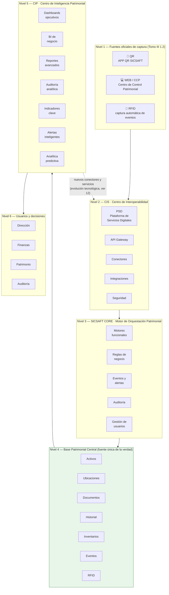

# Arquitectura de Referencia del Ecosistema SICSAFT — Marco Well-Architected

> Aplica los 6 pilares del AWS Well-Architected Framework como marco de **decisión**, no de
> implementación: ningún nombre de este documento es un servicio gestionado de un proveedor de
> nube específico. Cada capacidad se describe por su función (cola de mensajes, caché,
> almacenamiento de objetos, orquestador de contenedores...) para que el ecosistema pueda
> desplegarse en cualquier nube, on-premise, o híbrido, y cambiar de proveedor sin rediseño.

## 0. Por qué este documento

Los tomos oficiales (`TOMO III Cap.1 — Arquitectura General del Ecosistema`, `TOMO IV Cap.1 —
Modelo General`, `TOMO IV Cap.2 — SICSAFT CORE`, `TOMO III Cap.4 — Arquitectura de Datos`)
definen **qué** hace cada componente del ecosistema y
**qué reglas** debe cumplir (fuente única de la verdad, ningún acceso directo a la Base
Patrimonial, trazabilidad total). Este documento define **cómo** construir esos componentes para
que el sistema completo sea escalable, modular, resiliente y optimizado — sin comprometer esas
reglas y sin atarse a un proveedor.

Referencia cruzada: [README.md](README.md) (índice de sistemas) ·
[aidlc-docs/app-qr-sicsaft/design-artifacts/DOC-002-conector-qr.md](aidlc-docs/app-qr-sicsaft/design-artifacts/DOC-002-conector-qr.md)
(único contrato de integración ya escrito).

### 0.1. Patrimonio Digital Institucional vs. BPI — no confundir concepto con tecnología

- **Patrimonio Digital Institucional**: la representación digital organizada, trazable e
  histórica de los Activos Fijos Tangibles de la organización — identificación, ubicación,
  responsable, estado, documentos, eventos e historial. Es el concepto de negocio (el **qué**),
  no una tecnología.
- **BPI / Base Patrimonial Central — Nivel 4**: la estructura tecnológica que materializa ese
  concepto — almacena, relaciona y conserva la información ya validada (el **dónde**; alias ya
  aclarado en 1.1). La BPI no decide si una operación está permitida: solo persiste lo que el
  CORE ya validó.
- **SICSAFT CORE — Nivel 3**: gobierna qué operación puede tocar la BPI (usuario, permisos,
  reglas, estado) antes de persistir — ver Regla de modularidad, abajo.
- **CIP — Nivel 5**: consume la BPI para convertir datos validados en indicadores y alertas (el
  **para qué**) — nunca contra la transaccional en vivo (ver Pilar 5).

Un documento o fotografía puede vivir físicamente en un repositorio distinto (motor de Gestión
Documental, Tomo IV 2.4) y seguir siendo parte del Patrimonio Digital Institucional mientras la
BPI lo referencie desde el activo — no necesita contener el archivo en sí para que ese archivo
cuente como patrimonio digital.

## 1. Los 6 niveles como límites de módulo (Modularidad)

El Modelo General (Tomo IV Cap.1) ya define 6 niveles. Cada nivel es un **límite de despliegue
independiente** — se versiona, escala y falla por separado:

```
NIVEL 1  Fuentes de captura     APP QR · WEB · RFID · BLE · GPS · IoT · IA · ERP
NIVEL 2  CIS                    API Gateway · Conectores · Integraciones · Seguridad
NIVEL 3  SICSAFT CORE           Orquestador + 9 motores especializados
NIVEL 4  Base Patrimonial       Fuente única de la verdad (11 dominios)
NIVEL 5  CIP                    Dashboards · BI · Reportes · Alertas
NIVEL 6  Usuarios y decisión    Dirección · Finanzas · Patrimonio · Auditoría
```

**Regla de modularidad no negociable** (Tomo IV 1.7): *"Nunca existirán comunicaciones directas
entre las fuentes de captura y la Base Patrimonial Central."* Todo cruce de nivel pasa por el
nivel inmediatamente inferior. Esto es lo que permite que RFID, WEB o un futuro ERP se agreguen
sin tocar el CORE ni la Base Patrimonial: solo agregan un conector nuevo en el CIS.

**Cómo se traduce en código:**
- Cada nivel = un repositorio o paquete desplegable propio, con su propio ciclo de release.
- Los "9 motores" del CORE (Orquestador, Patrimonial, Reglas, Eventos, Auditoría, Alertas,
  Reportes, Gestión Documental, Gestión de Usuarios, Gestión de Permisos — Tomo IV 2.4) son
  módulos internos del CORE, no microservicios separados en el MVP: separarlos prematuramente
  antes de tener carga real es sobre-ingeniería. Se separan cuando un motor concreto necesite
  escalar o desplegarse independientemente (regla de YAGNI aplicada a este dominio).
- Contratos entre niveles = interfaces versionadas (ver DOC-002 como plantilla): todo cambio de
  contrato es aditivo o versionado explícitamente (`/v1/`, `/v2/`), nunca un breaking change
  silencioso, porque un nivel no controla el ciclo de deploy del nivel vecino.

### 1.1. Diagrama maestro de arquitectura funcional

Mismos 6 niveles de arriba, con los módulos internos de cada uno y el ciclo de vida completo
captura → orquestación → base de la verdad → inteligencia → decisión. "Base Patrimonial Central"
es el nombre oficial usado en todo el repo (README.md, `base-patrimonial/`) — un diagrama externo
puede referirse al mismo concepto como "BPI (Base Patrimonial Inteligente)", es el mismo Nivel 4,
no una pieza distinta.



**Regla de oro** (Tomo IV 1.7, ya citada arriba): ningún sistema, usuario o dispositivo modifica
la Base Patrimonial Central directamente — toda operación pasa por SICSAFT CORE. Los nuevos
sensores/protocolos de la hoja de ruta tecnológica (BLE, GPS, IoT, cámaras, IA, ERP — ver 12 y
`ROADMAP.md` YAGNI) se incorporan como conectores nuevos en el CIS (flecha punteada de vuelta al
Nivel 2), sin tocar CORE ni Base Patrimonial — la arquitectura no cambia, solo se agregan
conectores.

## 2. Pilar: Excelencia Operacional

Objetivo: operar el ecosistema con cambios frecuentes y bajo riesgo, con visibilidad completa de
qué pasó en cada transacción (exigido por Tomo IV 2.9 — Motor de Auditoría).

- **Infraestructura como código**: todo ambiente (CIS, CORE, Base Patrimonial, CIP) definido en
  archivos versionados en git, no configurado a mano. Reproducible en cualquier proveedor.
- **CI/CD por sistema**: cada nivel tiene su propio pipeline (build → test → seguridad → deploy),
  independiente de los demás — ya es la intención declarada en `devops/README.md`.
- **Observabilidad de extremo a extremo con `correlationId`**: todo evento que cruza un nivel
  (Captura → CIS → CORE → Base Patrimonial → CIP) lleva el mismo `correlationId` generado en el
  Nivel 1 (ya definido en DOC-002 6). Sin esto, "trazabilidad total" (Tomo IV 2.9) es
  imposible de verificar en producción.
- **Tres señales por sistema**: métricas (tasa de éxito, latencia, saturación), logs
  estructurados (JSON, correlacionables por `correlationId`), trazas distribuidas (un trace por
  transacción, un span por nivel atravesado).
- **Runbooks por motor**: cada motor del CORE (Reglas, Eventos, Auditoría, Alertas) documenta qué
  hacer cuando falla — no se depende de que "alguien se acuerde".
- **Despliegues progresivos**: canary o blue-green en CIS/CORE (los niveles con más blast radius
  si fallan) antes de exponer 100% del tráfico a una versión nueva.

## 3. Pilar: Seguridad

Objetivo: cumplir el Modelo de Responsabilidades (Tomo IV 1.8) y el modelo Usuario → Rol →
Permisos → Organización → Área → Acción ya definido en `seguridad/README.md`.

- **Cero confianza entre niveles**: cada llamada Nivel N → Nivel N-1 se autentica y autoriza
  explícitamente (credenciales de servicio, no solo "viene de la red interna"). El CIS es el
  único punto que valida identidad de fuentes de captura (Tomo IV 1.8); el CORE nunca confía en
  un `organizacionId`/`areaId` que no haya sido validado ya por el CIS.
- **Permisos mínimos necesarios** (Tomo IV 2.14): cada rol tiene exactamente las acciones que
  necesita — Consultar/Crear/Modificar/Eliminar/Autorizar/Exportar/Administrar/Configurar — nunca
  un rol "administrador de todo" salvo el estrictamente necesario.
- **Segregación por organización y por área**: toda consulta a la Base Patrimonial se filtra por
  el alcance del usuario/dispositivo autenticado, aplicada en el CORE (nunca confiar en un filtro
  hecho solo en el cliente).
- **Secretos fuera del código**: variables de entorno o un gestor de secretos dedicado — nunca
  hardcodeados (ya reforzado en el `.gitignore` raíz del repo).
- **Cifrado en tránsito siempre** (TLS de extremo a extremo) y **en reposo** para todo dato
  patrimonial, documental y de auditoría.
- **La auditoría es en sí un control de seguridad**: el Motor de Auditoría (Tomo IV 2.9) registra
  usuario, fecha, hora, operación, resultado, equipo, IP y tiempo de ejecución — es lo que permite
  detectar abuso de permisos después del hecho, no solo prevenirlo antes.

## 4. Pilar: Fiabilidad (Resiliencia)

Objetivo: que la caída de una fuente de captura o de un sistema externo (ERP, Contabilidad) no
tumbe el CORE ni corrompa la Base Patrimonial.

- **Idempotencia end-to-end**: toda escritura hacia el CORE lleva una `idempotencyKey` (ya
  definida en DOC-002 4). Reintentar una operación de red nunca duplica un alta, un movimiento
  ni un evento.
- **Colas para desacoplar captura de procesamiento**: el Nivel 1 (fuentes de captura) escribe a
  una cola/buffer, no llama sincrónicamente al CORE. Si el CORE está saturado o caído, los
  eventos esperan en cola en vez de perderse — esto es exactamente lo que pide TASK-008 de APP QR
  (cola sin conexión) generalizado a *todas* las fuentes de captura, no solo QR.
- **Reintentos con backoff exponencial + límite de intentos**, nunca reintento inmediato en bucle
  (evita "estampida" sobre un CORE que ya está degradado).
- **Circuit breaker en el CIS** hacia el CORE y hacia integraciones externas (ERP, BI): si un
  sistema externo empieza a fallar, el CIS deja de insistir temporalmente en vez de propagar la
  falla hacia arriba.
- **Aislamiento de fallos por integración**: una integración externa caída (Tomo III 4.13:
  ERP, Contabilidad, RRHH, Correo, Power BI, Cloud, RFID, APIs) nunca bloquea el flujo interno
  Captura → CIS → CORE → Base Patrimonial. Se degrada esa integración puntual, no el ecosistema.
- **Historial que nunca se pierde** (Tomo III 4.10: "nunca se elimina, nunca se reinicia"):
  requiere respaldos verificados con restauración probada periódicamente, no solo backups que
  nadie restauró nunca.
- **Multi-instancia sin estado en memoria compartido**: cualquier nivel debe poder correr en más
  de una instancia (para tolerar la caída de una) sin que el estado de una transacción dependa de
  qué instancia la atendió — el estado vive en la Base Patrimonial o en la cola, no en memoria de
  proceso.
  **Excepción aceptada y documentada** (ADR-005, 2026-08-27): el rate limiter y el device-registry
  de `cis/` (`src/rate-limit/`, `src/device-registry/`) pasaron de Redis a memoria del propio
  proceso — `cis/` no tiene Postgres propio y corre como instancia única en los 3 perfiles de
  `devops/` hoy, así que no hay ningún estado que sincronizar entre instancias todavía. Si `cis/`
  alguna vez necesita escalar a múltiples réplicas, estos dos componentes son los primeros a
  revisar (no se resolvió preventivamente — YAGNI). El resto de este pilar (colas, idempotencia,
  circuit breaker, aislamiento de fallos) no cambia.

## 5. Pilar: Eficiencia de Rendimiento

Objetivo: que el CIP (Nivel 5) sirva dashboards e indicadores sin degradar el CORE transaccional
(Nivel 3) — ya señalado como riesgo en `cip/README.md`.

- **Separar lectura transaccional de lectura analítica**: el CIP nunca consulta directamente la
  Base Patrimonial transaccional. Consume una réplica de solo lectura o un almacén optimizado
  para reportes, alimentado de forma asíncrona por el Motor de Eventos del CORE.
- **Caché en el nivel que más se repite la consulta**: catálogos (Tomo III 4.4), áreas y
  ubicaciones cambian poco y se consultan mucho — son candidatos naturales a caché con
  invalidación por evento, no por tiempo fijo arbitrario.
- **Paginación y proyección obligatorias**: ninguna API del CIS/CORE devuelve un dataset completo
  sin límite — todo listado (activos, eventos, auditoría) es paginado desde el diseño, no
  parcheado después de que el catálogo crezca.
- **Elegir el motor de datos por patrón de acceso, no por costumbre**: relacional para el modelo
  transaccional de 11 dominios con relaciones fuertes (Tomo III 4.14); un almacén
  columnar/analítico para el CIP; una cola para eventos; ninguna decisión de motor de base de
  datos es "una para todo el ecosistema".
- **Procesamiento asíncrono para todo lo que no bloquea al usuario**: generación de reportes
  (Tomo IV 2.11), recálculo de indicadores del CIP, envío de alertas — nunca en el camino
  síncrono de una transacción patrimonial.

## 6. Pilar: Optimización de Costos

Objetivo explícito del pedido del usuario — mantener el ecosistema optimizado sin atarlo a un
proveedor.

- **Escalar cada nivel de forma independiente**: si RFID (Nivel 1, fase tardía) no tiene tráfico
  todavía, no debe correr con la misma capacidad reservada que el CORE. El límite de módulo del
  1 es lo que hace esto posible.
- **Autoscaling basado en demanda real**, no capacidad fija dimensionada "por si acaso" —
  especialmente relevante en Nivel 1 (picos de escaneo QR en cierre de inventario) y Nivel 5
  (picos de consulta de dashboards a fin de mes).
- **Apagar/reducir a cero lo que no tiene tráfico**: entornos de desarrollo y sistemas de fase
  tardía (RFID, Integraciones) no necesitan estar corriendo permanentemente antes de tener uso
  real.
- **Formatos de exportación livianos por defecto** (Tomo IV 2.11 ya define PDF/Excel/CSV/JSON):
  generarlos bajo demanda, no precalcular y almacenar todas las combinaciones posibles.
- **Medir antes de sobre-aprovisionar**: ninguna decisión de capacidad para CORE/CIS se toma sin
  datos reales de carga — evita pagar por picos que nunca ocurren.

## 7. Pilar: Sostenibilidad

- **Apagar cómputo ocioso** (fases tardías, entornos de prueba) reduce huella y costo a la vez —
  mismo mecanismo que el pilar de costos, beneficio doble.
- **Evitar recomputar lo ya calculado**: cachear indicadores del CIP en vez de recalcularlos en
  cada consulta idéntica.
- **Preferir formatos y protocolos eficientes** (compresión en tránsito, paginación) sobre
  transferir datasets completos que el cliente descarta en su mayoría.

## 8. Cómo aplican los 4 principios del contrato de módulo a cada nivel

| Nivel | Escalable | Modular | Resiliente | Optimizado |
|---|---|---|---|---|
| Fuentes de captura | Cada tecnología (QR, RFID, WEB) escala según su propio patrón de uso | Un conector nuevo no toca el CORE | Cola local + reintento si no hay red (ya en curso: TASK-008 APP QR) | Batching de eventos antes de enviar, no 1 request por escaneo |
| CIS | Escala horizontal, sin estado propio | Un conector por fuente externa, aislado | Circuit breaker + rate limiting hacia el CORE | Valida y rechaza temprano lo inválido, antes de gastar cómputo en el CORE |
| CORE | Escala por motor si uno se vuelve cuello de botella | 9 motores + orquestador, límites internos claros | Idempotencia + colas entre motores asíncronos (Eventos, Alertas, Reportes) | Solo el camino síncrono mínimo (Reglas + Patrimonial) bloquea al usuario |
| Base Patrimonial | Réplicas de lectura para CIP/WEB | Un solo escritor (el CORE) — regla no negociable | Backups verificados, historial inmutable | Índices por patrón real de consulta, no "todo indexado" |
| CIP | Escala independiente del CORE | Consume eventos, no la base transaccional | Degrada a datos "últimos conocidos" si la fuente está caída, no cae | Precalcula solo lo que se consulta seguido |
| Usuarios/Decisión | N/A (cliente) | Portal WEB y APP QR son clientes intercambiables del mismo contrato | Manejo explícito de "sin conexión" en el cliente | Paginación y carga diferida en UI |

## 9. Qué NO hacer todavía (anti-sobre-ingeniería)

Consistente con YAGNI: este marco define *hacia dónde* escalar, no obliga a implementarlo todo
desde el día uno.

- No separar los 9 motores del CORE en servicios independientes antes de tener un motivo real de
  escalado o despliegue independiente — empezar con el CORE como un solo desplegable modular
  internamente.
- No introducir una cola de mensajes dedicada antes de que exista más de una fuente de captura
  con tráfico real simultáneo — para APP QR sola, una cola simple (incluida en TASK-008) alcanza.
- No elegir motor de base de datos analítico para el CIP antes de tener el modelo de dominio del
  CORE estable — evita migrar datos dos veces.
- No diseñar autoscaling ni multi-región antes de tener el primer sistema (CORE + Base
  Patrimonial) corriendo con carga real medida.

## 10. Próxima decisión pendiente

Este documento no reemplaza los ADR de stack tecnológico pendientes en `core/README.md`,
`cis/README.md` y `base-patrimonial/README.md` — les da el marco de decisión. El primer ADR de
stack (CORE + Base Patrimonial) debe declarar explícitamente, por cada pilar de este documento,
qué tecnología concreta lo satisface, para que quede trazable por qué se eligió.

## 11. Entradas y salidas oficiales del ecosistema (Tomo III Cap.1)

Tomo III Cap.1 ("Arquitectura General del Ecosistema SICSAFT") define, a nivel de todo el
ecosistema, las fuentes autorizadas de entrada y sus permisos, y las salidas oficiales de
explotación de información. Complementa el modelo de 6 niveles (1) y el modelo de permisos de
[`seguridad/README.md`](seguridad/README.md).

**Entradas oficiales (Tomo III 1.4)**

| Entrada | Función | Permisos | No puede |
|---|---|---|---|
| APP QR | Captura vía código QR | Lectura, registro de inventarios/estados, generación de informes | Modificar la Base Patrimonial Oficial |
| Plataforma WEB | Consulta, dashboards, reportes, administración | Generar configuraciones, asignar usuarios, autorizar procesos | Modificar directamente la Base Patrimonial sin permisos específicos |
| RFID (referencia de integración: MOVAT) | Recibe eventos RFID — movimientos, alarmas, ubicación, lecturas | Solo lectura de eventos | Nunca modifica la Base Patrimonial |
| **Administrador Patrimonial** ✅ (nombre funcional: Profesional de AFT, ver [DOC-012](seguridad/DOC-012-administrador-patrimonial.md) "Nomenclatura") | Único rol autorizado a modificar oficialmente la Base Patrimonial | Incorporar activos, eliminar activos (según permisos), modificar responsables/áreas, actualizar estados oficiales, importar bases contables | — |
| **Sistema Contable** | Fuente de la que siempre proviene la Base Oficial | Importación, actualización, sincronización de registros oficiales | Nunca elimina información histórica |

**Administrador Patrimonial** ya está implementado de punta a punta (ROADMAP.md Fase 4,
[DOC-012](seguridad/DOC-012-administrador-patrimonial.md)): rol de Proyecto en Zitadel + claim
`rolesPorOrganizacion` verificado en CORE (`core/src/common/auth/administrador-patrimonial.guard.ts`),
alta/baja/reincorporación/cambio de responsable de `Activo`
(`core/src/patrimonial/activo-escritura.controller.ts`), importación masiva idempotente de base
contable (`POST /importaciones/contable`, precursor manual de `CON-CONTABILIDAD`) y escritura de
`Contrato` (`POST /contratos`, `PATCH /contratos/:id`,
`core/src/entitlements/contrato-escritura.controller.ts`) — las 3 operaciones que Tomo III 1.4 le
exige a esta entrada. **Sistema Contable** (conector automático `CON-CONTABILIDAD`) sigue sin
modelar: no hay integración con un sistema contable real en `integraciones/README.md` (el
conector está listado pero sin iniciar, Fase 7 del ROADMAP) — la importación manual del
Administrador Patrimonial cubre el 80% del valor mientras tanto.

**Plataforma WEB** — las columnas "Permisos" (generar configuraciones, asignar usuarios, autorizar
procesos) ya están implementadas: es exactamente el alcance del rol Administrador del Sistema
(`administrador-sistema`, [DOC-021](aidlc-docs/ccp/design-artifacts/DOC-021-cobertura-ccp-y-administrador-sistema.md),
2026-08-18) — crea organizaciones y contratos, asigna usuarios a organizaciones (integración real
con la API de administración de Zitadel), ve indicadores de plataforma. Nunca modifica la Base
Patrimonial directamente (columna "No puede" de esta fila), simétrico con que el Administrador
Patrimonial nunca administra la plataforma — ver `seguridad/README.md` "Administrador del
Sistema" para el detalle de los dos niveles de autorización server-side que usa esta entrada.

**Nota de implementación (DOC-022, 2026-08-19)**: "Plataforma WEB" en la fila de arriba es una
sola entrada oficial de Tomo III, pero se implementó como **tres portales separados**, uno por rol
(`ccp/` para el Profesional de AFT, `web_admin/` para el Administrador del Sistema,
`core/frontend/` para el Directivo — nunca un login compartido, ver `seguridad/README.md` "Mapeo
rol → portal → hostname"). Autorizar procesos (columna "Permisos" de esta fila) también cubre la
capacidad nueva del Directivo: designar quién es el Profesional de AFT de su propia organización
(`GET/POST /directivo/usuarios`, `cis/src/directivo/`) — gestión de identidad acotada a una sola
organización, mismo criterio de "nunca modifica la Base Patrimonial directamente" que el
Administrador del Sistema.

**Decisión de producto sobre esta entrada**: SICSAFT nunca se conecta directamente (API/DB) al
sistema contable del cliente — la frontera de responsabilidad termina antes de esa integración.
`CON-CONTABILIDAD`, cuando se construya, debe seguir siendo una importación controlada (archivo
intermedio validado por el especialista contable, no una conexión en vivo), con flujo
recibido → validado → comparado → aprobado → procesado → auditado antes de que CORE aplique
cualquier cambio a la Base Patrimonial — nunca sobrescritura silenciosa de un campo patrimonial ya
existente. Esto no cambia los permisos que le exige Tomo III 1.4 (importación, actualización,
sincronización de registros oficiales); acota *cómo* se implementan.

**Salidas oficiales (Tomo III 1.5)**

| Salida | Contenido |
|---|---|
| Reportes Operacionales | Solo lectura, no modifican información |
| Dashboard Ejecutivo | Indicadores, gráficos, BI |
| Alertas | Notificaciones — correo, aplicación, SMS (si se implementa) |
| Auditoría | Historial, trazabilidad, bitácora, eventos |
| API | Intercambio de información con otros sistemas, permisos según autenticación/autorización |

Mapea 1:1 con los motores ya definidos en [`core/README.md`](core/README.md) (Motor de Reportes,
Motor de Alertas, Motor de Auditoría) más el nivel CIP ([`cip/README.md`](cip/README.md)) para el
Dashboard Ejecutivo. **Dashboard Ejecutivo ya implementado** (RF-09, DOC-019) — vive en
`ccp/src/pages/DashboardPage.tsx` (Profesional de AFT, dentro de su portal operativo) y, desde
DOC-022, también en `core/frontend/src/pages/DashboardPage.tsx` (Directivo, en su propio portal
de solo lectura) — mismo código fuente, dos portales distintos porque cada rol lo consume desde un
contexto diferente (ver "Nota de implementación" arriba).

## 12. Hoja de ruta tecnológica declarada (Tomo III 1.2)

Tomo III Cap.1 declara una hoja de ruta explícita en 5 etapas — evita "desarrollar funciones que
el mercado aún no demanda", consistente con YAGNI (9):

1. **Etapa 1 (v1.0)**: APP QR, Plataforma WEB, Integración RFID — converge todo a SICSAFT CORE.
   Etapa de comercialización inicial. **Es la etapa actual del ecosistema.**
2. **Etapa 2**: Bluetooth Low Energy (BLE), GPS.
3. **Etapa 3**: Sensores IoT, cámaras inteligentes.
4. **Etapa 4**: Inteligencia artificial, machine learning, analítica predictiva.
5. **Etapa 5**: Integraciones ERP, BI, plataformas externas.

Coincide con el orden de [`README.md`](README.md) (RFID e Integraciones como "fase tardía"), pero
agrega dos etapas intermedias (BLE/GPS, IoT/cámaras) que hoy no aparecen en ningún roadmap del
repo — no crear código para ellas todavía, siguiendo la regla explícita de la Etapa 1: "nunca
desarrollaremos funciones que el mercado aún no demanda".
