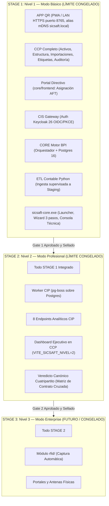

# SICSAFT — Documento Maestro de Gobernanza por Stages y Límites de Proyecto

> **Estado**: Vigente y Normativo (2026-09)  
> **Aprobación de Arquitectura**: Conforme a Tomo III (Principios no negociables), Tomo IV (Catálogo funcional) y ADR-001 a ADR-005.  
> **Enlazado desde**: [`CLAUDE.md`](../CLAUDE.md), [`NOMENCLATURA.md`](../NOMENCLATURA.md), [`README.md`](../README.md) y [`ROADMAP.md`](../ROADMAP.md).

---

## 1. Propósito y Marco de Gobernanza

El propósito de este documento es **fijar límites inmutables de alcance (*scope boundaries*) y criterios de aceptación (*Definition of Done*) para cada etapa del proyecto**, permitiendo **cerrar de forma definitiva y verificable el Nivel 1 y el Nivel 2**, eliminando la dispersión de requisitos, el desbordamiento de alcance (*scope creep*) y la reapertura no controlada de fases ya implementadas.

### Principio de Cierre por Puertas (*Phase-Gate Protocol*)
Ningún stage puede declararse formalmente CERRADO si no cumple el 100% de los criterios estipulados en su correspondiente **Puerta de Control (*Gate*)**. Una vez cerrada una etapa, su alcance queda **congelado**: cualquier nueva funcionalidad solicitada pasa obligatoriamente a una etapa posterior o requiere un ADR de excepción.

---

## 2. Taxonomía Oficial de Términos

Para evitar ambigüedades entre los documentos técnicos y de negocio, se establece la distinción estricta entre **Stage**, **Nivel/Modo** y **Fase**:

```
┌────────────────────────────────────────────────────────────────────────────────┐
│  STAGE (Hito de Entrega al Cliente)                                            │
│  Paquete de software completo, probado y congelado con una frontera inmutable. │
│  Ejemplo: STAGE 1 (Entregable Base On-Premise)                                │
├────────────────────────────────────────────────────────────────────────────────┤
│  NIVEL / MODO (Capacidad Comercial y Licenciamiento)                           │
│  Superficie funcional habilitada al cliente en la instalación o portal.        │
│  • Nivel 1 (Modo Básico): APP QR + CCP Completo + Directivo (Sin CIP)          │
│  • Nivel 2 (Modo Profesional): Nivel 1 + CIP (Dashboard e Inteligencia)       │
│  • Nivel 3 (Modo Enterprise): Nivel 2 + RFID (Captura Masiva Automática)       │
├────────────────────────────────────────────────────────────────────────────────┤
│  FASE AI-DLC (Ciclo Interno de Ingeniería de Software)                         │
│  Metodología por subsistema: Inception → Construction → Operations.            │
└────────────────────────────────────────────────────────────────────────────────┘
```

---

## 3. Fronteras de Alcance y Límites Inmutables (*Scope Boundaries*)



---

### 3.1 STAGE 1: Nivel 1 — Modo Básico On-Premise

El objetivo de Stage 1 es resolver la **operación, control físico e integridad patrimonial oficial** de una organización sin analítica compleja.

#### ✅ Qué ENTRA en Stage 1 (In Scope)
1. **Captura Móvil Terreno (`app-qr-sicsaft/`)**:
   - Flujo oficial de escaneo de 8 pasos ([`DOC-001`](app-qr-sicsaft/design-artifacts/DOC-001-flujo-oficial.md)).
   - Escaneo por cámara (QR y Code 128) + entrada manual de código.
   - Verificación inmediata contra catálogo local / IndexedDB.
   - Registro de incidencias (daño, extravío, faltante).
   - Operación offline autónoma y sincronización con CIS vía token OIDC PKCE.
   - Acceso LAN vía HTTPS en `https://<ip-lan>:8765` (`PUERTO_APP_QR`), con certificado autofirmado (SAN de la IP de LAN + alias mDNS `sicsaft.local`, `FUT-04`). El CCP del puesto del AFT se sirve aparte en `https://<ip-lan>:8767` (`PUERTO_CCP_LAN`, Fase G).
2. **Centro de Control Patrimonial (`ccp/`) — Completo en Nivel 1**:
   - **Activos**: Consulta integral, alta manual, edición de descripción, asignación de responsable, baja lógica con máquina de estados (invariante: nunca DELETE físico).
   - **Estructura**: Árbol de Direcciones, Áreas, Ubicaciones y Responsables con asignación cruzada.
   - **Importaciones Contables**: Carga de planillas Excel procesadas por el ETL Python; bandeja de revisión de lotes en staging (`pendiente_revision`); aprobación o rechazo humano con registro en auditoría.
   - **QR / Etiquetas**: Emisión e impresión de etiquetas patrimoniales (QR + Code 128) para activos dados de alta.
   - **Auditoría**: Consulta filtrable por usuario, fecha, operación y área operativa, con columna "Revisar".
   - **Resumen**: Pantalla de control post-inventario (Pantalla 8, DOC-029 RF-I).
3. **Portal Directivo (`core/frontend/`)**:
   - Consulta de estructura y designación formal del Profesional de AFT para la organización.
4. **Backends (`cis/` y `core/`)**:
   - CIS como API Gateway único y seguro; validación Zod en todas las entradas; circuit breaker y rate limiting; validación de tokens Keycloak 26.
   - CORE como orquestador y único autorizador de escritura a la BPI (Postgres 16).
   - Modelo de dominio de 11 entidades patrimoniales con esquema versionado (`node-pg-migrate`).
   - Token de servicio interno (`CORE_SERVICE_TOKEN`) en tiempo constante para comunicaciones inter-servicio.
5. **Herramienta ETL Contable (`herramientas/etl-contable/`)**:
   - Script Python (`pandas`, `xlrd`) que normaliza planillas heterogéneas (`.xls`/`.xlsx`) hacia el esquema canónico de staging.
6. **Empaquetado On-Premise (`sicsaft-core/`)**:
   - Binario `.exe` nativo Windows (Electron) que orquesta Postgres, Keycloak 26, CIS, CORE y sirve los frontends estáticos (`ccp`, `core/frontend`, `app-qr-sicsaft`).
   - Wizard de primer arranque de 3 pasos (Cliente → Director → Profesional AFT).
   - Consola técnica de arranque y fallback seguro.

#### ❌ Qué NUNCA entra en Stage 1 (Límite Negativo / Fuera de Alcance)
* ⛔ **CIP (Centro de Inteligencia Patrimonial)**: El proceso worker `cip/` **no** se ejecuta en Nivel 1 en el `.exe` (ahorrando ~120MB de RAM). El módulo Dashboard en el CCP está estrictamente oculto (`VITE_SICSAFT_NIVEL=1`).
* ⛔ **RFID**: Cero componentes de captura automática por radiofrecuencia.
* ⛔ **Conexiones automáticas no supervisadas**: Prohibido que un sistema contable escriba directo a la BPI sin aprobación del Profesional AFT.
* ⛔ **Portal Administrador del Sistema**: El portal `web_admin/` está formalmente **eliminado**. La configuración de tenant es asistida por el proveedor.
* ⛔ **Despliegues Cloud Multi-tenant / VPS**: Stacks `devops/local` y `devops/prod` retirados; la arquitectura es exclusivamente On-Premise / Desktop.

---

### 3.2 STAGE 2: Nivel 2 — Modo Profesional On-Premise

El objetivo de Stage 2 es sumar la **capacidad analítica, agregación de indicadores y detección temprana de discrepancias patrimoniales**.

#### ✅ Qué ENTRA en Stage 2 (In Scope)
1. **Todo el alcance de STAGE 1 verificado y sellado**, sin regresiones.
2. **Centro de Inteligencia Patrimonial (`cip/`)**:
   - Microservicio NestJS independiente ejecutando worker `pg-boss` sobre Postgres.
   - Consumo asíncrono y desacoplado de eventos patrimoniales (`inventario.cerrado`, `activo.creado`, etc.) emitidos por CORE.
   - Esquema de base de datos analítica propia con vistas materializadas y series temporales.
   - 8 endpoints de consulta analítica de alta velocidad (`/dashboard/cobertura`, `/dashboard/areas`, `/dashboard/sesiones`, `/dashboard/no-localizados`, `/dashboard/incidencias`, `/dashboard/estado-aft`, `/dashboard/categorias`, `/dashboard/resumen`).
3. **Veredicto Patrimonial Canónico**:
   - Matriz cuatripartita cruzada de 4 estados (CONFORME, OBSERVADO, FALTANTE, NO_LOCALIZADO), garantizada con paridad criptográfica y tests de contrato cruzados entre `app-qr`, `core` y `cip`.
4. **Activación de Visualización Directiva y Operativa**:
   - Activación del módulo **Dashboard** en el CCP (`VITE_SICSAFT_NIVEL=2`) para el Profesional de AFT.
   - Visualización de indicadores ejecutivos, gráficos de categorías y conciliación física vs. contable en el Portal Directivo (`core/frontend`).
5. **Selector de Modo en Wizard**:
   - Opción en el wizard del `.exe` que permite elegir "Nivel 2 (Modo Profesional)", orquestando el subproceso CIP de forma transparente.

#### ❌ Qué NUNCA entra en Stage 2 (Límite Negativo / Fuera de Alcance)
* ⛔ **RFID**: Ninguna antena, arco o lector masivo (exclusivo de Stage 3).
* ⛔ **Integraciones ERP en tiempo real bidireccionales**: (reservadas a integraciones corporativas futuras).
* ⛔ **Mutaciones analíticas a la BPI**: CIP es 100% de solo lectura y agregación; jamás muta una tabla patrimonial.

---

### 3.3 STAGE 3: Nivel 3 — Modo Enterprise / RFID

* **Estado**: **CONGELADO HASTA NUEVO AVISO**.
* **Regla**: No se inicia diseño ni código en `rfid/` hasta que Stage 1 y Stage 2 tengan sus Actas de Cierre firmadas y comprobadas en clientes reales.

---

## 4. Definition of Done (DoD) y Criterios de Aceptación por Gate

Para cerrar formalmente cada Stage se deben validar los 5 pilares de control:

### 4.1 Gate 1 — Cierre Definitivo de STAGE 1 (Nivel 1 Básico)

| Pilar | Criterio de Aceptación Obligatorio | Verificación |
|---|---|---|
| **1. Código y Calidad** | • Cobertura de tests >= 100% líneas y funciones en `cis/` y `core/`.<br>• `ccp/` y `core/frontend/` pasan `bun run lint:ci` y `bun run test`.<br>• Cero comentarios huérfanos y cero dependencias a Zitadel o Base Patrimonial Central en código activo. | `bun run test:cov`<br>`node herramientas/revision-codigo/inventario.mjs --tabla` |
| **2. Empaquetado** | • `npm run dist:win` en `sicsaft-core/` produce instalador `.exe` firmado.<br>• Instalación exitosa en VM Windows limpia sin Docker ni WSL2 preinstalados.<br>• Wizard de 3 pasos genera Organización, Director y Profesional AFT con contraseñas temporales forzadas. | Prueba en máquina limpia Windows 10/11 |
| **3. Flujo en Terreno** | • Dispositivo móvil en la misma LAN Wi-Fi abre la PWA en `https://<ip-lan>:8765` y el CCP del puesto en `https://<ip-lan>:8767` (cert autofirmado: se acepta la advertencia la primera vez).<br>• Escaneo de QR físico genera sesión de inventario que viaja CIS → CORE → BPI Postgres.<br>• Modo offline probado: almacenamiento en IndexedDB y sincronización automática al recuperar red. | Prueba con teléfono físico y etiquetas impresas |
| **4. Ingesta Contable** | • Ingesta de Excel institucional normalizada por `herramientas/etl-contable/`.<br>• Lote generado en staging revisado y aprobado por el Profesional AFT desde el CCP.<br>• Bienes insertados en la BPI visibles en el catálogo de escaneo. | Escenario de validación de lote |
| **5. Documentación** | • `aidlc-docs/app-qr-sicsaft/`, `ccp/`, `core/`, `devops/` y `sicsaft-core/` actualizados y con estado Stage 1 CERRADO.<br>• `CHANGELOG.md` con la versión de cierre publicada y `VERSION` alineada.<br>• `inventario.mjs --tabla` sin docs marcados como desactualizados para esos sistemas. | Auditoría de código y documentación ([`DOC-032`](revision-codigo/DOC-032-revision-de-codigo-y-documentacion.md)) + `node herramientas/revision-codigo/inventario.mjs --tabla` |

---

### 4.2 Gate 2 — Cierre Definitivo de STAGE 2 (Nivel 2 Profesional)

| Pilar | Criterio de Aceptación Obligatorio | Verificación |
|---|---|---|
| **1. Código y Calidad** | • `cip/` pasa suites Jest con 100% de cobertura.<br>• Test de contrato cruzado `calcularVeredicto` en verde idéntico entre `app-qr`, `core` y `cip`. | `bun run test:cov` en `cip/`<br>Jest contract tests |
| **2. Integración Asíncrona** | • Sesión de inventario cerrada en CORE emite evento a cola `cip-eventos` en `pg-boss`.<br>• Worker CIP procesa evento y actualiza vistas analíticas sin bloqueo de la BPI. | Test de integración e2e |
| **3. Portales y Consumo** | • CCP ejecutado con `VITE_SICSAFT_NIVEL=2` muestra tarjeta y pantalla de Dashboard con datos reales agregados.<br>• Portal Directivo visualiza indicadores ejecutivos en tiempo real. | Verificación visual y funcional |
| **4. Recursos y Rendimiento** | • Consumo de memoria total del instalador `.exe` con CIP activo verificado por debajo de 450MB RAM en reposo. | Monitoreo en Administrador de Tareas de Windows |
| **5. Documentación** | • `aidlc-docs/cip/00_PROJECT_METADATA.md` actualizado de Inception a CERRADO / STAGE 2. | Revisión documental |

---

## 5. Protocolo de Freeze y Reglas Antidesbordamiento

1. **Inmutabilidad de Contratos**: Una vez cerrado el Gate 1, los endpoints de CIS (`DOC-002`, `DOC-006`, `DOC-024`) no admiten cambios de contrato que rompan retrocompatibilidad.
2. **Gestión de Cambios Post-Cierre**: Si durante una prueba de cliente se identifica una mejora funcional no contemplada:
   * Si es un **defecto/bug real**: Se atiende en rama `fix/` y se documenta en [`DOC-027`](sicsaft-core/design-artifacts/DOC-027-bitacora-bugs-reales.md).
   * Si es un **nuevo requisito funcional**: Queda **prohibido** incluirlo en Stage 1 o Stage 2. Se registra en [`REQUISITOS.md`](../REQUISITOS.md) como candidato para etapas futuras.
3. **Versionado**:
   * Cierre de Stage 1 = Tag git `release/stage-1.0.0`
   * Cierre de Stage 2 = Tag git `release/stage-2.0.0`

---

## 6. Matriz Maestra de Componentes vs. Stages

| Componente | Carpeta | Rol Arquitectónico | Stage 1 (Modo Básico) | Stage 2 (Modo Profesional) |
|---|---|---|---|---|
| **APP QR** | `app-qr-sicsaft/` | PWA Móvil de Captura | ✅ Activo (8 pasos, offline, sync) | ✅ Activo (mismo binario) |
| **CCP** | `ccp/` | Portal Operativo Profesional AFT | ✅ Activo (Completo, sin Dashboard) | ✅ Activo (Con Dashboard CIP) |
| **Directivo** | `core/frontend/` | Portal Web Directivo | ✅ Activo (Estructura y designación AFT) | ✅ Activo (Con KPIs y veredictos) |
| **CIS** | `cis/` | API Gateway & Autenticación | ✅ Activo (Keycloak 26 OIDC/PKCE) | ✅ Activo (Ruteo analítico a CIP) |
| **CORE** | `core/` | Motor Patrimonial & Orquestador | ✅ Activo (BPI Postgres, Reglas, Auditoría) | ✅ Activo (Outbox pg-boss hacia CIP) |
| **BPI** | `core/migrations/` | Base Patrimonial Inteligente | ✅ Activo (11 dominios persistidos) | ✅ Activo (Fuente única de verdad) |
| **CIP** | `cip/` | Inteligencia Patrimonial & BI | ⛔ Desactivado (ahorro RAM) | ✅ Activo (Worker pg-boss + 8 endpoints) |
| **ETL Contable** | `herramientas/etl-contable/` | Normalizador Python Excel | ✅ Activo (Ingesta supervisada) | ✅ Activo (Ingesta supervisada) |
| **SICSAFT CORE** | `sicsaft-core/` | App Escritorio Host (.exe) | ✅ Activo (Servicios embebidos N1) | ✅ Activo (Servicios embebidos N1 + N2) |
| **APK AFT** | `apk-aft/` | Android WebView Nativa | 🟡 Opcional (PWA es camino base) | 🟡 Opcional (PWA es camino base) |
| **RFID** | `rfid/` | Captura Automática RFID | ⛔ Congelado | ⛔ Congelado |
