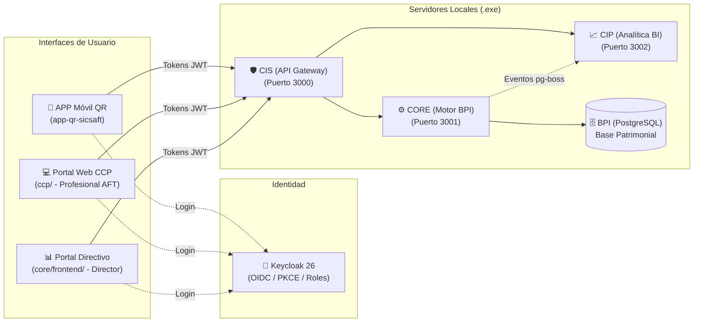

# Guía y Mapa Maestro de Documentación SICSAFT (AIDLC Docs)

> 📌 **¿Qué es este documento?**
> Este es el **índice central y mapa de ruta** de toda la arquitectura, casos de uso y especificaciones técnicas de SICSAFT. Está diseñado para que cualquier persona pueda orientarse, entender los componentes y encontrar la documentación relevante **en menos de 1 minuto** sin perderse en tecnicismos.

---

## 1. El Sistema en 1 Minuto

SICSAFT es un ecosistema de gestión, control e inteligencia de Activos Fijos Tangibles (AFT). Se distribuye para el cliente final como una **aplicación de escritorio autocontenida para Windows (`sicsaft-core.exe`)** que opera en red local (LAN):

---

## 1.1 Orden de prioridad (qué mirar primero)

Mismo orden de dependencia real que ya sigue [`ROADMAP.md`](../ROADMAP.md) — de "qué sostiene todo
lo demás" a "qué construye sobre lo ya sólido":

| # | Sistema | Por qué en ese lugar |
|---|---|---|
| 1 | **APP QR** (`app-qr-sicsaft/`) — Nivel 1 | La única fuente de captura real hoy; el resto del ecosistema no tiene datos que mostrar si esto falla. |
| 2 | **CIS** (`cis/`) | Único punto de entrada — sin esto, ninguna fuente de captura llega a CORE. |
| 3 | **CORE** (`core/`) + **BPI** (`base-patrimonial/`) | El orquestador y la fuente única de verdad — todo lo demás lee/escribe a través de acá. |
| 4 | **CCP** (`ccp/`) | Herramienta diaria del Profesional de AFT sobre el modelo ya sólido de CORE/BPI. |
| 5 | **CIP** (`cip/` + `core/frontend/`) | Inteligencia patrimonial — tiene sentido recién cuando hay datos reales y consistentes que analizar. |
| — | **Infraestructura transversal** (`seguridad/`, `devops/`, `sicsaft-core/`, `ccp-desktop/`) | No es una fase más: sostiene a todas las anteriores (identidad, empaquetado, distribución). |
| — | **Fase tardía** (`rfid/`, `integraciones/`, `apk-aft/`) | Deliberadamente no iniciado — depende de que 1–5 estén sólidos primero (YAGNI, ver `ROADMAP.md` "Principio de ordenamiento"). |

---

## 2. Buscador Rápido: ¿Dónde leo sobre...?

| Si necesitás entender... | Abrí este documento | ¿Qué vas a encontrar? |
|---|---|---|
| **Los Casos de Uso del negocio** | [`casos-de-uso/README.md`](../casos-de-uso/README.md) | Catálogo de los 24 casos de uso oficiales divididos en 10 dominios funcionales. |
| **Quién puede hacer qué (Roles y Permisos)** | [`casos-de-uso/MATRIZ-ACTOR-FUNCION.md`](../casos-de-uso/MATRIZ-ACTOR-FUNCION.md) | Mapeo de roles (`profesional-aft`, `administrador-patrimonial`, `directivo`). |
| **Cómo se prueba el sistema antes de entregar** | [`casos-de-uso/PLAN-QA.md`](../casos-de-uso/PLAN-QA.md) | Plan de pruebas paso a paso para el instalador `.exe` con el teléfono móvil. |
| **La Pantalla 8 (Informe de Control de Área)** | [`casos-de-uso/CONTRATO-PANTALLA-8.md`](../casos-de-uso/CONTRATO-PANTALLA-8.md) | Formato exacto del informe con veredictos de color (verde, amarillo, rojo). |
| **Cómo se carga el Excel contable (ETL)** | [`ccp/design-artifacts/DOC-029-endurecimiento-ccp-cliente-real.md`](ccp/design-artifacts/DOC-029-endurecimiento-ccp-cliente-real.md#rf-b--ingesta-de-excel-supervisada) | Pipeline Python sidecar, carpeta vigilada y revisión humana previa al guardado. |
| **El instalador de Windows (.exe)** | [`sicsaft-core/design-artifacts/DOC-028-camino-a-cliente-final.md`](sicsaft-core/design-artifacts/DOC-028-camino-a-cliente-final.md) | Cómo funciona la aplicación Electron que empaqueta Postgres, Keycloak y los servicios. |
| **El API Gateway (CIS): ruteo, circuit breaker, rate limit** | [`cis/00_PROJECT_METADATA.md`](cis/00_PROJECT_METADATA.md) + [`../cis/README.md`](../cis/README.md) | Sin DOC-XXX propio todavía (gap conocido, ver sección 3) — esta es la fuente más completa hoy. |
| **Cómo conectarse al CCP desde otra PC de la oficina** | [`../ccp-desktop/README.md`](../ccp-desktop/README.md) | Launcher Electron: descubrimiento UDP en la LAN + confianza en primer uso (TOFU) del certificado. |
| **El organigrama y los reportes en PDF** | [`core/design-artifacts/DOC-035-organigrama-controles-de-area.md`](core/design-artifacts/DOC-035-organigrama-controles-de-area.md) | Árbol jerárquico de áreas y generador oficial de reportes PDF para el Directivo. |
| **La seguridad, login y tokens** | [`ccp/design-artifacts/DOC-023-matriz-permisos-rbac.md`](ccp/design-artifacts/DOC-023-matriz-permisos-rbac.md) | Guards OIDC en CIS/CORE y matriz de permisos por módulo. |

---

## 3. Catálogo Maestro de Especificaciones Técnicas (DOCs)

| Código | Título Descriptivo y Claro | ¿Qué define en 1 oración? | Sistema | Estado Real |
|---|---|---|:---:|:---:|
| **DOC-001** | Flujo Oficial de Relevamiento | El ciclo estándar de escaneo e inventario con la APP móvil. | `app-qr-sicsaft` | 🟢 Listo |
| **DOC-002** | Conector QR y Resolución Local | Algoritmo para identificar activos en el móvil incluso sin conexión permanente. | `app-qr-sicsaft` | 🟢 Listo |
| **DOC-004** | Modelo de Contrato y Sedes | Estructura de tenencia jurídica y organizaciones en la base de datos. | `base-patrimonial` | 🟢 Listo |
| **DOC-005** | Modelo de Base Patrimonial (BPI) | Esquema relacional de tablas de activos, estados, ubicaciones y movimientos. | `base-patrimonial` | 🟢 Listo |
| **DOC-006** | Contrato de API CIS ↔ CORE | Rutas REST y esquemas de validación Zod entre el API Gateway y el Motor. | `core` | 🟢 Listo |
| **DOC-007** | Arquitectura del Motor CORE | Diseño de servicios, orquestador (MOP) y persistencia en Postgres. | `core` | 🟢 Listo |
| **DOC-008** | Motor Patrimonial | Lógica transaccional de altas, modificaciones, bajas y estados de activos. | `core` | 🟢 Listo |
| **DOC-009** | Motor de Reglas CFPS | Validación de reglas de negocio antes de permitir cambios patrimoniales. | `core` | 🟢 Listo |
| **DOC-010** | Motor de Eventos | Cola asíncrona de eventos transaccionales vía `pg-boss` hacia CIP. | `core` | 🟢 Listo |
| **DOC-011** | Motor de Auditoría | Registro inmutable de evidencias y operaciones por usuario y organización. | `core` | 🟢 Listo |
| **DOC-012** | Seguridad del Administrador | Políticas de acceso y gestión del Profesional de AFT. | `seguridad` | 🟢 Listo |
| **DOC-013** | Portal Web CCP | Interfaz web del Centro de Control Patrimonial para el Profesional de AFT. | `ccp` | 🟢 Listo |
| **DOC-014** | Dashboard CIP | Pantallas de indicadores patrimoniales y tarjetas de control de inventarios. | `cip` | 🟢 Listo |
| **DOC-016** | Conector de Contabilidad | Conceptos originales de importación contable (superado por RF-B). | `integraciones` | 📜 Histórico |
| **DOC-017** | Veredictos de Sesión y Brechas | Definición de los veredictos `exitoso`, `aceptable` y `defectuoso`. | `app-qr-sicsaft` | 🟢 Listo |
| **DOC-018** | Servicio de Analítica CIP (NestJS) | Backend de agregación y procesamiento de métricas patrimoniales. | `cip` | 🟢 Listo |
| **DOC-019** | Integración Dashboard CIP en Frontend | Conexión segura entre los portales web y el backend CIP vía CIS. | `ccp` | 🟢 Listo |
| **DOC-020** | Segmentación por Rol Directivo | Separación del perfil directivo para que solo vea analítica e indicadores. | `ccp` | 🟢 Listo |
| **DOC-021** | Cobertura Funcional de CCP | Ampliación de pantallas administrativas en el portal web. | `ccp` | 🟢 Listo |
| **DOC-022** | Reestructuración de Portales | División física entre portal CCP (`ccp/`) y portal Directivo (`core/frontend/`). | `ccp` | 🟢 Listo |
| **DOC-023** | Matriz de Permisos RBAC | Reglas exactas de autorización verificadas en el backend (guards de CIS/CORE). | `ccp` | 🟢 Listo |
| **DOC-024** | Auditoría de Identidad | Registro de eventos de autenticación, alta de usuarios y cambios de rol. | `ccp` | 🟢 Listo |
| **DOC-025** | Niveles de Producto On-Premise | Definición de Nivel 1 (QR), Nivel 2 (Analítica) y Nivel 3 (RFID). | `devops` | 🟢 Listo |
| **DOC-026** | Inteligencia Decisional CIP (8 preguntas) | Las 8 preguntas que CIP debe responder para dejar de ser "solo gráficos". | `cip` | 📐 Solo diseño — sin código todavía |
| **DOC-027** | Bitácora de Bugs Reales | Registro de problemas resueltos durante pruebas reales en Windows y LAN. | `sicsaft-core` | 🟢 Listo |
| **DOC-028** | Camino a Cliente Final (.exe) | Plan de empaquetado del instalador Windows autocontenido con Electron. | `sicsaft-core` | 🟢 Listo |
| **DOC-029** | Endurecimiento para Cliente Real | Plan maestro de 9 frentes (RF-A a RF-I): Excel, etiquetas, Pantalla 8, etc. | `ccp` | 🟢 Listo |
| **DOC-030** | Soporte de Nivel 2 en el .exe | Selector de nivel en el asistente inicial del instalador Windows. | `sicsaft-core` | 🟢 Listo |
| **DOC-031** | Ambiente Real y Endurecimiento | Parámetros de robustez y resiliencia para despliegue en clientes finales. | `sicsaft-core` | 🟢 Listo |
| **DOC-032** | Revisión de Código y Documentación | Estrategia de auditoría de calidad, código duplicado y consistencia documental. | `revision-codigo` | 🟢 Listo |
| **DOC-033-A** | Selector de Dirección en APP QR | Agrupación jerárquica Dirección → Área en la APP móvil. | `app-qr-sicsaft` | 🟢 Listo |
| **DOC-033-B** | Catálogo Enriquecido y ETL Ampliado | Nuevas columnas comerciales en CCP (Marca, Serie, etc.) y lectura en Excel. | `ccp` | 🟢 Listo |
| **DOC-034** | Alertas Entrelazadas con Reportes | Conexión de notificaciones con sesiones e historial nocturno en CIP. | `cip` | 🟢 Listo |
| **DOC-035** | Organigrama y Reportes PDF | Vista jerárquica de controles de área y exportación de informe oficial en PDF. | `core` | 🟢 Listo |
| **DOC-036** | Marcar Sesión Revisada (primera escritura de CIP) | El Directivo baja el contador de notificaciones de un Área al revisar una sesión — CIP deja de ser 100% lectura. | `cip` | 🟢 Listo |

### Gaps detectados (2026-09-17) — funcionalidad real sin DOC-XXX propio

Encontrados al contrastar este catálogo contra el código real. No son casos urgentes, pero el
próximo que toque esa zona debería cerrarlos:

- **CIS sin DOC propio**: `cis/` tiene código real desde varias fases (gateway, circuit breaker,
  rate limit, CRUD contra Keycloak) pero ningún DOC-XXX lo documenta de punta a punta — solo
  `cis/README.md` y el stub `aidlc-docs/cis/00_PROJECT_METADATA.md`.
- ~~`ccp-desktop/` sin carpeta en `aidlc-docs/`~~ — **cerrado 2026-09-17**: ver
  [`ccp-desktop/README.md`](../ccp-desktop/README.md) y
  [`ccp-desktop/design-artifacts/ARCHITECTURE.md`](ccp-desktop/design-artifacts/ARCHITECTURE.md).
- **`ccp-desktop/` sin ADR de stack**: es la primera superficie Electron nativa del ecosistema
  (no NestJS ni Vite/React SPA, los dos stacks que cubre [ADR-001](../adr/ADR-001-stack-backend-nestjs.md))
  — documentada en su propio `ARCHITECTURE.md` y en DOC-028, pero sin un ADR transversal que la
  respalde como decisión de stack.
- **Retiro de `devops/local`/`devops/prod` sin ADR propio**: el cambio de modelo de despliegue
  (de stacks VPS multi-tenant a instalador `.exe` + `devops/onprem/`) solo vive en
  `devops/README.md` y se anotó como corrección puntual en ADR-004/ADR-005 — ninguno de los dos lo
  declaró como su propia decisión.

---

## 4. Mapa de Directorios AIDLC

Cada subsistema en `aidlc-docs/` agrupa sus especificaciones según su rol en el ecosistema:

- [`app-qr-sicsaft/`](app-qr-sicsaft/): Especificaciones de la APP móvil PWA (escaneo, cámara, resolución local de QR).
- [`ccp/`](ccp/): Especificaciones del portal web del Profesional de AFT (gestión de activos, etiquetas, importaciones).
- [`core/`](core/): Motor patrimonial, reglas de negocio, base de datos Postgres y organigrama.
- [`cip/`](cip/): Backend de inteligencia y analítica, cálculo de KPIs y veredictos de inventario.
- [`cis/`](cis/): API Gateway, validación criptográfica de tokens OIDC y ruteo seguro.
- [`core-frontend/`](core-frontend/): Portal web exclusivo para directores y gerentes.
- [`sicsaft-core/`](sicsaft-core/): Instalador de escritorio Electron (`.exe`) para Windows y servicios autocontenidos.
- [`devops/`](devops/): Empaquetado, niveles de producto on-premise y scripts de release.
- [`integraciones/`](integraciones/): Conectores con sistemas externos, Excel contable y ERP.
- [`revision-codigo/`](revision-codigo/): Auditorías de código, métricas de calidad y consistencia técnica.
- [`apk-aft/`](apk-aft/): WebView Android mínima (DOC-029 RF-H) — scaffold Kotlin/Gradle, sin `.apk` firmado todavía.
- [`ccp-desktop/`](ccp-desktop/): Launcher Electron que descubre `sicsaft-core.exe` en la LAN (TOFU por certificado), real y en producción desde DOC-028 Fase G.
