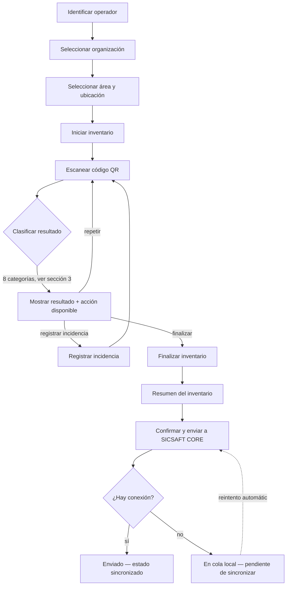

# DOC-001: Flujo oficial de captura (APP QR SICSAFT)

Evidencia de la tarjeta DOC-001 del tablero [SICSAFT](https://trello.com/b/nCi6W4oB/sicsaft). Define el flujo de referencia contra el que se mide la cobertura funcional actual (ver [AUDIT-SICSAFT-FLOW.md](./AUDIT-SICSAFT-FLOW.md)) y contra el que deben construirse TASK-004 a TASK-010.

## 1. Diagrama del flujo

Cada inventario es una **sesión** (operador + organización + área + ubicación + fecha de inicio/cierre + activos esperados/encontrados/faltantes/externos + incidencias + estado de sincronización) — no escaneos sueltos. El detalle de implementación de la sesión es responsabilidad de TASK-004; este documento solo fija el flujo y las pantallas que la sesión debe soportar.

## 2. Pantallas mínimas

> **Actualizado**: la tabla de abajo era el baseline de Inception (pre TASK-004 a TASK-010), donde
> casi nada existía todavía. Las 12 pantallas están **✅ Activo** hoy — TASK-004 a TASK-010 se
> completaron (ver `app-qr-sicsaft/HANDOFF-APP-QR-SICSAFT.md` y `README.md`, que ya listan las 10
> etapas del flujo como implementadas). El detalle fila por fila queda como registro histórico de
> qué se construyó en cada tarea, no como estado pendiente.

| # | Pantalla | Estado en el código actual |
|---|---|---|
| 1 | Inicio de sesión | ✅ Activo — `src/components/OperatorGate.tsx` + login OIDC/PKCE real (`src/lib/oidc/`) |
| 2 | Selección de organización | ✅ Activo — `src/components/OrganizationPicker.tsx` |
| 3 | Selección de área y ubicación | ✅ Activo — `src/components/AreaLocationPicker.tsx` |
| 4 | Lista de inventarios | ✅ Activo — `src/pages/HistoryPage.tsx` |
| 5 | Creación o inicio de inventario | ✅ Activo — `src/pages/ScanPage.tsx` con metadatos de sesión completos (operador/organización/área/ubicación) |
| 6 | Escáner QR | ✅ Activo — `src/components/QrScanner.tsx` |
| 7 | Resultado del escaneo | ✅ Activo — clasificación de 8 categorías (sección 3) vía `src/lib/scan-resolve.ts` |
| 8 | Ficha resumida del activo | ✅ Activo — resuelta en el flujo de escaneo |
| 9 | Registro de incidencia | ✅ Activo — `src/components/IncidentDialog.tsx` |
| 10 | Resumen del inventario | ✅ Activo — vista de reporte con incidencias y activos externos incluidos |
| 11 | Confirmación y envío | ✅ Activo — Conector QR real (`src/lib/qr-connector.ts`, DOC-002/DOC-006) contra CIS→CORE, no solo export CSV local |
| 12 | Estado de sincronización | ✅ Activo — cola offline con reintento (`src/lib/sync-queue.ts`, TASK-008) |

## 3. Clasificación de resultados del escaneo

Cada lectura de QR debe resolverse en una de estas categorías. La app debe mostrar claramente qué ocurrió y qué acción puede tomar el operador — nunca solo "encontrado/no encontrado".

| Categoría | Qué significa | Acción disponible para el operador |
|---|---|---|
| Activo correcto | El código pertenece a un activo esperado en esta organización/área/ubicación | Queda marcado como encontrado; continuar escaneando |
| Activo de otra área | El activo existe pero está registrado en otra área de la misma organización | Ver a qué área pertenece; opción de reportarlo como "fuera de lugar" o continuar |
| Activo de otra ubicación | El activo existe pero está registrado en otra ubicación | Igual que arriba, a nivel ubicación |
| Activo no registrado | El código no corresponde a ningún activo conocido en la BPI — Base Patrimonial Inteligente | Opción de registrar como hallazgo / activo externo, o descartar |
| Código QR inválido | El código leído no tiene el formato esperado (no es un QR de activo) | Mensaje de error claro; reintentar escaneo |
| Activo duplicado | El mismo código físico aparece registrado más de una vez en la base | Alertar; requiere resolución manual fuera del flujo de escaneo (no la resuelve el operador en campo) |
| Activo ya escaneado | El código ya fue leído en esta misma sesión de inventario | Aviso de "ya contado"; no se duplica en el conteo |
| Activo con incidencia | El activo se identifica correctamente pero el operador necesita dejar una nota (daño, faltante de accesorio, mal estado, etc.) | Abre el formulario de registro de incidencia (pantalla 9) |

## 4. Envío de resultados

Al finalizar el inventario (pantalla 10 → 11), la sesión completa se envía a SICSAFT CORE a través del **Conector QR** (contrato a definir en DOC-002). Si no hay conexión, la sesión queda en cola local (pantalla 12, implementación en TASK-008) y se reintenta automáticamente sin perder los datos ya escaneados.

## Dependencias hacia el resto del backlog
- **TASK-004** (sesiones de inventario) implementa el modelo de datos detrás de las pantallas 1–5.
- **TASK-005** (normalizar resultados) implementa la tabla de la sección 3.
- **DOC-002** (contrato del Conector QR) define cómo se envían los resultados de la sección 4 — bloqueante para las pantallas 11–12 y para TASK-006/007/008.
