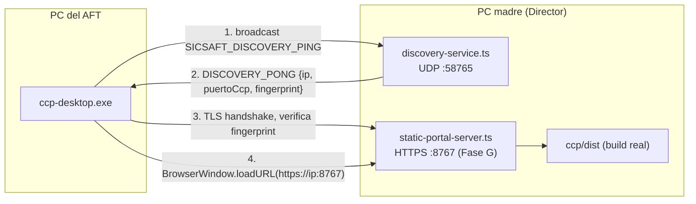

# ARCHITECTURE — `ccp-desktop`

## 1. Qué es y qué no es

`ccp-desktop` es un **launcher Electron liviano**, no un sistema con backend. Su única lógica
propia es: descubrir la PC madre en la LAN → verificar su certificado → abrir una `BrowserWindow`
apuntando al CCP que esa PC madre ya sirve. Todo lo demás (auth OIDC/PKCE, datos, UI del CCP) sigue
viviendo donde vive hoy (`ccp/`, servido por `sicsaft-core.exe` vía `static-portal-server.ts`,
Fase G de [DOC-028](../../sicsaft-core/design-artifacts/DOC-028-camino-a-cliente-final.md)).

## 2. Flujo de arranque

1. `ccp-desktop` arranca, intenta primero la última IP persistida (RF-05). Si responde y el
   certificado matchea el fingerprint guardado, salta directo al paso 4.
2. Si no hay IP guardada o dejó de responder, transmite el ping UDP (RF-01) y espera respuestas con
   timeout corto (a definir, ~3s con reintentos).
3. Si llega una única respuesta: pide confirmación una sola vez ("¿Conectar a `<nombre>` en
   `<ip>`?") antes de guardarla — evita conectarse ciegamente a la primera PC que responda en una
   LAN compartida (ver pregunta abierta 2 de REQUIREMENTS.md). Si llegan varias, lista todas para
   que el AFT elija.
4. Verifica el certificado (ver 3. Confianza del certificado) y abre la `BrowserWindow` sobre
   `https://<ip>:8767`.
5. Si el discovery no encuentra nada, cae al formulario manual de IP (RF-04).

## 3. Confianza del certificado — la parte que no se puede resolver "después"

El CCP de la PC madre corre HTTPS con el certificado **autofirmado** de `appqr-tls.ts` (mismo que
usa la APP QR). Un `BrowserWindow` de Electron por defecto **rechaza** un cert autofirmado
(`ERR_CERT_AUTHORITY_INVALID`) — hay que decidir cómo confiar en él sin abrir la puerta a que
cualquier PC de la LAN se haga pasar por la PC madre:

- **Opción A (recomendada)** — el `DISCOVERY_PONG` (RF-02) incluye el fingerprint SHA-256 del cert
  actual de la PC madre. `ccp-desktop` intercepta `app.on('certificate-error')`, calcula el
  fingerprint del cert que le presenta el servidor en el handshake TLS, y solo lo acepta si
  coincide con el que vino por UDP. Sigue siendo *trust-on-first-use* (alguien podría falsificar
  ambos canales a la vez), pero ya no es "aceptar cualquier cert autofirmado sin mirar".
- **Opción B (descartada por ahora)** — distribuir una CA propia de SICSAFT y firmar el cert de
  `appqr-tls.ts` con ella en vez de autofirmarlo. Más correcto en teoría, pero cambia cómo
  `sicsaft-core` genera certificados (afecta también a la APP QR) — alcance mayor al de esta fase.

Sea cual sea la opción, **no queda en manos del AFT** aceptar manualmente una advertencia de
certificado — ese es exactamente el paso "se siente web" que esta fase busca eliminar (ver
INTENT.md).

## 4. Empaquetado

Mismo patrón que `sicsaft-core` (RNF-03): `electron-vite` para dev/build, `electron-builder` +
NSIS para el instalador. A diferencia de `sicsaft-core`, no hay `extraResources` de Postgres ni
Keycloak que vendorizar — el instalador debería ser sustancialmente más chico (sin binarios de
base de datos ni JRE).

## 5. Qué reusa vs. qué es nuevo

| Pieza | Reusa | Nuevo en `ccp-desktop` |
|---|---|---|
| Protocolo de descubrimiento UDP | `discovery-service.ts` (servidor, ya existe) | Cliente que emite el ping y parsea la respuesta |
| Fingerprint del cert en la respuesta | — | Campo nuevo en `armarRespuestaDiscovery` (RF-02) |
| CCP (UI, lógica, auth OIDC) | `ccp/dist` tal cual, sin cambios | — |
| Logging a archivo | Patrón de `sicsaft-core/src/main/services/logger.ts` | Instancia propia, mismo patrón |
| Empaquetado | Config de `electron-builder` de `sicsaft-core` como plantilla | `package.json`/`build` propios, sin las `extraResources` de Postgres/Keycloak |

## 6. Pendiente de decidir antes de escribir código

Las 3 preguntas abiertas de `REQUIREMENTS.md` (timeout/reintento de discovery, múltiples PC madre
en la misma LAN, distinción de íconos) más la elección de Opción A vs. B de la sección 3 acá
arriba. Ninguna bloquea crear el esqueleto del proyecto, pero sí bloquean implementar el flujo de
conexión real.
