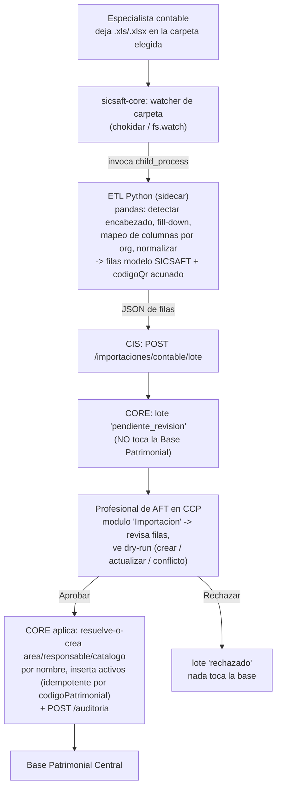

# DOC-029 — Endurecimiento del CCP para cliente real

Contrato formal de la fase, mismo esquema que DOC-019/020/021/022. Nace en el portal del
Profesional de AFT (`ccp/`) pero toca `cis/`, `core/` y `sicsaft-core/` — se documenta acá porque
la decisión de diseño de cada punto es una necesidad del portal AFT (CLAUDE.md "una fase que toca
varias capas se documenta bajo el sistema donde nace la decisión").

> **Origen (2026-08-31)**: pedido del usuario, con un cliente real ya sobre `sicsaft-core.exe`
> (DOC-028). Seis frentes; alcance de cada uno confirmado por el usuario en la misma sesión.
> **v2 (2026-08-31)** — decisiones cerradas: RF-B = sidecar Python; RF-H = APK WebView propia
> mínima (opción B), se construye ya; "Dirección" = CORE refleja el Excel tal cual en esta v1.
> **v3 (2026-08-31)** — reconciliación con el avance real + `casos-de-uso/`: RF-A y las capas
> CORE/CIS/ETL de RF-B ya commiteadas; se formaliza **RF-I** (contrato de la Pantalla 8, antes
> suelto en `casos-de-uso/CONTRATO-PANTALLA-8.md`) como octavo frente; se agrega el desglose de
> tareas de **RF-B.4** (capa CCP + watcher + empaquetado) y la sección **§Vacíos de casos de uso
> fuera de alcance** (los CU del catálogo que ningún RF cubre, con recomendación in/out Nivel 1).

**Estado (v3): RF-G, RF-A y RF-B (capas ETL Python + CORE staging + CIS puente) implementados y
commiteados en el stack de ramas. Falta: RF-B.4 (capa CCP + watcher del `.exe` + empaquetado del
sidecar), RF-I, RF-F, RF-D, RF-E, RF-H. RF-C sigue bloqueado por el spec de Guido. Detalle por
frente en la tabla §0 y estado por rama en §Plan de fases.**

---

## 0. Resumen de los frentes

| ID | Frente | Capas | Estado (v3, 2026-08-31) |
|----|--------|-------|--------|
| **RF-A** | Flag de nivel (1/2) en CCP — gate de módulos/features (+ retiro de Contratos e Inventarios del portal) | CCP + `sicsaft-core` config | ✅ **Hecho** (`feat/ccp-nivel-flag`, `92f6a0e`→`e3169bf`) |
| **RF-B** | Ingesta de Excel supervisada — carpeta → **ETL Python** → CIS → CORE (staging) → **revisión del AFT** → BPI | Python sidecar + CORE + CIS + CCP | 🟡 **Parcial**: ETL Python (`772df6f`), CORE staging + resolve-or-create (`c41a054`), CIS puente (`cedd836`), **CCP revisión de lotes** (`cecb0b7`) y **selector de carpeta IPC** (`707d732`) hechos. **Falta B.6.2**: watcher del `.exe` (chokidar → ETL → CIS) + su token de servicio + empaquetado del sidecar Python en `prepack.cjs`. |
| **RF-C** | 3 pestañas nuevas en el resumen (Dashboard) | CCP | 🔒 **Bloqueado — spec lo entrega Guido** |
| **RF-D** | Veredicto de sesión accionable → Auditoría / baja / Inventario / Contrato | CCP + 1 automatización en CORE | Diseñado — pendiente |
| **RF-E** | Auditoría por **área operativa real** del actor + columna "Revisar" | CORE + CIS + CCP | Diseñado — pendiente |
| **RF-F** | Módulo **"QR / Etiquetas"** en CCP — todos los códigos acuñados, por dirección, QR + código de barras, listos para imprimir | CCP + CORE (lectura) | ✅ **Hecho** (`feat/ccp-etiquetas-qr`, `20a82e5`) — verificado en modo mock |
| **RF-G** | Fix: crash del login por timeout + layout del wizard roto a pantalla completa | `sicsaft-core` | ✅ **Hecho** (`fix/sicsaft-core-login-timeout-crash`, `db268a1`) |
| **RF-H** | APK Android — WebView propia mínima, generada en build-time, servida por el `.exe` | `apk-aft/` (nuevo) + `sicsaft-core` | Diseñado — pendiente |
| **RF-I** | **Pantalla 8** — informe de control de área: agregación (%, desglose por estado declarado, tipo ordinario/extraordinario, nombres) + presentación con fondos verde/amarillo/rojo, en la APP QR y en el Resumen del CCP | CORE (lectura) + CIS + APP QR + CCP | 🟡 **Parcial**: capa CORE (`f64bda1`) + puente CIS (`3d9256d`) hechos. Falta la **presentación** en APP QR y CCP. Contrato: [`casos-de-uso/CONTRATO-PANTALLA-8.md`](../../../casos-de-uso/CONTRATO-PANTALLA-8.md) |

Reemplaza / extiende:

- **DOC-025 §1** ("Portal de Profesional de AFT: dos piezas distintas, no una"): RF-A revierte la
  decisión de *"no es una versión desbloqueada vía feature flag — es una aplicación distinta"*
  (RF-A §1).
- **DOC-016** (Conector CON-CONTABILIDAD): RF-B reusa los **conceptos de transporte** (carpeta
  local vigilada, identidad sintética para el paso de ingesta, idempotencia por fila, canal de
  auditoría) pero **reemplaza su implementación**: parser Python (no `split(',')` en Node),
  formato `.xls`/`.xlsx` real, y una **compuerta humana** que DOC-016 explícitamente no tenía
  (*"sin intervención humana"*, DOC-016 §1).
- **DOC-028 Fase E** (APK Android, diferida): RF-H la des-difiere con un alcance acotado
  (WebView propia, no TWA/PWABuilder — ver RF-H §1).

No reabre: [ADR-004](../../../adr/ADR-004-identidad-keycloak-reemplaza-zitadel.md) (Keycloak),
[DOC-023](DOC-023-matriz-permisos-rbac.md) (RBAC — RF-B/RF-D/RF-E/RF-F reusan guards existentes),
el invariante de Tomo III 4.10 (baja por `estado`, nunca `DELETE` — RF-D lo respeta).

---

## RF-A — Flag de nivel (1/2) en CCP

### A.1 Qué resuelve y por qué revierte DOC-025

DOC-025 reservó para el Profesional de AFT **dos aplicaciones distintas**: un "web-aft" liviano de
Nivel 1 y `ccp/` completo recién en Nivel 2. Estado real: el "web-aft" liviano **nunca tuvo
código** (DOC-025 §1, 🔲); `ccp/` existe, probado, y `sicsaft-core.exe` **ya lo embebe completo
sin condicionarlo al nivel** (DOC-025 excepción 2026-08-28).

**Decisión del usuario (2026-08-31)**: en vez de una segunda app, `ccp/` gana un `nivel` de
ejecución (`1` | `2`) que oculta los módulos/acciones de "gestión avanzada" cuando corre en Nivel
1. Es la "decisión de diseño nueva" que DOC-025 §2 anticipó.

### A.2 De dónde sale el flag — no es un dato de dominio

DOC-025 §2 sigue en pie: **no se agrega un campo `nivel` a `Contrato`/`Organización`/`Sede`**.

1. **`.exe`**: `instalacion.json` gana `nivel` (default `1`), fijado en el bootstrap. `sicsaft-core`
   lo inyecta al servir `ccp` por el canal de config runtime de DOC-028 Fase C.0 —
   `window.__SICSAFT_PORTAL_CONFIG__.VITE_SICSAFT_NIVEL` (ver `static-portal-server.ts`
   `inyectarConfigRuntime`, `handlers.ts` `asegurarServidoresPortales`).
2. **`devops/onprem`**: env var `VITE_SICSAFT_NIVEL` en el servicio `ccp` del Compose.
3. **Fallback dev/local**: `import.meta.env.VITE_SICSAFT_NIVEL`, default **`2`**.

Lectura en CCP: helper `nivelActual(): 1 | 2` en `src/lib/nivel.ts` (mismo patrón que
`oidc-config.ts` `requireEnv` de DOC-028 C.0).

### A.3 Qué muestra cada nivel

`nivel` es el **techo**; `modulosContratados` (ya existente) sigue siendo el permiso fino por
organización. Un módulo se muestra si el nivel lo permite **y** está en `modulosContratados`.

| Módulo del hub | Nivel 1 | Nivel 2 |
|---|---|---|
| Activos | ✅ **solo consulta** (sin alta manual) | ✅ completo |
| Inventarios | ✅ | ✅ |
| Dashboard | ✅ | ✅ |
| **Ingesta / Importación (RF-B)** | ✅ (único camino de carga en Nivel 1) | ✅ |
| **QR / Etiquetas (RF-F)** | ✅ | ✅ |
| Contratos | ❌ | ✅ |
| Estructura (ABM áreas/ubicaciones/responsables) | ❌ | ✅ |
| Administración (transversal) | ❌ | ✅ |

Enforcement: **solo oculta en la UI**. El guard real sigue en CIS/CORE (DOC-023).

---

## RF-B — Ingesta de Excel supervisada

### B.1 Alcance confirmado (2026-08-31)

> "En el CCP, donde dice Importación, uno selecciona una carpeta del PC donde se cargan los Excel
> y mediante programación se hace ETL de la información y se transforma al modelo de SICSAFT. Esa
> información pasa por CIS, luego CORE, y en CORE espera validación del Profesional de AFT por el
> portal."

ETL = **sidecar Python** (`pandas` + `xlrd`), decisión del usuario: el Excel real
(`EJEMPLOS DE EMPRESAS Y AFT.xls`, inspeccionado en esta sesión) tiene encabezado en la fila 5,
celdas combinadas (`DIRECCION`/`AREA`/`RESPONSABLE` con fill-down), y una columna `CATEGORIA` de
texto libre — `pandas` reshapea eso sin esfuerzo; un parser Node a mano no.

### B.2 Flujo

Respeta el invariante de CLAUDE.md: nada escribe directo a la BPI, todo pasa por CIS→CORE, y ahora
además hay aprobación humana explícita.

### B.3 Sidecar Python — `herramientas/etl-contable/`

- Carpeta nueva en la raíz (no un desplegable — es una herramienta, criterio de CLAUDE.md como
  `aidlc-docs/`). Contenido: `etl_contable.py` (CLI: `--entrada archivo.xls --mapeo mapeo.json
  --salida -` → JSON a stdout), `mapeo/` con un `mapeo-<organizacionId>.json` de ejemplo,
  `requirements.txt` (`pandas`, `xlrd`), `tests/` (pytest, con un `.xls` fixture chico).
- Qué hace: detección de fila de encabezado (busca la fila con `CODIGO`/`DIRECCION`), fill-down de
  combinadas, remapeo de columnas por `mapeo-<org>.json`, normalización de tipos
  (`VALOR.CLP.` → número, `FECHA COMPRA` → ISO), **acuñado de `codigoQr`** a partir de `CODIGO`
  (namespaced: `<organizacionId>:<CODIGO>` o solo `<CODIGO>` — ver B.6), y `--dry-run` local que
  reporta filas sin `CODIGO`, duplicados en el archivo, y `CATEGORIA` desconocidas.
- Empaquetado en el `.exe`: Python embebido (`python-build-standalone`, ~15 MB comprimido) +
  `pandas`/`xlrd` en un venv, copiado por `prepack.cjs` a `resources/etl-contable/`. `sicsaft-core`
  lo invoca con `execFile(rutaPythonEmbebido, [rutaScript, ...args])`.

### B.4 CORE — bandeja de staging

Migración `node-pg-migrate` en `core/migrations/` — dos tablas nuevas. **v1: reflejan el Excel tal
cual** (decisión del usuario), no el modelo canónico reducido:

- `importacion_contable_lote`: `id`, `organizacion_id`, `origen`, `archivo_nombre`, `recibido_en`,
  `estado` (`pendiente_revision` | `aprobado` | `rechazado`), `revisado_por`, `revisado_en`,
  `resumen` (jsonb).
- `importacion_contable_lote_fila`: `id`, `lote_id`, `linea`, y las columnas del Excel del cliente
  mapeadas a nombres estables: `direccion`, `area`, `responsable`, `codigo_patrimonial`,
  `nombre_aft`, `categoria`, `estado_aft`, `marca`, `modelo`, `serie`, `fecha_compra`,
  `valor_clp`, `codigo_qr` (acuñado). `dry_run_resultado` (`crear` | `actualizar` | `conflicto`),
  `dry_run_motivo`.

**No es un registro oficial de Base Patrimonial** (Tomo III 4.10 no aplica: bandeja de entrada).
Usa `estado` en vez de borrar; un job de limpieza de lotes cerrados > N días es aceptable.

Endpoints nuevos (guard `administrador-patrimonial` en la organización, DOC-012 §3):

| Método | Ruta | Qué hace |
|---|---|---|
| `POST` | `/importaciones/contable/lote` | Crea lote + filas `pendiente_revision`, calcula dry-run, devuelve `id` + resumen |
| `GET` | `/importaciones/contable/lotes?estado=&organizacionId=` | Lista |
| `GET` | `/importaciones/contable/lotes/:id` | Lote + filas con `dry_run_resultado` |
| `POST` | `/importaciones/contable/lotes/:id/aprobar` | **Resuelve-o-crea** área/responsable/catálogo por nombre, inserta activos (idempotente por `codigo_patrimonial`), marca `aprobado`, `POST /auditoria` |
| `POST` | `/importaciones/contable/lotes/:id/rechazar` | Marca `rechazado` (+ motivo), `POST /auditoria`, nada toca la BPI |

El "aprobar" es más grande que resolver IDs ya presentes: reflejar el Excel implica crear áreas,
responsables y catálogo tipos que todavía no existen. Todo eso pasa por los servicios de dominio
de CORE existentes, nunca `INSERT` directo.

### B.5 CIS

Endpoint nuevo `POST /importaciones/contable/lote` en el bridge — passthrough a CORE con la
identidad sintética de DOC-016 §5 (`operadorId: 'ingesta-contable'`, rol
`administrador-patrimonial` afirmado por config; CORE re-verifica igual). **La aprobación** la hace
un humano con su JWT real desde CCP, no la identidad sintética.

### B.6 CCP + watcher + empaquetado — lo único que falta de RF-B

Rama `feat/ccp-ingesta-revision` (off `feat/etl-contable-python`). Estado (2026-08-31): B.6.3 y
B.6.1 **hechos y commiteados**; B.6.2 (watcher + empaquetado) pendiente — necesita el stack
arriba para validar el round-trip real.

#### B.6.3 CCP — módulo Importaciones (✅ hecho, `cecb0b7`)

| Archivo | Cambio |
|---|---|
| `src/lib/cis-client.ts` | `listar/obtener/aprobar/rechazarLoteImportacionContable` contra `/admin/importaciones/contable/lote*` (endpoints ya existentes de `feat/cis-ingesta-lote`). Tipos `LoteImportacionContable` / `FilaLoteImportacionContable` espejo de `cis/src/core-client/core-client.types.ts`. |
| `src/pages/ImportacionesPage.tsx` → `pages/importaciones/` | Se parte en `LotesRevision` (bandeja) + `CargaManualCsv` (lo que había, sin cambios). `LotesRevision`: lista de lotes (`pendiente_revision` arriba, `ordenarLotes`), detalle por lote con tabla de dry-run por fila (`crear`/`ya_importado`/`conflicto` como `<Badge>`) filtrable, **Aprobar** / **Rechazar** (rechazo con motivo opcional inline, no `prompt`). Aprobar → toast con contadores + refresco. Muestra `VITE_SICSAFT_CARPETA_INGESTA` (solo lectura). |
| `src/lib/lotes-importacion.ts` + `.test.ts` | Helpers puros: `contarDryRun`, `loteAccionable`, `ordenarLotes`. |
| `src/lib/importacion-csv.ts` + `.test.ts` | `parsearCsv` extraído de la página para testearlo (antes era una función suelta sin cobertura). |
| `src/components/ui.tsx` | `Badge`: 6 keywords nuevos (estados de lote + resultado de dry-run). |

#### B.6.1 `sicsaft-core` — selector de carpeta (✅ hecho, `707d732`)

El CCP embebido se sirve como PWA estática **sin preload** (`portal-login-service.ts` crea la
`WebContentsView` con `sandbox: true`, sin bridge) → no puede abrir un diálogo nativo. La
elección de carpeta va en el **wizard del `.exe`** (que sí tiene IPC) y el CCP la recibe por
config runtime, solo lectura.

| Archivo | Cambio |
|---|---|
| `src/shared/ipc-contract.ts` | `InstalacionCompleta.carpetaIngesta?: string`; `SicsaftCoreApi.elegir/leerCarpetaIngesta(): Promise<string \| null>`. |
| `src/main/services/instalacion-marker.ts` | `actualizarCarpetaIngestaInstalacion()` (mismo patrón que `actualizarIpLanInstalacion`). |
| `src/main/ipc/handlers.ts` | Handler `elegirCarpetaIngesta`: `dialog.showOpenDialog(ventana, { properties: ['openDirectory', 'createDirectory'] })` → persiste. `asegurarServidoresPortales` agrega `VITE_SICSAFT_CARPETA_INGESTA` al `configRuntime` de `ccp`. |
| `src/preload/index.ts` | Expone ambos. |
| `src/renderer/.../components/CarpetaIngesta.tsx` | Componente del wizard, dos modos: tarjeta en "Instalación completa" + versión compacta en la franja del portal cargado. |

#### B.6.2 `sicsaft-core` — watcher + token de servicio + empaquetado (⬜ pendiente)

| Archivo | Cambio |
|---|---|
| `src/main/services/ingesta-watcher.ts` **(nuevo)** | `chokidar.watch(carpeta, { ignoreInitial: true, awaitWriteFinish: { stabilityThreshold: 2000 } })` sobre `*.xls`/`*.xlsx`. Por cada `add`: `execFile(rutaPythonEmbebido, [rutaScript, '--entrada', archivo, '--organizacion', orgId, '--mapeo', rutaMapeoOrg, '--cis-url', 'http://127.0.0.1:56000', '--token', tokenServicio])`. Mueve el `.xls` a `<carpeta>/.procesados/` o `.error/`. Log a `ingesta.log`. Unit-testable con carpeta temporal + `execFile` mockeado. |
| Wiring del arranque | Tras `asegurarServidoresPortales`, si hay `carpetaIngesta` → `iniciarWatcher`. Reiniciar cuando el usuario cambia la carpeta (el handler `elegirCarpetaIngesta` ya persiste; falta que dispare el reinicio). |
| **token de servicio** — decisión pendiente | Todo `cis/src/administrador/AdministradorController` es `@UseGuards(KeycloakAuthGuard, RateLimitGuard)` — **no hay ruta con `ServiceTokenGuard`** para el lote. El watcher necesita un JWT que `KeycloakAuthGuard` acepte con el rol `administrador-patrimonial`. Opción v1: un **service account** dedicado en Keycloak (client `sicsaft-ingesta`, grant `client_credentials`, rol `administrador-patrimonial` en la organización del cliente), provisionado en el bootstrap junto al resto de clients. El `.exe` pide el token con `client_credentials` (mismo mecanismo que ya usa para la Admin API) y lo pasa al ETL. La "identidad sintética `ingesta-contable`" de DOC-016 §5 sigue siendo lo que CIS **reenvía a CORE** como `operadorId`; la aprobación la hace el humano con su JWT real. |
| `resources/etl-contable/` + `prepack.cjs` | Vendorizar `python-build-standalone` (win-x64, ~15 MB) + venv con `pandas`/`xlrd`, copiar `herramientas/etl-contable/`. `execFile` con ruta absoluta y `PATH` acotado (sonar S4036, mismo criterio que el `prepack.cjs` actual). En **dev** usa el `python` del sistema + la carpeta del repo. `extraResources` incluye `resources/etl-contable/**`. Necesita red (descarga) y un Windows real para validar. |

- No se unifica la carga manual bajo staging (decisión del usuario): el AFT que sube un CSV a mano
  ya es el humano que revisa, en ese acto.

### B.7 `codigoQr` acuñado — resuelto en el ETL

El ETL ya acuña `codigoQr = CODIGO.strip().upper()` (el propio código del Excel, `DG-001`), único
por organización, ASCII corto → representable como QR **y** como Code128 (lo confirma RF-F). Sin
prefijo de organización en v1. Ver `herramientas/etl-contable/etl_contable.py` `acunar_qr`.

---

## RF-C — 3 pestañas nuevas en el resumen — BLOQUEADO

`DashboardPage.tsx` pasa de scroll único a layout con pestañas. Tres pestañas nuevas cuyo
contenido **lo define Guido**. No se diseña ni se codea hasta tener ese spec.

Fijado ahora, porque RF-D lo necesita: patrón de tabs compound (`web/patterns.md`), estado en la
URL (`?tab=`) para deep-linking. Las secciones actuales del Dashboard se reparten en "General" +
las 3 de Guido, sin perder ninguna.

> **Pestaña 1**: _(pendiente)_ · **Pestaña 2**: _(pendiente)_ · **Pestaña 3**: _(pendiente)_

---

## RF-D — Veredicto de sesión accionable

### D.1 Alcance confirmado — "Mixto"

Links profundos para navegar + **una** acción automática (D.3).

Veredicto de sesión: `exitoso` | `aceptable` | `defectuoso` (DOC-017; `verdict.ts`). "Excelente"
del usuario = **`exitoso`**. Aparece en el Dashboard (tarjeta "Sesiones de inventario":
`sesionId`, `areaId`, `veredicto`, `fechaCierre`) y en Inventarios.

### D.2 Links profundos (sin escritura)

Cada sesión gana un grupo de acciones que llevan `organizacionId` + `areaId` + (cuando aplique)
los `codigoQr` observados:

| Destino | Link |
|---|---|
| **Auditoría** | `/auditoria?organizacionId=…&area=…` (usa el filtro por área de RF-E) |
| **Inventario** | `/inventarios?organizacionId=…&sesionId=…` |
| **Contrato** | `/contratos?organizacionId=…` |
| **Baja de activo** ("eliminar") | `/activos?organizacionId=…&baja=<codigoQr,…>` → `cisClient.bajaActivo` (soft, `estado`, **nunca `DELETE`**, Tomo III 4.10) |

Los 4 links siempre visibles; el veredicto solo cambia el énfasis.

### D.3 Acción automática — **aprobada por el usuario (2026-08-31)**

Cuando una sesión cierra con veredicto **`defectuoso`** (faltan ítems **y** hay ítems fuera de
área), CORE registra automáticamente **una entrada de auditoría**:

- `operacion: 'sesiones/{id}/veredicto-defectuoso'`, `resultado: 'registrado'`, `observaciones`:
  cantidad de faltantes + fuera de área + `areaId`.
- Canal: `POST /auditoria` (mismo que otros flujos no-humanos, DOC-024 §3).
- **No** da de baja nada, **no** toca la Base Patrimonial, **no** cambia estado de activos. Solo
  rastro. Únicamente para `defectuoso`, nunca `aceptable` (ruido).

---

## RF-E — Auditoría por área operativa real

### E.1 Alcance confirmado — "Campo real en CORE"

Hoy `auditoria` no tiene el área del actor (`core/src/auditoria/auditoria.types.ts`). Cambio
multi-capa.

### E.2 CORE

- Migración: `auditoria` gana `area_operativa text NULL` (histórico y eventos sin área → `null`).
- `RegistrarAuditoriaInput` / `AuditoriaEntrada` ganan `areaOperativa?: string | null`.
- `AuditoriaFiltro` gana `area?: string` (parcial `ILIKE`). `GET /auditoria` acepta `?area=`.

### E.3 CIS

Passthrough en ambos sentidos del bridge `/admin/auditoria`. El actor humano trae su área del
claim de Keycloak (o de la sesión); los flujos sin humano (ingesta, veredicto automático) mandan
`null` o `'sistema'`.

### E.4 CCP — `AuditoriaPage.tsx`

Cambio pedido: *"donde dice usuario poner área, operación, revisar"*.

- Columnas: `Usuario` **→ `Área`**. `Operación` se mantiene. `Resultado` / `Observaciones` se
  mantienen. Se agrega **`Revisar`** = botón que expande la fila con el detalle completo
  (`usuario`, `equipo`, `ip`, `categoria`, `organizacionId`, `observaciones`). **El usuario no se
  pierde** — pasa al detalle.
- Filtro superior: `Usuario` **→ `Área`**; se mantiene `Usuario` como filtro secundario.

---

## RF-F — Módulo "QR / Etiquetas" en CCP — ✅ HECHO

### F.1 Qué resuelve

Es el **paso 3** de la estrategia de validación del usuario: una vez cargados los AFT (RF-B),
generar los códigos QR de cada uno, **separados por dirección**, para imprimir en etiquetas y
meterlos en sobres por dirección.

### F.2 Cómo quedó (`feat/ccp-etiquetas-qr`, `20a82e5`)

- Ruta `/etiquetas` (`RequireModulo 'etiquetas'`, ya en `MODULOS_NIVEL_1` de RF-A) + nav en
  `AppShell`/`HubPage` + `IconQrCode`.
- Datos: `GET /catalogo` + `GET /admin/areas` (ya existentes). Agrupa por **dirección** =
  `area.dependencia` (RF-B la refleja de la columna DIRECCION del Excel al resolver-o-crear el
  área) y dentro por **área**. Helper puro `src/lib/etiquetas.ts` (`agruparParaEtiquetas`, orden
  numeric-aware, grupos "Sin dirección"/"Sin área").
- Cada activo = una **etiqueta** (`src/components/EtiquetaActivo.tsx`): `codigoQr` como **QR**
  (PNG data URL vía `qrcode` — única dependencia nueva, la misma que usa `sicsaft-core`; se
  generan todos una vez con `Promise.all`) **y** como **código de barras Code 128** (encoder
  propio `src/lib/code128.ts`, tabla canónica + checksum ponderado, **sin dependencia**), más
  nombre y área.
- Impresión: `@media print` en `index.css` — fuera del chrome de la app (`.no-print`), una
  dirección por página (`.direccion { break-before: page }`), etiquetas sin cortar. Filtro por
  dirección + "solo activos vigentes" + botón Imprimir (`window.print()`).
- Sin backend nuevo. Cobertura: `code128.test.ts` (5) + `etiquetas.test.ts` (3). Verificado en
  el navegador en modo mock (agrupación, QR y Code 128 renderizados).

---

## RF-G — Fix: crash del login + layout del wizard ✅ HECHO

Encontrados probando con el cliente real (2026-08-31). Rama
`fix/sicsaft-core-login-timeout-crash`:

1. **Crash del proceso main** (`portal-login-service.ts`): el timeout de 60s del login hacía
   `view.webContents.off()` sobre una `WebContentsView` ya destruida (el usuario > 60s en una
   pantalla previa sin loguearse) → `TypeError: Cannot read properties of undefined (reading
   'off')` no capturado → diálogo rojo "A JavaScript error occurred in the main process". Fix:
   guard `isDestroyed()` antes del `.off()`.
2. **Layout del wizard a pantalla completa** (`WizardApp.tsx`): `<main>` con `items-center`
   recortaba la parte de arriba del paso "Instalación completa" en ventanas bajas / pantalla
   completa (QR cortado). `[&>*]:m-auto` centra cuando entra y no recorta cuando desborda.
3. **Desalineación de la vista embebida** (`PasoListoConLogin.tsx`): la `WebContentsView` nativa
   se dibuja sobre el `placeholderRef`, pero el `ResizeObserver` no ve un traslado sin cambio de
   tamaño (scroll del `<main>`, reflow). Se re-envían bounds en `resize`/`scroll` y en reflows
   tardíos.

La pantalla "cambio de IP" (`PasoIpCambio`, DOC-028 C.1) **no es un bug** — funciona como debe
cuando la PC pasa de `127.0.0.1` a una IP de LAN real.

---

## RF-H — APK Android (WebView propia mínima)

### H.1 Por qué WebView propia y no TWA/PWABuilder — decisión del usuario (2026-08-31)

Un TWA (lo que genera PWABuilder/Bubblewrap) es Chrome cargando la PWA. Con **certificado propio
en IP de LAN**, Chrome no ofrece "Continuar" dentro de un TWA → **no carga**. Además la URL de
arranque queda compilada en el APK → un APK por instalación/IP. Y firmar un APK en la PC del
cliente al instalar necesita JDK+SDK+Gradle+keystore por cliente. Todo eso lo evita una **WebView
propia**.

### H.2 Diseño — `apk-aft/` (proyecto nuevo, no un desplegable)

- App Android nativa mínima (Kotlin, un `Activity`, un `WebView` a pantalla completa):
  - `webViewClient.onReceivedSslError` → `handler.proceed()` **solo** para el host/puerto
    configurado (servidor propio, solo LAN — riesgo aceptado y documentado).
  - Permiso de cámara + `WebChromeClient` para que la PWA use `getUserMedia` (escaneo de QR).
  - **Primer arranque**: no hay URL → pantalla que pide escanear el **QR de conexión** que muestra
    el `.exe`; se guarda la URL en `SharedPreferences`. Menú "Reconectar" para re-escanear cuando
    cambia la IP.
- **Build-time, una vez**: Android SDK + Gradle en CI (workflow nuevo `apk-aft-ci.yml`) o en
  `prepack.cjs`. Firmado con un keystore de proyecto (secreto de CI, **no** en el repo). Sale un
  `sicsaft-aft.apk` versionado.
- **Distribución**: `prepack.cjs` copia el `.apk` a `resources/apk/`. `sicsaft-core` lo sirve en
  `https://<ip>:8765/sicsaft-aft.apk` (mismo servidor estático de la PWA, DOC-028 Fase D). La
  pantalla "listo" del wizard muestra **dos QR**: el de la PWA (ya existe) y uno nuevo para
  **descargar el APK**. Instalar pide "orígenes desconocidos" — se documenta en el runbook.
- **QR de conexión**: el `.exe` expone una pantalla con un QR que codifica
  `https://<ip>:8765` (la misma URL de la PWA) — la app lo lee en el primer arranque.

### H.3 Qué NO hace v1

- No se publica en Play Store (sideload por QR, org controlada).
- No auto-actualiza (una versión del APK por versión del `.exe`; reinstalar para actualizar).
- No hay verificación de Digital Asset Links (no es un TWA).

---

## RF-I — Pantalla 8 (informe de control de área)

### I.1 Alcance confirmado — spec del usuario (2026-08-31, "PANTALLA 8")

Título en pantalla: *RESULTADOS DE ACCIÓN DE SUPERVISIÓN Y CONTROL DE AFT*. La arma la APP QR al
cerrar el control de un área (CU-INV-004) y la envía a CORE; el CCP la muestra por sesión en el
Resumen. Contrato exacto (6 bloques + encabezado + veredicto con color):
[`casos-de-uso/CONTRATO-PANTALLA-8.md`](../../../casos-de-uso/CONTRATO-PANTALLA-8.md).

**Casi todo el plumbing ya existía** (Fase 3.1 / DOC-017): `InventarioRequest` lleva encabezado,
`escaneos[].estadoDeclarado` y `escaneos[].bajaSugerida`; `calcularVeredicto` idéntico en
`app-qr-sicsaft/` y `cip/`. RF-I es **agregación + presentación** — con **una** migración menor
(el estado declarado no quedaba asociado al escaneo).

### I.2 CORE — resumen de control por sesión — ✅ HECHO (`feat/core-cip-resumen-control`, `f64bda1`)

- **Migración `1756100000000`**: `inventarios` gana `estado_declarado` + `baja_sugerida_motivo`
  (nullable, con check). Se persisten por escaneo en `crear()` — además de seguir aplicándose como
  transición/evento. `inventarios` es la bitácora de escaneos, no un registro oficial (Tomo III
  4.10 no aplica).
- **`veredicto.ts`** en `core/src/inventarios/` — puerto de `calcularVeredicto`.
- **`SesionInventarioRepository.findResumenControl(id)`** (4 queries) + **`GET /inventarios/:id/control`**
  (`ServiceTokenGuard`, declarado antes de `:id`). Devuelve:

| Campo | Cálculo |
|---|---|
| `escaneados` | `count(inventarios WHERE sesion_id)` |
| `delArea` / `delAreaPct` | numerador = escaneos `resultado = correcto`; denominador = `count(activos WHERE area_id = <sesión> AND estado <> 'dado_de_baja')` |
| `porEstadoDeclarado` | `{ enServicio, enMantenimiento, inactivo, baja }` desde `estado_declarado` + `baja_sugerida_motivo` |
| `escaneadosLista[]` | `{ codigoQr, nombre, tipo, resultado }` — `nombre` compuesto (`construirNombreActivo`), `tipo` = `ordinario` si `tecnologia_identificacion = 'qr'`, `extraordinario` si `rfid`/`qr_rfid`, `null` si el escaneo no resolvió a un activo |
| `fueraDeArea[]` | `{ codigoQr, nombre, tipo, areaRealNombre }` — escaneos `otra_area`/`otra_ubicacion` |
| `faltantes[]` | `{ codigoQr, nombre }` — activos del área no escaneados en la sesión |
| `delAreaPct` + `veredicto` | los suma el service (`obtenerResumenControl`), regla pura |

Cobertura: repo/service/controller/veredicto 100% líneas-funciones + e2e contra Postgres real.

### I.2b CIS — passthrough — ✅ HECHO (`feat/cis-inventario-control`, `3d9256d`)

CCP y APP QR hablan con CIS, no con CORE. `GET /inventarios/:id/control` agregado al
`QrConnectorController` (mismo controller que sirve `GET /inventarios/:id` para **ambos** — no
hace falta un `/admin/...` aparte, la lectura del detalle de sesión ya es abierta a cualquier
operador autenticado). `core-client` gana el schema Zod espejo + `getInventarioResumenControl`;
`qr-connector` el proxy delgado. 3 archivos a 100% líneas-funciones, e2e nuevo.

### I.3 APP QR — Pantalla 8 al cerrar

Nueva pantalla tras `POST /inventarios`, renderiza el resumen de I.2 con los **fondos de color**
del veredicto (🟩 `exitoso` / 🟨 `aceptable` / 🟥 `defectuoso`). Confirmar/ajustar la UI de marcado
de estado por AFT durante el escaneo en `ScanPage.tsx` (el payload ya lo acepta).

### I.4 CCP — Resumen → detalle de sesión

`DashboardPage.tsx` / la tarjeta "Sesiones de inventario": al abrir una sesión, la **misma
Pantalla 8** (mismo contrato, mismos colores) que la APP.

### I.5 Relación con RF-D

El veredicto `defectuoso` de la Pantalla 8 es el mismo que dispara la auto-auditoría de RF-D §D.3
y el énfasis de los links profundos de RF-D §D.2. RF-I entrega la vista; RF-D las acciones.

---

## §Vacíos de casos de uso fuera del alcance de DOC-029

Del catálogo `casos-de-uso/` (Cap. 12), los CU que **ningún RF de esta fase cubre**. Recomendación
in/out para la entrega del cliente **Nivel 1 QR**, con el criterio de que Nivel 1 = flujo de
auditoría por QR + carga inicial; la "gestión avanzada" es Nivel 2 (RF-A ya la oculta).

| CU | Vacío | Recomendación Nivel 1 | Si el cliente lo pide |
|---|---|---|---|
| **CU-INV-001** Crear/programar inventario | Hoy el operador abre la sesión ad-hoc desde la APP; no hay estado `Programado` ni paso previo del Adm/Supervisor | **Fuera de v1** — el flujo ad-hoc alcanza para una municipalidad chica | RF nuevo `feat/core-inventario-programado` (tabla `inventario` con estado + alcance; el CCP lista y la APP filtra por inventario asignado) |
| **CU-INV-003** Conciliar — 6 categorías completas | El veredicto + 3 tarjetas del Resumen cubren *no localizado / fuera de área / incidencia*. Faltan "sobrante" (parcialmente visible como fuera-de-área) y "discrepancia de responsable", y un resultado de conciliación persistido como tal | **Parcial aceptable en v1** — RF-I formaliza la vista por sesión; la conciliación multi-sesión del Supervisor queda para después | RF nuevo `feat/cip-conciliacion` (vista dedicada + persistir el resultado de conciliación) |
| **CU-INC-001** Expediente de incidencia completo | Hoy `{codigoQr, descripcion}` dentro de la sesión. Sin categoría/responsable/estado propios, sin alta manual fuera de un relevamiento | **Fuera de v1** — para el relevamiento alcanza | RF nuevo `feat/core-incidencias-expediente` (tabla `incidencia` con máquina de estados) |
| **CU-INC-002** Resolver incidencia | Sin endpoint de cierre; el Resumen sólo muestra en lectura | **Fuera de v1** (depende de CU-INC-001) | Junto con CU-INC-001 |
| **CU-PAT-004** Traslado dedicado | `areaId`/`ubicacionId` se editan, pero no hay flujo "Trasladar" con evento y registro de ubicación anterior | **Fuera de v1** — oculto en Nivel 1 por RF-A de todos modos; la discrepancia de ubicación se ve en el relevamiento | RF nuevo cuando se habilite Nivel 2 |
| **CU-CIP-002** Reporte parametrizado PDF/Excel | Hay dashboards interactivos, no un generador con export y bloque "fecha + parámetros + contexto" | **Fuera de v1** — los dashboards alcanzan para la validación | RF nuevo `feat/cip-reporte-parametrizado` (usa el estilo de informe `.docx` ya definido en memoria del proyecto) |
| **CU-ADM-001/002** CRUD completo de usuarios | Sólo alta del Director (wizard) + "designar AFT" (Directivo). `web_admin/` en construcción (DOC-022) | **Suficiente para v1** — con 2-3 usuarios por organización el wizard + designar AFT cubren el alta | Terminar `web_admin/` (DOC-022, ya diseñado) |
| **RBAC** — Supervisor Patrimonial / Auditor sin rol propio | Hoy los cubre `administrador-patrimonial` (`casos-de-uso/MATRIZ-ACTOR-FUNCION.md`) | **Decisión requerida ANTES de entregar** si el cliente exige separación de funciones (que quien concilia ≠ quien carga; auditor sólo-lectura) | Rama `feat/rbac-supervisor-auditor` (roles Keycloak nuevos + guards + DOC-023) — **no** es opcional si el pliego lo pide |
| **CU-RFID-\*** | Nivel 3, sin código | **Fuera** — no es Nivel 1 | Nivel 3 (`rfid/` nuevo, ROADMAP) |

Ninguno bloquea la QA del flujo de auditoría (QA-3..QA-6 de `casos-de-uso/PLAN-QA.md`). El único
que puede bloquear la **entrega** es el RBAC de Supervisor/Auditor, y sólo si el cliente lo exige.

---

## §Plan de fases (`gh stack`)

Orden por dependencia (E y B: CORE→CIS→CCP; D depende del filtro por área de E; F depende del
campo `direccion` de B; I depende de que existan sesiones con `estadoDeclarado`, ya en prod).

**Estado real del stack (2026-08-31)** — ramas locales, sin push ni PR todavía:

| # | Rama | Frente | Depende de | Estado |
|---|------|--------|------------|--------|
| 1 | `docs/doc-029-endurecimiento-ccp-cliente-real` | Este diseño (PR solo-docs) | — | ✅ v3 commiteado |
| 1b | `docs/casos-de-uso-qa` | `casos-de-uso/` (Cap. 12) + `PLAN-QA.md` + `CONTRATO-PANTALLA-8.md` | 3 | ✅ commiteado (`0437b54`) |
| 2 | `fix/sicsaft-core-login-timeout-crash` | **RF-G** | — | ✅ `db268a1` |
| 3 | `feat/ccp-nivel-flag` | RF-A (+ retiro Contratos/Inventarios) | 2 | ✅ `92f6a0e`→`e3169bf` |
| 7 | `feat/etl-contable-python` | RF-B sidecar Python (`herramientas/etl-contable/`) | 3 | ✅ `772df6f` — **falta** el empaquetado en el `.exe` (movido a #10) |
| 8 | `feat/core-ingesta-staging` | RF-B capa CORE (tablas espejo + dry-run) | 3 | ✅ `c41a054` |
| 9 | `feat/cis-ingesta-lote` | RF-B capa CIS (endpoint de lote) + resolve-or-create en CORE | 8 | ✅ `cedd836` |
| 10a | `feat/ccp-ingesta-revision` | **RF-B.6.3** CCP (revisión Aprobar/Rechazar) — `cecb0b7`; **RF-B.6.1** IPC selector de carpeta — `707d732` | 7, 9 | ✅ |
| **10b** | `feat/ccp-ingesta-revision` (o rama nueva) | **RF-B.6.2** — watcher del `.exe` (chokidar → ETL → CIS) + service account Keycloak `sicsaft-ingesta` + `prepack.cjs` del sidecar Python | 10a | ⬜ **siguiente** (necesita el stack arriba) |
| 11 | `feat/core-cip-resumen-control` | RF-I capa CORE (`GET /inventarios/:id/control` + migración `estado_declarado`/`baja_sugerida_motivo` + `veredicto.ts`) | main (prod) | ✅ `f64bda1` |
| 11b | `feat/cis-inventario-control` | RF-I puente CIS — passthrough de `GET /inventarios/:id/control` (sirve CCP y APP QR desde el mismo `QrConnectorController`) | 11 | ✅ `3d9256d` |
| 12 | `feat/appqr-pantalla8` | RF-I APP QR (Pantalla 8 + fondos de color + UI de estado por AFT) | 11b | ⬜ |
| 13 | `feat/ccp-pantalla8` | RF-I CCP (detalle de sesión en el Resumen) | 11b | ⬜ |
| 14 | `feat/ccp-etiquetas-qr` | RF-F (módulo QR + Code128 por dirección) | 10a | ✅ `20a82e5` |
| 15 | `feat/core-auditoria-area` | RF-E capa CORE (`auditoria.area_operativa`) | 3 | ⬜ |
| 16 | `feat/cis-auditoria-area` | RF-E capa CIS (passthrough `?area=`) | 15 | ⬜ |
| 17 | `feat/ccp-auditoria-area` | RF-E capa CCP (Área / Operación / Revisar) | 16 | ⬜ |
| 18 | `feat/ccp-veredicto-accionable` | RF-D (links profundos + automatización D.3) | 13, 17 | ⬜ |
| 19 | `apk-aft-webview` | RF-H (`apk-aft/` + CI + servido por el `.exe` + 2º QR) | 3 | ⬜ |
| — | RF-C | 3 pestañas — rama aparte cuando Guido entregue el spec | spec de Guido | 🔒 |

**Camino crítico para desbloquear la QA completa** (`casos-de-uso/PLAN-QA.md §5`): #10 (desbloquea
QA-1) → #14 (desbloquea QA-2) → #11-13 (completan QA-3.10 / QA-4.2) → #18 (completa QA-5.5) →
#15-17 (refuerzan QA-4.6) → #19 (reemplaza la PWA). #11-13 (RF-I) son independientes de #10 y se
pueden hacer en paralelo.

## §Testing — runbook de validación (los 6 pasos del usuario)

El runbook completo ya vive en [`casos-de-uso/PLAN-QA.md`](../../../casos-de-uso/PLAN-QA.md)
(suites QA-0…QA-6, criterios §12.36, tabla de resultados). Resumen de los 6 pasos:

1. **Cargar el Excel**: dejar `EJEMPLOS DE EMPRESAS Y AFT.xls` en la carpeta elegida en CCP →
   verificar que el ETL lo normaliza y aparece un lote `pendiente_revision`.
2. **Revisar y aprobar**: el AFT abre el lote en CCP, revisa el dry-run, aprueba → verificar
   activos/áreas/responsables/catálogos creados en la Base Patrimonial.
3. **Generar QR por dirección** (RF-F): imprimir las etiquetas de una dirección, "meter en el
   sobre".
4. **Auditoría por dirección**: abrir la app del teléfono (PWA o APK de RF-H), seleccionar el
   sobre de una dirección, escanear todos los QR, enviar informe → comparar informe resumen +
   Dashboard contra lo esperado. Repetir por cada dirección.
5. **Informe final**: al terminar todas las direcciones, comparar el resumen del Dashboard
   (cobertura, incidencias, veredictos) contra el diseño. Si coincide → V1.0 OK.
6. **Escenarios de prueba y error**: mover QR entre sobres, sacar QR, etc. → validar la respuesta
   de cada auditoría (por área y general del Dashboard). Cada combinación = una hipótesis de la
   vida real.

Cobertura automatizada nueva por frente:

- **RF-A** ✅ `nivelActual()` + `moduloHabilitado()` (`ccp/src/lib/nivel.test.ts`).
- **RF-B** ✅ ciclo lote staging → aprobar/rechazar + resolve-or-create contra Postgres real
  (`core` e2e); ETL Python con `.xls` fixture (`herramientas/etl-contable/tests/`, pytest + ruff).
- **RF-B.6** ⬜ `cis-client` métodos de lote (msw); `ImportacionesPage` render + aprobar/rechazar
  (vitest/RTL); watcher: test de `ingesta-watcher.ts` con carpeta temporal + ETL mockeado.
- **RF-I** ⬜ agregación del resumen de control (`core`/`cip` unit + e2e); render de Pantalla 8
  con los 3 veredictos (vitest, APP QR y CCP comparten el componente).
- **RF-D** ⬜ links profundos (query params) + automatización D.3 (`core` e2e: cerrar sesión
  `defectuoso` → 1 fila en `auditoria`).
- **RF-E** ⬜ filtro `?area=` + passthrough en ambos sentidos (`core`/`cis`).
- **RF-F** ⬜ render QR/Code128 + agrupación por dirección (vitest).

Sin bajar el umbral de cobertura vigente (core/cis/cip 100% líneas-funciones; frontends
`vitest run --coverage`).

## §Documentos relacionados

[DOC-025](../../devops/design-artifacts/DOC-025-niveles-producto-onprem.md) §1/§2 (RF-A lo revierte
parcialmente), [DOC-016](../../integraciones/design-artifacts/DOC-016-conector-con-contabilidad.md)
(transporte que RF-B reusa, implementación que reemplaza), [DOC-028](../../sicsaft-core/design-artifacts/DOC-028-camino-a-cliente-final.md)
Fase C.0 (config runtime — RF-A/RF-B), Fase D (servidor estático — RF-H), Fase E (APK diferida —
RF-H la des-difiere), [DOC-012](../../../seguridad/DOC-012-administrador-patrimonial.md) §3/§6
(endpoint y guard de importación contable), [DOC-017](../../app-qr-sicsaft/design-artifacts/DOC-017-fase-3.1-brechas-flujo.md)
§2 (veredicto de sesión), [DOC-023](DOC-023-matriz-permisos-rbac.md) (RBAC),
[DOC-024](DOC-024-crud-completo-auditoria-identidad.md) §3 (canal `POST /auditoria` no-humano),
[DOC-005](../../../base-patrimonial/DOC-005-modelo-patrimonial.md) §7 (modelo de auditoría), Tomo
III 4.10 (baja por `estado`, nunca `DELETE`),
[`casos-de-uso/`](../../../casos-de-uso/README.md) (catálogo Cap. 12: RF-B ↔ CU-INT-001, RF-F ↔
CU-QR-001, RF-I ↔ CU-INV-003/004 + [`CONTRATO-PANTALLA-8.md`](../../../casos-de-uso/CONTRATO-PANTALLA-8.md),
RF-D ↔ CU-INV-004, RF-E ↔ §12.35.4; §Vacíos ↔ MATRIZ-TRAZABILIDAD),
[`casos-de-uso/PLAN-QA.md`](../../../casos-de-uso/PLAN-QA.md) (suites de QA que cada RF desbloquea).
