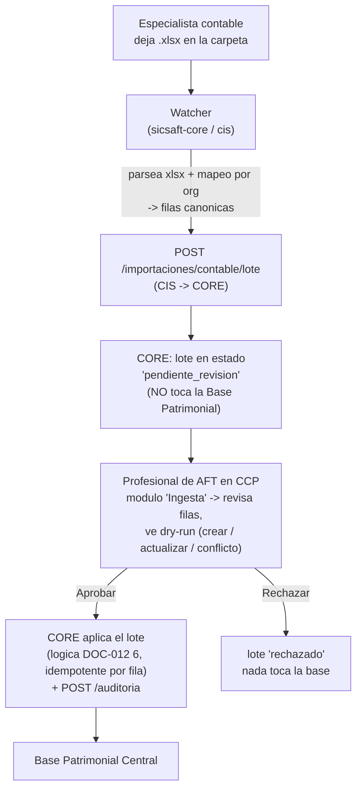

# DOC-029 — Endurecimiento del CCP para cliente real

Contrato formal de la fase, mismo esquema que DOC-019/020/021/022. Nace en el portal del
Profesional de AFT (`ccp/`) pero toca `cis/` y `core/` — se documenta acá porque la decisión de
diseño de cada punto es una necesidad del portal AFT, no de CIS/CORE (CLAUDE.md "una fase que toca
varias capas se documenta bajo el sistema donde nace la decisión").

> **Origen (2026-08-31)**: pedido del usuario, con un cliente real ya sobre `sicsaft-core.exe`
> (DOC-028). Cinco frentes independientes; respuestas de alcance confirmadas por el usuario en la
> misma sesión (ver §2 de cada workstream).

**Estado: diseñado, sin código todavía. Esperando confirmación del usuario antes de tocar `src/`.**

---

## 0. Resumen de los cinco frentes

| ID | Frente | Capas | Estado |
|----|--------|-------|--------|
| **RF-A** | Flag de nivel (1/2) en CCP — gate de módulos/features | CCP + `.exe` config | Diseñado |
| **RF-B** | Ingesta de Excel supervisada — carpeta → CIS → CORE → **revisión del AFT** → BPI | CORE + CIS + CCP | Diseñado |
| **RF-C** | 3 pestañas nuevas en el resumen (Dashboard) | CCP | **Bloqueado — spec lo entrega Guido** |
| **RF-D** | Veredicto de sesión accionable (`exitoso`/`aceptable`/`defectuoso`) → Auditoría / baja / Inventario / Contrato | CCP + 1 automatización en CORE | Diseñado |
| **RF-E** | Auditoría por **área operativa real** del actor + columna "Revisar" | CORE + CIS + CCP | Diseñado |

Reemplaza / extiende:

- **DOC-025 §1** ("Portal de Profesional de AFT: dos piezas distintas, no una"): RF-A revierte la
  decisión de *"no es una versión desbloqueada vía feature flag — es una aplicación distinta"*.
  Ver RF-A §1 para el motivo.
- **DOC-016** (Conector CON-CONTABILIDAD): RF-B reusa el transporte (carpeta vigilada → CIS →
  `POST /importaciones/contable`) y le agrega la compuerta humana que DOC-016 explícitamente no
  tenía (*"sin intervención humana"*, DOC-016 §1).

No reabre: [ADR-004](../../../adr/ADR-004-identidad-keycloak-reemplaza-zitadel.md) (Keycloak),
[DOC-023](DOC-023-matriz-permisos-rbac.md) (RBAC — RF-B/RF-D/RF-E reusan guards existentes, no
inventan patrones nuevos), el invariante de Tomo III 4.10 (baja por `estado`, nunca `DELETE` —
RF-D lo respeta explícitamente).

---

## RF-A — Flag de nivel (1/2) en CCP

### A.1 Qué resuelve y por qué revierte DOC-025

DOC-025 reservó para el Profesional de AFT **dos aplicaciones distintas**: un "web-aft" liviano de
Nivel 1 (identificación, consulta, inventarios, incidencias, historial, trazabilidad básica) y
`ccp/` completo recién en Nivel 2 (gestión avanzada, administración, reportes, configuración).

Estado real a hoy: el "web-aft" liviano **nunca tuvo una línea de código ni carpeta propia**
(DOC-025 §1, marcado 🔲). `ccp/` existe, probado de punta a punta, y `sicsaft-core.exe` **ya lo
embebe completo sin condicionarlo al nivel** (DOC-025 excepción 2026-08-28).

**Decisión del usuario (2026-08-31)**: en vez de construir una segunda app, `ccp/` gana un
`nivel` de ejecución (`1` | `2`) que oculta los módulos/acciones de "gestión avanzada" cuando
corre en Nivel 1. Es exactamente la "decisión de diseño nueva, fuera de este documento" que
DOC-025 §2 anticipó (*"si en el futuro se necesita que el propio sistema sepa en qué nivel
corre... para ocultar features de un nivel superior en la UI"*).

### A.2 De dónde sale el flag — no es un dato de dominio

DOC-025 §2 sigue en pie: **no se agrega ningún campo `nivel` a `Contrato`/`Organización`/`Sede`**.
El nivel es una decisión de despliegue, no un atributo del patrimonio.

Fuente del valor, en orden de precedencia:

1. **`.exe`**: `instalacion.json` gana `nivel` (default `1`), fijado en el bootstrap del wizard.
   `sicsaft-core` lo inyecta al servir `ccp` por el mecanismo de config runtime de DOC-028 Fase
   C.0 — `window.__SICSAFT_PORTAL_CONFIG__.VITE_SICSAFT_NIVEL` (mismo canal que hoy inyecta
   `VITE_KEYCLOAK_ISSUER`, ver `sicsaft-core/src/main/services/static-portal-server.ts`
   `inyectarConfigRuntime` y `handlers.ts` `asegurarServidoresPortales`).
2. **`devops/onprem`**: env var `VITE_SICSAFT_NIVEL` en el servicio `ccp` del Compose (solo
   presente en el perfil `nivel2`; una instalación "Nivel 1 con `ccp` por la excepción" pone `1`).
3. **Fallback dev/local**: `import.meta.env.VITE_SICSAFT_NIVEL`, default **`2`** — el portal
   completo sigue siendo lo que ve un desarrollador sin configurar nada.

Lectura en CCP: helper `nivelActual(): 1 | 2` en `src/lib/nivel.ts`, leyendo
`window.__SICSAFT_PORTAL_CONFIG__?.VITE_SICSAFT_NIVEL ?? import.meta.env.VITE_SICSAFT_NIVEL ?? '2'`
(mismo patrón que `oidc-config.ts` `requireEnv` de DOC-028 C.0).

### A.3 Qué muestra cada nivel (PROPUESTA — confirmar)

Mapa contra las capacidades de DOC-025 §1. `modulosContratados` (ya existente, `Contrato`) sigue
siendo el permiso fino por organización; `nivel` es el **techo**: un módulo se muestra solo si el
nivel lo permite **y** está en `modulosContratados`.

| Módulo del hub (`HubPage.tsx`) | Nivel 1 | Nivel 2 | Nota |
|---|---|---|---|
| Activos (consulta + alta) | ✅ consulta | ✅ completo | Nivel 1: sin alta manual (queda para RF-B / APP QR) — **confirmar** |
| Inventarios (sesiones de control) | ✅ | ✅ | Capacidad núcleo de Nivel 1 |
| Dashboard (cobertura, incidencias, historial) | ✅ | ✅ | "trazabilidad básica" de DOC-025 §1 |
| Contratos (vigencia, transiciones) | ❌ | ✅ | "gestión avanzada" |
| Estructura (ABM áreas/ubicaciones/responsables) | ❌ | ✅ | "gestión avanzada" |
| Importaciones / Ingesta (RF-B) | ❌ | ✅ | "operación centralizada" |
| Administración (transversal, `AppShell`) | ❌ | ✅ | "administración web" de DOC-025 §1 |

Enforcement: **solo oculta en la UI**. El guard real sigue en CIS/CORE (DOC-023) — un `POST` a un
endpoint de Nivel 2 desde un CCP en Nivel 1 lo sigue rechazando CORE por rol/`modulosContratados`,
no por el flag.

---

## RF-B — Ingesta de Excel supervisada

### B.1 Alcance confirmado por el usuario (2026-08-31)

> "Quiero que dentro del CCP el cliente seleccione una carpeta donde se depositen los Excel, para
> así pasar por el CIS, luego por el CORE y luego llegue a la base de datos — pero que no llegue
> directo: cuando llegue al CORE, el Profesional de AFT debe aceptar, revisar y visualizar la
> información que llegó; eso se hace desde su portal de AFT."

### B.2 Flujo

**No es un camino de escritura nuevo a la BPI**: aprobar un lote ejecuta la misma lógica de
`POST /importaciones/contable` que ya usa el puente manual de `ImportacionesPage.tsx` (DOC-012 §6).
Lo nuevo es la bandeja de staging + el gate humano. Refuerza el invariante de CLAUDE.md ("ninguna
fuente de captura modifica la Base Patrimonial directamente; todo pasa por CIS → CORE") — ahora
con una aprobación explícita además.

### B.3 CORE — bandeja de staging

Migración `node-pg-migrate` en `core/migrations/` — dos tablas nuevas:

- `importacion_contable_lote`: `id`, `organizacion_id`, `origen` (`'carpeta'` | `'manual'`),
  `archivo_nombre`, `recibido_en`, `estado` (`pendiente_revision` | `aprobado` | `rechazado`),
  `revisado_por`, `revisado_en`, `resumen` (jsonb: totales crear/actualizar/conflicto del
  dry-run).
- `importacion_contable_lote_fila`: `id`, `lote_id`, `linea`, los campos canónicos
  (`codigo_patrimonial`, `codigo_qr`, `catalogo_id`, `serie`, `responsable_id`, `area_id`,
  `ubicacion_id`, `valor_patrimonial`), `dry_run_resultado` (`crear` | `actualizar` | `conflicto`),
  `dry_run_motivo`.

**No es un registro oficial de Base Patrimonial** (Tomo III 4.10 no aplica: es una bandeja de
entrada, no una entidad del patrimonio). Aun así usa `estado` en vez de borrar filas — trazabilidad
y consistencia con el resto del esquema. Un job de limpieza de lotes `aprobado`/`rechazado` más
viejos que N días es aceptable (a diferencia de `activos`/`responsables`).

Endpoints nuevos (mismo guard que `POST /importaciones/contable` hoy: `administrador-patrimonial`
en la organización, DOC-012 §3):

| Método | Ruta | Qué hace |
|---|---|---|
| `POST` | `/importaciones/contable/lote` | Crea el lote + filas en `pendiente_revision`, calcula el dry-run, devuelve el `id` y el resumen |
| `GET` | `/importaciones/contable/lotes?estado=&organizacionId=` | Lista de lotes |
| `GET` | `/importaciones/contable/lotes/:id` | Lote + filas con su `dry_run_resultado` |
| `POST` | `/importaciones/contable/lotes/:id/aprobar` | Aplica fila por fila (DOC-012 §6, idempotente) → BPI, marca `aprobado`, `POST /auditoria` |
| `POST` | `/importaciones/contable/lotes/:id/rechazar` | Marca `rechazado` (+ `motivo` opcional), `POST /auditoria`, nada toca la BPI |

### B.4 CIS — watcher + parser + mapeo por organización

Módulo nuevo `cis/src/importacion-contable-ingesta/` (reusa el diseño de transporte de DOC-016
§3/§6: `@nestjs/schedule` `@Cron`, carpeta configurable, corrida manual para pruebas):

- **Carpeta**: la elige el AFT desde CCP (B.5), no una env var fija. El `.exe` la persiste en
  `instalacion.json` (`carpetaIngesta`) y se la pasa a `cis` al arrancar por `backend-configs.ts`
  (`crearConfigCis`), igual que hoy con `KEYCLOAK_URL`/`CORE_URL`. En `devops/onprem` sigue siendo
  una env var (`INGESTA_CONTABLE_CARPETA`).
- **Parser `.xlsx`**: **dependencia nueva** — `exceljs` (o SheetJS/`xlsx`). DOC-016 asumía CSV con
  `split(',')`; Excel binario no se parsea a mano. Decisión de dependencia a registrar en el
  `package.json` de `cis/` y en `cis/README.md`. Se elige `exceljs` salvo objeción (streaming,
  sin CVEs abiertos conocidos a la fecha, MIT).
- **Mapeo por organización**: archivo `mapeo-<organizacionId>.json` en la carpeta de ingesta
  (o en `userData`): `{ "Código Bien": "codigoPatrimonial", "QR": "codigoQr", "Tipo": "catalogoId", ... }`.
  v1: si no hay archivo de mapeo y los encabezados del Excel ya son los canónicos, pasa directo.
  Resolución de `catalogoId`/`responsableId`/`areaId` desde nombres de texto: **fuera de v1** — el
  Excel trae los IDs, o el mapeo los deja como conflicto para que el AFT los corrija. (Igual que
  el importador manual hoy.)
- Identidad hacia CORE para crear el lote: misma identidad sintética de DOC-016 §5
  (`operadorId: 'ingesta-contable'`, `organizacionId` de la instalación, rol
  `administrador-patrimonial` afirmado por config) — CORE re-verifica igual, sin bypass. **La
  aprobación**, en cambio, la hace un humano con su JWT real desde CCP.

### B.5 CCP — selector de carpeta + módulo de revisión

- **Selector de carpeta**: en el `.exe`, IPC nuevo `sicsaftCore.elegirCarpetaIngesta()` →
  `dialog.showOpenDialog({ properties: ['openDirectory'] })` en el main process, persiste en
  `instalacion.json`. En navegador puro (Nivel 2 sobre `devops/onprem`) queda **fuera de v1**
  (File System Access API es solo Chromium y re-pide permiso por sesión) — ahí la carpeta la fija
  el operador del despliegue por env var. Se documenta como limitación.
- **Módulo "Ingesta"** (`src/pages/IngestaPage.tsx`, ruta `/ingesta`, en el hub solo si
  `nivel === 2` y en `modulosContratados`; guard `administrador-patrimonial` como
  `ImportacionesPage`):
  - Lista de lotes (`pendiente_revision` arriba), con `archivo_nombre`, `recibido_en`, totales
    del resumen (N crear / N actualizar / N conflicto).
  - Detalle de lote: tabla de filas con su `dry_run_resultado` como `<Badge>` (reusa el patrón de
    `ImportacionesPage.tsx` "Resultado"), filtrable por resultado.
  - Botones **Aprobar** / **Rechazar** (con confirmación; Rechazar pide motivo opcional).
  - `ImportacionesPage.tsx` (carga manual) se mantiene tal cual — es el camino rápido sin
    staging para un CSV puntual. **Confirmar** si se prefiere unificar todo bajo staging.

---

## RF-C — 3 pestañas nuevas en el resumen — BLOQUEADO

`DashboardPage.tsx` pasa de scroll único a layout con pestañas. Tres pestañas nuevas cuyo
contenido **lo define Guido**. No se diseña ni se codea hasta tener ese spec.

Lo único que DOC-029 fija ahora, porque RF-D lo necesita:

- Patrón de tabs: compound component (`web/patterns.md` "Compound Components"), estado en la URL
  (`?tab=`) para que cada pestaña sea deep-linkable.
- Las secciones actuales del Dashboard (Áreas, Sesiones, Estado AFT, Fuera de área, No
  localizados, Incidencias, Categorías) se reparten en la pestaña "General" + las 3 de Guido, sin
  perder ninguna.

Placeholder — completar al recibir el spec de Guido:

> **Pestaña 1**: _(pendiente)_
> **Pestaña 2**: _(pendiente)_
> **Pestaña 3**: _(pendiente)_

---

## RF-D — Veredicto de sesión accionable

### D.1 Alcance confirmado — "Mixto"

Links profundos para navegar + **una** acción automática (D.3) que el usuario aprueba o rechaza en
este documento.

El veredicto de sesión es `exitoso` | `aceptable` | `defectuoso` (DOC-017; `verdict.ts`,
`cip/src/agregacion/veredicto.ts`). "Excelente" del usuario = **`exitoso`**. Aparece hoy en el
Dashboard, tarjeta "Sesiones de inventario" (`VeredictoSesion`: `sesionId`, `areaId`, `veredicto`,
`fechaCierre`) y en el módulo Inventarios.

### D.2 Links profundos (sin escritura)

Cada sesión, en el Dashboard y en Inventarios, gana un grupo de acciones que llevan
`organizacionId` + `areaId` + (cuando aplique) los `codigoQr` observados:

| Destino | Link | Para qué |
|---|---|---|
| **Auditoría** | `/auditoria?organizacionId=…&area=…` | Ver qué se hizo en esa área (usa el filtro por área de RF-E) |
| **Inventario** | `/inventarios?organizacionId=…&sesionId=…` | Abrir los escaneos de esa sesión |
| **Contrato** | `/contratos?organizacionId=…` | Revisar vigencia/módulos de la organización |
| **Baja de activo** ("eliminar") | `/activos?organizacionId=…&baja=<codigoQr,…>` | Abrir Activos en modo baja para los faltantes/observados |

"Baja" = `POST /admin/activos/:id/baja` (`cisClient.bajaActivo`, ya existente) — soft-delete por
`estado`, **nunca `DELETE`** (Tomo III 4.10, invariante de CLAUDE.md). El link solo pre-selecciona;
la baja la confirma el AFT fila por fila en Activos.

Presentación: los 4 links siempre visibles; el veredicto solo cambia el énfasis
(`defectuoso` → "Baja de activo" y "Auditoría" destacados; `aceptable` → "Inventario";
`exitoso` → todos en tono neutro).

### D.3 Acción automática propuesta (aprobar / rechazar)

**Propuesta**: cuando una sesión cierra con veredicto **`defectuoso`** (faltan ítems **y** hay
ítems fuera de área — el peor caso, `verdict.ts`), CORE registra automáticamente **una entrada de
auditoría**:

- `operacion: 'sesiones/{id}/veredicto-defectuoso'`, `resultado: 'registrado'`,
  `observaciones`: cantidad de faltantes + fuera de área + `areaId`.
- Canal: el `POST /auditoria` que ya usan otros flujos no-humanos (DOC-024 §3). Mismo nivel de
  confianza, sin endpoint nuevo.

**Qué NO hace**: no da de baja nada, no toca la Base Patrimonial, no cambia el estado de ningún
activo. Es solo un rastro. Inocuo y reversible (una fila de auditoría de más).

`[ ]` Usuario aprueba esta automatización · `[ ]` Usuario la rechaza (solo links profundos).

---

## RF-E — Auditoría por área operativa real

### E.1 Alcance confirmado — "Campo real en CORE"

Hoy `auditoria` no tiene el área del actor (`AuditoriaEntrada`: `usuario`, `fecha`, `equipo`,
`ip`, `operacion`, `resultado`, `observaciones`, `categoria`, `organizacionId` — ver
`core/src/auditoria/auditoria.types.ts`). Cambio multi-capa para que la columna "Área" sea real.

### E.2 CORE

- Migración `node-pg-migrate`: `auditoria` gana `area_operativa text NULL` (histórico y eventos
  sin área → `null`).
- `RegistrarAuditoriaInput` y `AuditoriaEntrada` ganan `areaOperativa?: string | null`.
- `AuditoriaFiltro` gana `area?: string` — filtro parcial `ILIKE`, igual que `usuario`/`operacion`.
- `GET /auditoria` acepta `?area=`.

### E.3 CIS

Passthrough del campo en ambos sentidos del bridge `/admin/auditoria`:

- **Lectura**: propaga `areaOperativa` y el filtro `area` de CCP a CORE.
- **Escritura**: el actor humano trae su área operativa del claim de Keycloak (o de la sesión);
  los flujos sin humano (ingesta contable de RF-B, veredicto automático de RF-D) mandan `null` o
  una constante (`'sistema'`).

### E.4 CCP — `AuditoriaPage.tsx`

Cambio pedido: *"donde dice usuario poner área, operación, revisar"*.

- Columnas de la tabla: `Usuario` **→ `Área`**. `Operación` se mantiene (ya existía).
  `Resultado` y `Observaciones` se mantienen. Se agrega **`Revisar`** como columna de acción.
- **`Revisar`** = botón que expande la fila con el detalle completo: `usuario`, `equipo`, `ip`,
  `categoria`, `organizacionId`, `observaciones` completas. **El usuario no se pierde** — pasa del
  encabezado al detalle.
- Filtro superior: `Usuario` **→ `Área`**. Se mantiene `Usuario` como filtro secundario (no se
  pierde la capacidad de filtrar por operador).

---

## §Plan de fases (`gh stack`)

CLAUDE.md exige `gh stack` para incrementos multi-fase. Orden por dependencia (E: CORE→CIS→CCP;
B: CORE→CIS→CCP; D depende del filtro por área de E):

| # | Rama | Workstream | Depende de |
|---|------|-----------|------------|
| 1 | `docs/doc-029-endurecimiento-ccp-cliente-real` | Este diseño (PR solo-docs) | — |
| 2 | `feat/ccp-nivel-flag` | RF-A (CCP + inyección de config en `.exe` + `instalacion.json.nivel`) | 1 |
| 3 | `feat/core-auditoria-area` | RF-E capa CORE (migración + tipos + filtro) | 1 |
| 4 | `feat/cis-auditoria-area` | RF-E capa CIS (passthrough) | 3 |
| 5 | `feat/ccp-auditoria-area` | RF-E capa CCP (Área / Operación / Revisar) | 4 |
| 6 | `feat/core-ingesta-staging` | RF-B capa CORE (tablas + endpoints aprobar/rechazar/dry-run) | 1 |
| 7 | `feat/cis-ingesta-excel` | RF-B capa CIS (watcher + parser xlsx + mapeo) | 6 |
| 8 | `feat/ccp-ingesta-revision` | RF-B capa CCP (selector de carpeta IPC + módulo de revisión) | 7 |
| 9 | `feat/ccp-veredicto-accionable` | RF-D (links profundos + automatización de D.3 si se aprueba) | 5 |
| — | RF-C | 3 pestañas — rama aparte cuando Guido entregue el spec, no bloquea nada | spec de Guido |

## §Testing

Sin bajar el umbral vigente (100% líneas/funciones en `cis`/`core`; cobertura de `vitest` en CCP,
hoy solo `src/lib/`). Puntos nuevos:

- **RF-A**: unit de `nivelActual()` (precedencia config runtime → env → default); test de
  `HubPage`/`AppShell` con `nivel=1` y `nivel=2` (mock de `window.__SICSAFT_PORTAL_CONFIG__`).
- **RF-B**: CORE — e2e del ciclo lote `pendiente_revision` → `aprobar` (aplica, idempotente) /
  `rechazar` (no toca BPI) contra Postgres real; CIS — unit del parser xlsx + mapeo por org (con
  un `.xlsx` fixture); CCP — test del módulo de revisión (mock de lotes).
- **RF-D**: unit de la construcción de cada link profundo por veredicto; e2e de la automatización
  D.3 (cierre `defectuoso` → 1 fila en `auditoria`, 0 cambios en `activos`).
- **RF-E**: CORE — e2e del filtro `?area=` y del passthrough del campo; CCP — test de la fila
  expandible "Revisar".

## §Documentos relacionados

[DOC-025](../../devops/design-artifacts/DOC-025-niveles-producto-onprem.md) §1/§2 (niveles — RF-A
lo revierte parcialmente), [DOC-016](../../integraciones/design-artifacts/DOC-016-conector-con-contabilidad.md)
(transporte de carpeta que RF-B reusa), [DOC-028](../../sicsaft-core/design-artifacts/DOC-028-camino-a-cliente-final.md)
Fase C.0 (inyección de config runtime que RF-A/RF-B reusan), [DOC-012](../../../seguridad/DOC-012-administrador-patrimonial.md)
§3/§6 (endpoint y guard de importación contable), [DOC-017](../../app-qr-sicsaft/design-artifacts/DOC-017-fase-3.1-brechas-flujo.md)
§2 (veredicto de sesión), [DOC-023](DOC-023-matriz-permisos-rbac.md) (RBAC),
[DOC-024](DOC-024-crud-completo-auditoria-identidad.md) §3 (canal `POST /auditoria` no-humano que
RF-D/RF-B reusan), [DOC-005](../../../base-patrimonial/DOC-005-modelo-patrimonial.md) §7 (modelo de
auditoría), Tomo III 4.10 (baja por `estado`, nunca `DELETE`).
