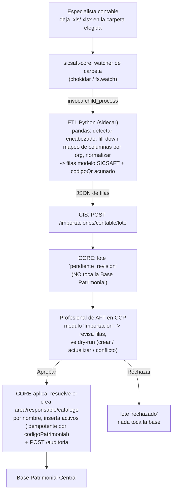

# DOC-029 — Endurecimiento del CCP para cliente real

Contrato formal de la fase, mismo esquema que DOC-019/020/021/022. Nace en el portal del
Profesional de AFT (`ccp/`) pero toca `cis/`, `core/` y `sicsaft-core/` — se documenta acá porque
la decisión de diseño de cada punto es una necesidad del portal AFT (CLAUDE.md "una fase que toca
varias capas se documenta bajo el sistema donde nace la decisión").

> **Origen (2026-08-31)**: pedido del usuario, con un cliente real ya sobre `sicsaft-core.exe`
> (DOC-028). Seis frentes; alcance de cada uno confirmado por el usuario en la misma sesión.
> **v2 (2026-08-31)** — decisiones cerradas: RF-B = sidecar Python; RF-H = APK WebView propia
> mínima (opción B), se construye ya; "Dirección" = CORE refleja el Excel tal cual en esta v1.

**Estado: diseñado. RF-G ya implementado (fix de crash + layout). El resto espera confirmación
del plan de fases antes de tocar `src/`.**

---

## 0. Resumen de los seis frentes

| ID | Frente | Capas | Estado |
|----|--------|-------|--------|
| **RF-A** | Flag de nivel (1/2) en CCP — gate de módulos/features | CCP + `sicsaft-core` config | Diseñado |
| **RF-B** | Ingesta de Excel supervisada — carpeta → **ETL Python** → CIS → CORE (staging) → **revisión del AFT** → BPI | Python sidecar + CORE + CIS + CCP | Diseñado |
| **RF-C** | 3 pestañas nuevas en el resumen (Dashboard) | CCP | **Bloqueado — spec lo entrega Guido** |
| **RF-D** | Veredicto de sesión accionable → Auditoría / baja / Inventario / Contrato | CCP + 1 automatización en CORE | Diseñado |
| **RF-E** | Auditoría por **área operativa real** del actor + columna "Revisar" | CORE + CIS + CCP | Diseñado |
| **RF-F** | Módulo **"QR / Etiquetas"** en CCP — todos los códigos acuñados, por dirección, QR + código de barras, listos para imprimir | CCP + CORE (lectura) | Diseñado |
| **RF-G** | Fix: crash del login por timeout + layout del wizard roto a pantalla completa | `sicsaft-core` | ✅ **Hecho** (rama `fix/sicsaft-core-login-timeout-crash`) |
| **RF-H** | APK Android — WebView propia mínima, generada en build-time, servida por el `.exe` | `apk-aft/` (nuevo) + `sicsaft-core` | Diseñado |

Reemplaza / extiende:

- **DOC-025 §1** ("Portal de Profesional de AFT: dos piezas distintas, no una"): RF-A revierte la
  decisión de *"no es una versión desbloqueada vía feature flag — es una aplicación distinta"*
  (RF-A §1).
- **DOC-016** (Conector CON-CONTABILIDAD): RF-B reusa los **conceptos de transporte** (carpeta
  local vigilada, identidad sintética para el paso de ingesta, idempotencia por fila, canal de
  auditoría) pero **reemplaza su implementación**: parser Python (no `split(',')` en Node),
  formato `.xls`/`.xlsx` real, y una **compuerta humana** que DOC-016 explícitamente no tenía
  (*"sin intervención humana"*, DOC-016 §1).
- **DOC-028 Fase E** (APK Android, diferida): RF-H la des-difiere con un alcance acotado
  (WebView propia, no TWA/PWABuilder — ver RF-H §1).

No reabre: [ADR-004](../../../adr/ADR-004-identidad-keycloak-reemplaza-zitadel.md) (Keycloak),
[DOC-023](DOC-023-matriz-permisos-rbac.md) (RBAC — RF-B/RF-D/RF-E/RF-F reusan guards existentes),
el invariante de Tomo III 4.10 (baja por `estado`, nunca `DELETE` — RF-D lo respeta).

---

## RF-A — Flag de nivel (1/2) en CCP

### A.1 Qué resuelve y por qué revierte DOC-025

DOC-025 reservó para el Profesional de AFT **dos aplicaciones distintas**: un "web-aft" liviano de
Nivel 1 y `ccp/` completo recién en Nivel 2. Estado real: el "web-aft" liviano **nunca tuvo
código** (DOC-025 §1, 🔲); `ccp/` existe, probado, y `sicsaft-core.exe` **ya lo embebe completo
sin condicionarlo al nivel** (DOC-025 excepción 2026-08-28).

**Decisión del usuario (2026-08-31)**: en vez de una segunda app, `ccp/` gana un `nivel` de
ejecución (`1` | `2`) que oculta los módulos/acciones de "gestión avanzada" cuando corre en Nivel
1. Es la "decisión de diseño nueva" que DOC-025 §2 anticipó.

### A.2 De dónde sale el flag — no es un dato de dominio

DOC-025 §2 sigue en pie: **no se agrega un campo `nivel` a `Contrato`/`Organización`/`Sede`**.

1. **`.exe`**: `instalacion.json` gana `nivel` (default `1`), fijado en el bootstrap. `sicsaft-core`
   lo inyecta al servir `ccp` por el canal de config runtime de DOC-028 Fase C.0 —
   `window.__SICSAFT_PORTAL_CONFIG__.VITE_SICSAFT_NIVEL` (ver `static-portal-server.ts`
   `inyectarConfigRuntime`, `handlers.ts` `asegurarServidoresPortales`).
2. **`devops/onprem`**: env var `VITE_SICSAFT_NIVEL` en el servicio `ccp` del Compose.
3. **Fallback dev/local**: `import.meta.env.VITE_SICSAFT_NIVEL`, default **`2`**.

Lectura en CCP: helper `nivelActual(): 1 | 2` en `src/lib/nivel.ts` (mismo patrón que
`oidc-config.ts` `requireEnv` de DOC-028 C.0).

### A.3 Qué muestra cada nivel

`nivel` es el **techo**; `modulosContratados` (ya existente) sigue siendo el permiso fino por
organización. Un módulo se muestra si el nivel lo permite **y** está en `modulosContratados`.

| Módulo del hub | Nivel 1 | Nivel 2 |
|---|---|---|
| Activos | ✅ **solo consulta** (sin alta manual) | ✅ completo |
| Inventarios | ✅ | ✅ |
| Dashboard | ✅ | ✅ |
| **Ingesta / Importación (RF-B)** | ✅ (único camino de carga en Nivel 1) | ✅ |
| **QR / Etiquetas (RF-F)** | ✅ | ✅ |
| Contratos | ❌ | ✅ |
| Estructura (ABM áreas/ubicaciones/responsables) | ❌ | ✅ |
| Administración (transversal) | ❌ | ✅ |

Enforcement: **solo oculta en la UI**. El guard real sigue en CIS/CORE (DOC-023).

---

## RF-B — Ingesta de Excel supervisada

### B.1 Alcance confirmado (2026-08-31)

> "En el CCP, donde dice Importación, uno selecciona una carpeta del PC donde se cargan los Excel
> y mediante programación se hace ETL de la información y se transforma al modelo de SICSAFT. Esa
> información pasa por CIS, luego CORE, y en CORE espera validación del Profesional de AFT por el
> portal."

ETL = **sidecar Python** (`pandas` + `xlrd`), decisión del usuario: el Excel real
(`EJEMPLOS DE EMPRESAS Y AFT.xls`, inspeccionado en esta sesión) tiene encabezado en la fila 5,
celdas combinadas (`DIRECCION`/`AREA`/`RESPONSABLE` con fill-down), y una columna `CATEGORIA` de
texto libre — `pandas` reshapea eso sin esfuerzo; un parser Node a mano no.

### B.2 Flujo

Respeta el invariante de CLAUDE.md: nada escribe directo a la BPI, todo pasa por CIS→CORE, y ahora
además hay aprobación humana explícita.

### B.3 Sidecar Python — `herramientas/etl-contable/`

- Carpeta nueva en la raíz (no un desplegable — es una herramienta, criterio de CLAUDE.md como
  `aidlc-docs/`). Contenido: `etl_contable.py` (CLI: `--entrada archivo.xls --mapeo mapeo.json
  --salida -` → JSON a stdout), `mapeo/` con un `mapeo-<organizacionId>.json` de ejemplo,
  `requirements.txt` (`pandas`, `xlrd`), `tests/` (pytest, con un `.xls` fixture chico).
- Qué hace: detección de fila de encabezado (busca la fila con `CODIGO`/`DIRECCION`), fill-down de
  combinadas, remapeo de columnas por `mapeo-<org>.json`, normalización de tipos
  (`VALOR.CLP.` → número, `FECHA COMPRA` → ISO), **acuñado de `codigoQr`** a partir de `CODIGO`
  (namespaced: `<organizacionId>:<CODIGO>` o solo `<CODIGO>` — ver B.6), y `--dry-run` local que
  reporta filas sin `CODIGO`, duplicados en el archivo, y `CATEGORIA` desconocidas.
- Empaquetado en el `.exe`: Python embebido (`python-build-standalone`, ~15 MB comprimido) +
  `pandas`/`xlrd` en un venv, copiado por `prepack.cjs` a `resources/etl-contable/`. `sicsaft-core`
  lo invoca con `execFile(rutaPythonEmbebido, [rutaScript, ...args])`.

### B.4 CORE — bandeja de staging

Migración `node-pg-migrate` en `core/migrations/` — dos tablas nuevas. **v1: reflejan el Excel tal
cual** (decisión del usuario), no el modelo canónico reducido:

- `importacion_contable_lote`: `id`, `organizacion_id`, `origen`, `archivo_nombre`, `recibido_en`,
  `estado` (`pendiente_revision` | `aprobado` | `rechazado`), `revisado_por`, `revisado_en`,
  `resumen` (jsonb).
- `importacion_contable_lote_fila`: `id`, `lote_id`, `linea`, y las columnas del Excel del cliente
  mapeadas a nombres estables: `direccion`, `area`, `responsable`, `codigo_patrimonial`,
  `nombre_aft`, `categoria`, `estado_aft`, `marca`, `modelo`, `serie`, `fecha_compra`,
  `valor_clp`, `codigo_qr` (acuñado). `dry_run_resultado` (`crear` | `actualizar` | `conflicto`),
  `dry_run_motivo`.

**No es un registro oficial de Base Patrimonial** (Tomo III 4.10 no aplica: bandeja de entrada).
Usa `estado` en vez de borrar; un job de limpieza de lotes cerrados > N días es aceptable.

Endpoints nuevos (guard `administrador-patrimonial` en la organización, DOC-012 §3):

| Método | Ruta | Qué hace |
|---|---|---|
| `POST` | `/importaciones/contable/lote` | Crea lote + filas `pendiente_revision`, calcula dry-run, devuelve `id` + resumen |
| `GET` | `/importaciones/contable/lotes?estado=&organizacionId=` | Lista |
| `GET` | `/importaciones/contable/lotes/:id` | Lote + filas con `dry_run_resultado` |
| `POST` | `/importaciones/contable/lotes/:id/aprobar` | **Resuelve-o-crea** área/responsable/catálogo por nombre, inserta activos (idempotente por `codigo_patrimonial`), marca `aprobado`, `POST /auditoria` |
| `POST` | `/importaciones/contable/lotes/:id/rechazar` | Marca `rechazado` (+ motivo), `POST /auditoria`, nada toca la BPI |

El "aprobar" es más grande que resolver IDs ya presentes: reflejar el Excel implica crear áreas,
responsables y catálogo tipos que todavía no existen. Todo eso pasa por los servicios de dominio
de CORE existentes, nunca `INSERT` directo.

### B.5 CIS

Endpoint nuevo `POST /importaciones/contable/lote` en el bridge — passthrough a CORE con la
identidad sintética de DOC-016 §5 (`operadorId: 'ingesta-contable'`, rol
`administrador-patrimonial` afirmado por config; CORE re-verifica igual). **La aprobación** la hace
un humano con su JWT real desde CCP, no la identidad sintética.

### B.6 CCP — selector de carpeta + revisión, dentro de "Importación"

- **Selector de carpeta**: IPC nuevo `sicsaftCore.elegirCarpetaIngesta()` →
  `dialog.showOpenDialog({ properties: ['openDirectory'] })`, persistido en `instalacion.json`
  (`carpetaIngesta`) y pasado a `cis` por `backend-configs.ts`. En navegador puro (Nivel 2 sobre
  `devops/onprem`) **fuera de v1**: la fija el operador por env var.
- **`ImportacionesPage.tsx`** gana dos secciones: (1) la carga manual de CSV actual, sin cambios;
  (2) "Carpeta vigilada" — muestra la carpeta elegida (botón para cambiarla) y la lista de lotes
  (`pendiente_revision` arriba); al abrir un lote, tabla de filas con `dry_run_resultado` como
  `<Badge>`, filtrable, y botones **Aprobar** / **Rechazar** (Rechazar pide motivo).
- No se unifica la carga manual bajo staging (decisión del usuario): el AFT que sube un CSV a mano
  ya es el humano que revisa, en ese acto.

### B.7 `codigoQr` acuñado — decisión pendiente menor

El QR de cada AFT lo genera el ETL (el Excel no lo trae). Formato propuesto: **el propio `CODIGO`
del Excel** (`DG-001`), que ya es único por organización y legible. Alternativa: prefijar la
organización. Se confirma al implementar RF-F (las etiquetas tienen que poder representarlo como
QR y como Code128 — un `CODIGO` corto ASCII cumple ambos).

---

## RF-C — 3 pestañas nuevas en el resumen — BLOQUEADO

`DashboardPage.tsx` pasa de scroll único a layout con pestañas. Tres pestañas nuevas cuyo
contenido **lo define Guido**. No se diseña ni se codea hasta tener ese spec.

Fijado ahora, porque RF-D lo necesita: patrón de tabs compound (`web/patterns.md`), estado en la
URL (`?tab=`) para deep-linking. Las secciones actuales del Dashboard se reparten en "General" +
las 3 de Guido, sin perder ninguna.

> **Pestaña 1**: _(pendiente)_ · **Pestaña 2**: _(pendiente)_ · **Pestaña 3**: _(pendiente)_

---

## RF-D — Veredicto de sesión accionable

### D.1 Alcance confirmado — "Mixto"

Links profundos para navegar + **una** acción automática (D.3).

Veredicto de sesión: `exitoso` | `aceptable` | `defectuoso` (DOC-017; `verdict.ts`). "Excelente"
del usuario = **`exitoso`**. Aparece en el Dashboard (tarjeta "Sesiones de inventario":
`sesionId`, `areaId`, `veredicto`, `fechaCierre`) y en Inventarios.

### D.2 Links profundos (sin escritura)

Cada sesión gana un grupo de acciones que llevan `organizacionId` + `areaId` + (cuando aplique)
los `codigoQr` observados:

| Destino | Link |
|---|---|
| **Auditoría** | `/auditoria?organizacionId=…&area=…` (usa el filtro por área de RF-E) |
| **Inventario** | `/inventarios?organizacionId=…&sesionId=…` |
| **Contrato** | `/contratos?organizacionId=…` |
| **Baja de activo** ("eliminar") | `/activos?organizacionId=…&baja=<codigoQr,…>` → `cisClient.bajaActivo` (soft, `estado`, **nunca `DELETE`**, Tomo III 4.10) |

Los 4 links siempre visibles; el veredicto solo cambia el énfasis.

### D.3 Acción automática — **aprobada por el usuario (2026-08-31)**

Cuando una sesión cierra con veredicto **`defectuoso`** (faltan ítems **y** hay ítems fuera de
área), CORE registra automáticamente **una entrada de auditoría**:

- `operacion: 'sesiones/{id}/veredicto-defectuoso'`, `resultado: 'registrado'`, `observaciones`:
  cantidad de faltantes + fuera de área + `areaId`.
- Canal: `POST /auditoria` (mismo que otros flujos no-humanos, DOC-024 §3).
- **No** da de baja nada, **no** toca la Base Patrimonial, **no** cambia estado de activos. Solo
  rastro. Únicamente para `defectuoso`, nunca `aceptable` (ruido).

---

## RF-E — Auditoría por área operativa real

### E.1 Alcance confirmado — "Campo real en CORE"

Hoy `auditoria` no tiene el área del actor (`core/src/auditoria/auditoria.types.ts`). Cambio
multi-capa.

### E.2 CORE

- Migración: `auditoria` gana `area_operativa text NULL` (histórico y eventos sin área → `null`).
- `RegistrarAuditoriaInput` / `AuditoriaEntrada` ganan `areaOperativa?: string | null`.
- `AuditoriaFiltro` gana `area?: string` (parcial `ILIKE`). `GET /auditoria` acepta `?area=`.

### E.3 CIS

Passthrough en ambos sentidos del bridge `/admin/auditoria`. El actor humano trae su área del
claim de Keycloak (o de la sesión); los flujos sin humano (ingesta, veredicto automático) mandan
`null` o `'sistema'`.

### E.4 CCP — `AuditoriaPage.tsx`

Cambio pedido: *"donde dice usuario poner área, operación, revisar"*.

- Columnas: `Usuario` **→ `Área`**. `Operación` se mantiene. `Resultado` / `Observaciones` se
  mantienen. Se agrega **`Revisar`** = botón que expande la fila con el detalle completo
  (`usuario`, `equipo`, `ip`, `categoria`, `organizacionId`, `observaciones`). **El usuario no se
  pierde** — pasa al detalle.
- Filtro superior: `Usuario` **→ `Área`**; se mantiene `Usuario` como filtro secundario.

---

## RF-F — Módulo "QR / Etiquetas" en CCP

### F.1 Qué resuelve

Es el **paso 3** de la estrategia de validación del usuario: una vez cargados los AFT (RF-B),
generar los códigos QR de cada uno, **separados por dirección**, para imprimir en etiquetas y
meterlos en sobres por dirección.

### F.2 Diseño

- Ruta `/etiquetas` (o sección dentro del hub), visible en Nivel 1 y 2, sin guard especial
  (lectura).
- Datos: `GET /activos?organizacionId=…` ya existente, agrupados **por dirección** (campo nuevo de
  RF-B) y dentro de cada dirección por área.
- Cada activo se renderiza como una **etiqueta**: `codigoQr` como **QR** (lib `qrcode`, ya
  dependencia de `sicsaft-core`; en CCP se agrega `qrcode` o `qrcode.react`) **y** como **código
  de barras Code128** (lib `jsbarcode` o `bwip-js`), más `codigoPatrimonial`, `nombre_aft`, área.
- Layout de impresión: grilla tipo hoja de etiquetas (Avery), `@media print` con salto de página
  por dirección. Filtro/selección por dirección → "Imprimir dirección X".
- Sin backend nuevo — es una vista de impresión sobre datos que CORE ya expone.

---

## RF-G — Fix: crash del login + layout del wizard ✅ HECHO

Encontrados probando con el cliente real (2026-08-31). Rama
`fix/sicsaft-core-login-timeout-crash`:

1. **Crash del proceso main** (`portal-login-service.ts`): el timeout de 60s del login hacía
   `view.webContents.off()` sobre una `WebContentsView` ya destruida (el usuario > 60s en una
   pantalla previa sin loguearse) → `TypeError: Cannot read properties of undefined (reading
   'off')` no capturado → diálogo rojo "A JavaScript error occurred in the main process". Fix:
   guard `isDestroyed()` antes del `.off()`.
2. **Layout del wizard a pantalla completa** (`WizardApp.tsx`): `<main>` con `items-center`
   recortaba la parte de arriba del paso "Instalación completa" en ventanas bajas / pantalla
   completa (QR cortado). `[&>*]:m-auto` centra cuando entra y no recorta cuando desborda.
3. **Desalineación de la vista embebida** (`PasoListoConLogin.tsx`): la `WebContentsView` nativa
   se dibuja sobre el `placeholderRef`, pero el `ResizeObserver` no ve un traslado sin cambio de
   tamaño (scroll del `<main>`, reflow). Se re-envían bounds en `resize`/`scroll` y en reflows
   tardíos.

La pantalla "cambio de IP" (`PasoIpCambio`, DOC-028 C.1) **no es un bug** — funciona como debe
cuando la PC pasa de `127.0.0.1` a una IP de LAN real.

---

## RF-H — APK Android (WebView propia mínima)

### H.1 Por qué WebView propia y no TWA/PWABuilder — decisión del usuario (2026-08-31)

Un TWA (lo que genera PWABuilder/Bubblewrap) es Chrome cargando la PWA. Con **certificado propio
en IP de LAN**, Chrome no ofrece "Continuar" dentro de un TWA → **no carga**. Además la URL de
arranque queda compilada en el APK → un APK por instalación/IP. Y firmar un APK en la PC del
cliente al instalar necesita JDK+SDK+Gradle+keystore por cliente. Todo eso lo evita una **WebView
propia**.

### H.2 Diseño — `apk-aft/` (proyecto nuevo, no un desplegable)

- App Android nativa mínima (Kotlin, un `Activity`, un `WebView` a pantalla completa):
  - `webViewClient.onReceivedSslError` → `handler.proceed()` **solo** para el host/puerto
    configurado (servidor propio, solo LAN — riesgo aceptado y documentado).
  - Permiso de cámara + `WebChromeClient` para que la PWA use `getUserMedia` (escaneo de QR).
  - **Primer arranque**: no hay URL → pantalla que pide escanear el **QR de conexión** que muestra
    el `.exe`; se guarda la URL en `SharedPreferences`. Menú "Reconectar" para re-escanear cuando
    cambia la IP.
- **Build-time, una vez**: Android SDK + Gradle en CI (workflow nuevo `apk-aft-ci.yml`) o en
  `prepack.cjs`. Firmado con un keystore de proyecto (secreto de CI, **no** en el repo). Sale un
  `sicsaft-aft.apk` versionado.
- **Distribución**: `prepack.cjs` copia el `.apk` a `resources/apk/`. `sicsaft-core` lo sirve en
  `https://<ip>:8765/sicsaft-aft.apk` (mismo servidor estático de la PWA, DOC-028 Fase D). La
  pantalla "listo" del wizard muestra **dos QR**: el de la PWA (ya existe) y uno nuevo para
  **descargar el APK**. Instalar pide "orígenes desconocidos" — se documenta en el runbook.
- **QR de conexión**: el `.exe` expone una pantalla con un QR que codifica
  `https://<ip>:8765` (la misma URL de la PWA) — la app lo lee en el primer arranque.

### H.3 Qué NO hace v1

- No se publica en Play Store (sideload por QR, org controlada).
- No auto-actualiza (una versión del APK por versión del `.exe`; reinstalar para actualizar).
- No hay verificación de Digital Asset Links (no es un TWA).

---

## §Plan de fases (`gh stack`)

Orden por dependencia (E y B: CORE→CIS→CCP; D depende del filtro por área de E; F depende del
campo `direccion` de B):

| # | Rama | Frente | Depende de |
|---|------|--------|------------|
| 1 | `docs/doc-029-endurecimiento-ccp-cliente-real` | Este diseño (PR solo-docs) | — |
| 2 | `fix/sicsaft-core-login-timeout-crash` | **RF-G — ya commiteado** | — |
| 3 | `feat/ccp-nivel-flag` | RF-A (CCP + inyección de config + `instalacion.json.nivel`) | 1 |
| 4 | `feat/core-auditoria-area` | RF-E capa CORE | 1 |
| 5 | `feat/cis-auditoria-area` | RF-E capa CIS | 4 |
| 6 | `feat/ccp-auditoria-area` | RF-E capa CCP (Área / Operación / Revisar) | 5 |
| 7 | `feat/etl-contable-python` | RF-B sidecar Python + empaquetado en el `.exe` | 1 |
| 8 | `feat/core-ingesta-staging` | RF-B capa CORE (tablas espejo del Excel + aprobar/rechazar/dry-run + resolve-or-create) | 1 |
| 9 | `feat/cis-ingesta-lote` | RF-B capa CIS (endpoint de lote) | 8 |
| 10 | `feat/ccp-ingesta-revision` | RF-B capa CCP (selector de carpeta IPC + revisión en Importación) | 7, 9 |
| 11 | `feat/ccp-etiquetas-qr` | RF-F (módulo QR + Code128 por dirección) | 10 |
| 12 | `feat/ccp-veredicto-accionable` | RF-D (links profundos + automatización D.3) | 6 |
| 13 | `apk-aft-webview` | RF-H (proyecto `apk-aft/` + CI + servido por el `.exe` + 2º QR) | 1 |
| — | RF-C | 3 pestañas — rama aparte cuando Guido entregue el spec | spec de Guido |

## §Testing — runbook de validación (los 6 pasos del usuario)

Va en `aidlc-docs/ccp/testing/` como runbook ejecutable. Sin bajar el umbral de cobertura vigente.

1. **Cargar el Excel**: dejar `EJEMPLOS DE EMPRESAS Y AFT.xls` en la carpeta elegida en CCP →
   verificar que el ETL lo normaliza y aparece un lote `pendiente_revision`.
2. **Revisar y aprobar**: el AFT abre el lote en CCP, revisa el dry-run, aprueba → verificar
   activos/áreas/responsables/catálogos creados en la Base Patrimonial.
3. **Generar QR por dirección** (RF-F): imprimir las etiquetas de una dirección, "meter en el
   sobre".
4. **Auditoría por dirección**: abrir la app del teléfono (PWA o APK de RF-H), seleccionar el
   sobre de una dirección, escanear todos los QR, enviar informe → comparar informe resumen +
   Dashboard contra lo esperado. Repetir por cada dirección.
5. **Informe final**: al terminar todas las direcciones, comparar el resumen del Dashboard
   (cobertura, incidencias, veredictos) contra el diseño. Si coincide → V1.0 OK.
6. **Escenarios de prueba y error**: mover QR entre sobres, sacar QR, etc. → validar la respuesta
   de cada auditoría (por área y general del Dashboard). Cada combinación = una hipótesis de la
   vida real.

Cobertura automatizada nueva: `nivelActual()` (RF-A); ciclo de lote staging → aprobar/rechazar
contra Postgres real (RF-B CORE); ETL Python con `.xls` fixture (pytest, RF-B); links profundos +
automatización D.3 (RF-D); filtro `?area=` + passthrough (RF-E); render QR/Code128 (RF-F).

## §Documentos relacionados

[DOC-025](../../devops/design-artifacts/DOC-025-niveles-producto-onprem.md) §1/§2 (RF-A lo revierte
parcialmente), [DOC-016](../../integraciones/design-artifacts/DOC-016-conector-con-contabilidad.md)
(transporte que RF-B reusa, implementación que reemplaza), [DOC-028](../../sicsaft-core/design-artifacts/DOC-028-camino-a-cliente-final.md)
Fase C.0 (config runtime — RF-A/RF-B), Fase D (servidor estático — RF-H), Fase E (APK diferida —
RF-H la des-difiere), [DOC-012](../../../seguridad/DOC-012-administrador-patrimonial.md) §3/§6
(endpoint y guard de importación contable), [DOC-017](../../app-qr-sicsaft/design-artifacts/DOC-017-fase-3.1-brechas-flujo.md)
§2 (veredicto de sesión), [DOC-023](DOC-023-matriz-permisos-rbac.md) (RBAC),
[DOC-024](DOC-024-crud-completo-auditoria-identidad.md) §3 (canal `POST /auditoria` no-humano),
[DOC-005](../../../base-patrimonial/DOC-005-modelo-patrimonial.md) §7 (modelo de auditoría), Tomo
III 4.10 (baja por `estado`, nunca `DELETE`).
