# DOC-026: CIP — inteligencia decisional (segundo incremento, Fase 9)

> **Alcance de este documento**: diseño (Inception AI-DLC) de RF-11 a RF-17 de
> [`requirements/REQUIREMENTS.md`](../requirements/REQUIREMENTS.md), agregados 2026-08-25 a pedido
> explícito del usuario ("CIP no debe limitarse a gráficos, debe responder preguntas"). Extiende el
> primer dashboard de CIP ([DOC-014](DOC-014-cip-dashboard.md) → [DOC-018](DOC-018-cip-servicio-nestjs.md),
> `ROADMAP.md` Fase 6, ✅ completa) — no lo reemplaza. **Solo diseño, sin código todavía**
> (`cip/src/` no se toca en este incremento) — ver `ROADMAP.md` Fase 9.

## 1. Qué resuelve este incremento

El primer dashboard de CIP responde "cuánto" (% de cobertura, conteos por estado/categoría). Las
8 preguntas que trajo el usuario piden "cuáles" (listados accionables), tendencia en el tiempo, y
una noción de riesgo — ninguna de las tres existe hoy en `aidlc-docs/cip/design-artifacts/DOMAIN_MODEL.md`:

| Pregunta del usuario | Requisito | Ya existe algo parecido hoy |
|---|---|---|
| ¿qué activos no han sido verificados? | RF-11 | Parcial — RF-01 da el % de cobertura, no el listado de cuáles |
| ¿qué áreas concentran incidencias? | RF-12 | Parcial — RF-06 lista incidencias, sin `areaId` para agrupar/rankear |
| ¿qué activos cambian frecuentemente de responsable? | RF-13 | El evento existe (`cambio_responsable`, DOC-005 6) y ya fluye por el outbox hacia CIP, pero **sin consumidor** — ver `ARCHITECTURE.md` 3, fila "Ninguno todavía (YAGNI)" |
| ¿qué ubicaciones presentan mayores diferencias? | RF-14 | Parcial — `ACTIVO_FUERA_DE_AREA` existe por activo, no agregado/rankeado por ubicación |
| ¿qué activos generan mayor riesgo? | RF-15 | No existe — concepto nuevo |
| ¿cómo evoluciona el patrimonio? | RF-16 | No existe — todos los agregados de hoy son "último valor", sin serie temporal |
| ¿dónde existen inconsistencias? | RF-17 (parte) | No existe como vista propia |
| ¿qué debe revisar el responsable patrimonial? | RF-17 (parte) | No existe — es la síntesis de las anteriores |

## 2. Campos de un Activo — confirmación, no requisito nuevo

El usuario listó los campos que debería tener un Activo (código patrimonial, QR, características,
ubicación, área, responsable, estado, documentos, fotografía, último inventario, movimientos,
incidencias, eventos, auditoría, historial) con un ejemplo concreto. Verificado contra
[`base-patrimonial/DOC-005-modelo-patrimonial.md`](../../../base-patrimonial/DOC-005-modelo-patrimonial.md)
2 y la migración `documentos_activo`
(`core/migrations/1755800000000_gaps-ccp-y-admin-sistema.ts`): **todos estos campos ya están
modelados e implementados** — no genera ningún cambio de esquema en `ACTIVO`. Se deja anotado acá
solo como confirmación explícita (mismo criterio de honestidad que el resto del repo: no declarar
"pendiente" algo que ya existe).

## 3. Modelo de datos — agregados nuevos en la base `cip`

Mismo criterio que `DOMAIN_MODEL.md` 2 (agregados/vistas, no una copia 1:1 de las tablas
transaccionales de CORE):

```mermaid
erDiagram
    HISTORIAL_RESPONSABLE_ACTIVO {
        string codigoQr PK
        string organizacionId FK
        int cambiosEnPeriodo
        datetime ultimoCambioEn
        datetime periodoDesde
    }
    INCIDENCIA_AREA_RESUMEN {
        string organizacionId PK
        string areaId PK
        int cantidadIncidencias
        datetime periodoDesde
    }
    DIFERENCIA_UBICACION {
        string ubicacionId PK
        string organizacionId FK
        int cantidadDiferencias
        datetime detectadoEn
    }
    RIESGO_ACTIVO {
        string codigoQr PK
        string organizacionId FK
        numeric score
        string formulaVersion "ver 5 — permite recalcular con una fórmula distinta sin ambigüedad"
        jsonb factores "desglose: incidencias, cambiosResponsable, criticidad, tiempoFueraDeArea"
        datetime calculadoEn
    }
    EVOLUCION_PATRIMONIO_SNAPSHOT {
        string organizacionId PK
        date fecha PK
        numeric porcentajeCobertura
        int activosRegistrados
        int activosEscaneados
        jsonb estadoActivosResumen "copia de ESTADO_ACTIVO_RESUMEN de ese día, ver 6"
    }
```



`RIESGO_ACTIVO`, `HISTORIAL_RESPONSABLE_ACTIVO`, `INCIDENCIA_AREA_RESUMEN` y
`DIFERENCIA_UBICACION` son "último valor" (mismo patrón que las 7 tablas de `DOMAIN_MODEL.md` 2).
`EVOLUCION_PATRIMONIO_SNAPSHOT` es el primer agregado de **serie temporal** de CIP (ver 6). La
vista "revisión sugerida" (RF-17, 7) no es tabla nueva — es una consulta compuesta sobre las de
arriba.

**`INCIDENCIA` (ya existente, `DOMAIN_MODEL.md` 2) gana `areaId`**: hoy solo tiene
`codigoQr`/`organizacionId`, insuficiente para RF-12 (rankear por área). Se resuelve el
`areaId` en el worker al momento de recalcular (misma fuente que ya usa para `ACTIVO_FUERA_DE_AREA`
— el catálogo completo de la organización vía `GET /catalogo`), no requiere ningún endpoint nuevo
en CORE.

## 4. Fuente de los datos — sin endpoints nuevos en CORE

Igual que el primer dashboard (`ARCHITECTURA.md` 1): el worker de CIP relee de CORE vía
`GET /catalogo`/`GET /inventarios/:id` (ya existentes), usando el evento como señal de qué
recalcular. Ningún RF de este documento requiere un endpoint HTTP nuevo en CORE — `cambio_responsable`
ya viaja en `eventos.detalle` (DOC-005 6, `{responsableAnteriorId, responsableNuevoId}`), y
`areaId`/ubicación ya están en `GET /catalogo`.

## 5. Score de riesgo (RF-15) — fórmula simple, explícita, versionada

**Decisión de diseño, no negociable en este incremento**: el score de riesgo es una fórmula fija
en código, con un `formulaVersion` guardado junto a cada fila calculada — **nunca** un modelo
predictivo/ML (RNF-06). Justificación: Tomo III 1.2 excluye explícitamente "funciones que el
mercado aún no demanda" y ubica IA/ML en Etapa 4 (`ROADMAP.md` "YAGNI: qué NO construir todavía");
un score simple y auditable además es más defendible frente a un cliente institucional que un
modelo caja negra.

Primera versión de la fórmula (ajustable — por eso `formulaVersion`, no hardcodeada sin registro):

```
score = (incidenciasEnPeriodo * 3)
      + (cambiosResponsableEnPeriodo * 2)
      + (criticidadCatalogo == 'alta' ? 5 : criticidadCatalogo == 'media' ? 2 : 0)
      + (diasFueraDeAreaEnPeriodo * 1)
```

Pesos elegidos por orden de severidad percibida (incidencia > cambio de responsable > criticidad
base > tiempo fuera de área), sin calibrar contra datos reales todavía — a ajustar cuando haya
volumen real que lo justifique (mismo criterio YAGNI que el resto del repo: no sobre-diseñar antes
de tener señal real).

## 6. Evolución del patrimonio (RF-16) — primer patrón de serie temporal en CIP

Hasta este incremento, todos los agregados de CIP son "último valor" (`DOMAIN_MODEL.md` 2). Un
snapshot diario (`EVOLUCION_PATRIMONIO_SNAPSHOT`, una fila por organización por día) es el primer
caso que necesita conservar historia en vez de sobrescribir. Disparado por un job periódico del
worker de CIP (no por un evento de CORE — es una foto del estado agregado en un momento, no una
reacción a un cambio puntual), copiando el valor de `COBERTURA_ORGANIZACION`/`ESTADO_ACTIVO_RESUMEN`
de ese momento. Retención sin definir en este documento — decisión de producto para el incremento
de Construction (¿cuántos días/meses conservar?).

## 7. Vista "revisión sugerida" (RF-17)

No es tabla nueva — es una consulta compuesta de lectura que junta, ordenado por severidad:
activos sin verificar (RF-11) + top áreas con incidencias (RF-12) + activos con cambios de
responsable frecuentes (RF-13) + top ubicaciones con diferencias (RF-14) + top activos por riesgo
(RF-15), con un límite configurable (ej. "top 10 de cada categoría"). Responde directamente "¿qué
debe revisar el responsable patrimonial?" sin que el responsable tenga que cruzar 5 pantallas
distintas.

## 8. Qué NO se construye en este incremento

- **Implementación real** (`cip/src/`) — este documento es Inception, la Construction es un
  incremento posterior, igual que DOC-014 → DOC-018.
- **Modelo predictivo/ML para el riesgo** — excluido explícitamente, no solo diferido (RNF-06, 5).
- **Motor de Alertas** sobre estos nuevos indicadores — sin consumidor real todavía, mismo criterio
  YAGNI que el primer dashboard (`INTENT.md`).
- **Cálculo en tiempo real** de ninguno de RF-11 a RF-17 — mismo patrón asíncrono/batch que RF-01 a
  RF-10 (RNF-07).
- **Retención/purga de `EVOLUCION_PATRIMONIO_SNAPSHOT`** — sin definir, ver 6.
- **UI (React) de estas vistas** — Construction posterior, mismo criterio que el dashboard actual.

## Depende de
[DOC-014](DOC-014-cip-dashboard.md)/[DOC-018](DOC-018-cip-servicio-nestjs.md) (arquitectura de
ingesta ya construida — este incremento la reusa, no la reemplaza) y del evento
`cambio_responsable` ya emitido por CORE desde DOC-005 6 (Fase 1, ✅ implementado).

## Bloquea
Nada — es una extensión aditiva sobre agregados ya existentes.

## Documentos relacionados
[`DOMAIN_MODEL.md`](DOMAIN_MODEL.md) — modelo consolidado del primer incremento, referenciado y
extendido acá. [`ARCHITECTURE.md`](ARCHITECTURE.md) 3 — tabla de eventos que importan al agregado,
extendida en 4 de este documento. [`ROADMAP.md`](../../../ROADMAP.md) Fase 9.

## Próximo paso sugerido
Construction: implementar `cip/src/agregacion/` con los 5 recálculos nuevos, activar
`cambio_responsable` en el dispatcher (`ARCHITECTURE.md` 3), y los endpoints de lectura
correspondientes en `DashboardModule` — mismo patrón que DOC-018.
