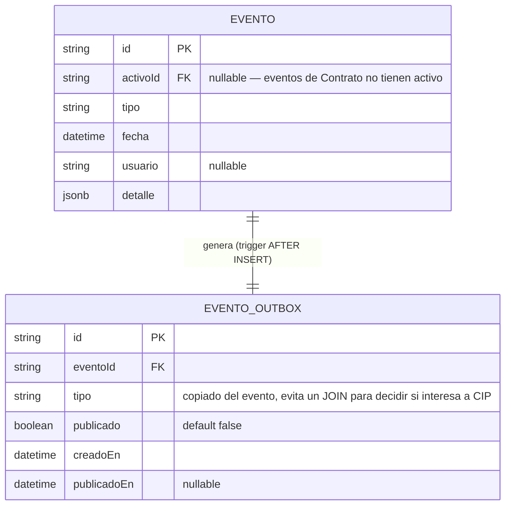

# Domain Model — CIP: primer dashboard (Fase 6)

CIP no tiene dominio transaccional propio — es un modelo de **lectura**, derivado de las entidades
ya definidas en `base-patrimonial/DOC-005-modelo-patrimonial.md` (`Activo`, `Inventario`,
`Evento`, `SesionInventario`, `Area`, `Ubicacion`, `CatalogoActivo`). Este documento define (1) el
punto de salida de CORE (outbox) y (2) las tablas de agregados propias de CIP que ese outbox
alimenta.

## 1. Punto de salida en CORE: `eventos_outbox`

Vive en la base `core`, no en la de CIP — es responsabilidad de CORE garantizar que todo evento
que escribe se ofrece para publicar, sin que ningún módulo de negocio (`EventoRepository`,
`InventariosService`, etc.) tenga que acordarse de hacerlo.

**Por qué un trigger de Postgres y no un `INSERT` extra en `EventoRepository.registrar`**: la
alternativa (agregar el insert a mano en cada call site — `EventoRepository`,
`SesionInventarioRepository.crear`, etc.) depende de que cada desarrollador futuro se acuerde de
hacerlo; un trigger `AFTER INSERT ON eventos` lo garantiza a nivel de base de datos, en la misma
transacción, sin tocar código de aplicación existente (RNF-03). Tradeoff aceptado: la lógica de
"qué se publica" queda parcialmente en SQL en vez de TypeScript — igual que `activos_estado_check`
ya vive en una constraint, no en código (precedente ya aceptado en este repo).

**No todo evento interesa a CIP** — `escaneo_qr` (uno por cada lectura, alto volumen) no dispara
recalculo por sí solo; el trigger filtra por `tipo` (ver
`design-artifacts/ARCHITECTURE.md` "Qué eventos importan al agregado").

## 2. Almacén de lectura propio de CIP

Base Postgres separada de `core` (RNF-01, RNF-05 — Postgres, no un motor analítico nuevo),
poblada exclusivamente por el worker consumidor de la cola (nunca por escritura directa de un
cliente). Vistas materializadas y tablas de agregados, no una copia 1:1 de las tablas
transaccionales de CORE (evita que CIP se vuelva una segunda Base Patrimonial).

```mermaid
erDiagram
    COBERTURA_ORGANIZACION {
        string organizacionId PK
        int activosRegistrados
        int activosEscaneados
        numeric porcentajeCobertura
        datetime actualizadoEn
    }
    CONTROL_AREA {
        string areaId PK
        string organizacionId FK
        string sedeId FK "eliminado en DOC-018 2.7 — sin forma de resolverlo desde las APIs de CORE disponibles hoy"
        boolean controladaEnPeriodo
        datetime ultimaSesionEn "nullable"
    }
    VEREDICTO_SESION {
        string sesionId PK
        string organizacionId FK
        string areaId FK
        string veredicto "exitoso | aceptable | defectuoso — recalculado por CIP, ver ARCHITECTURE.md"
        datetime fechaCierre
    }
    ACTIVO_FUERA_DE_AREA {
        string codigoQr PK "no activoId — GET /catalogo y GET /inventarios/:id de CORE no exponen el id interno del activo, ver DOC-018 2.5"
        string organizacionId FK
        string areaRealId FK
        string areaEsperadaId FK
        datetime detectadoEn
    }
    ACTIVO_NO_LOCALIZADO {
        string codigoQr PK
        string organizacionId FK
        datetime desdeEn
    }
    INCIDENCIA {
        string inventarioId PK
        string organizacionId FK
        string codigoQr "nullable"
        string observaciones
        datetime fecha
    }
    ESTADO_ACTIVO_RESUMEN {
        string organizacionId PK
        string estado PK "activo | mantenimiento | inactivo | dado_de_baja"
        int cantidad
    }
    CATEGORIA_ACTIVO_RESUMEN {
        string organizacionId PK
        string areaId PK "nullable — total sin filtrar cuando es null"
        string familia PK
        int cantidad
    }
    SYNC_ESTADO {
        string singleton PK "siempre 'global'"
        datetime ultimoEventoProcesadoEn
        boolean alDia
    }
```

Las 7 tablas de agregados cubren RF-01 a RF-07/RF-09 uno a uno. `SYNC_ESTADO` es la fila que
respalda RF-10 ("últimos datos conocidos"): el worker la actualiza en cada ciclo; la API de
lectura la expone junto con cada respuesta para que el frontend pueda mostrar "actualizado hace
X" sin adivinar.

## 3. Qué CIP deliberadamente NO replica

- **`auditoria`** — ya tiene su propio consumidor (`GET /auditoria` en CORE, Fase 5); duplicarla en
  CIP no tiene un caso de uso nuevo todavía.
- **Detalle completo de cada escaneo** (`inventarios` fila por fila) — CIP guarda agregados y las
  proyecciones puntuales que las historias piden (fuera de área, incidencias), no una copia
  completa de la tabla — si en el futuro se necesita el detalle de una sesión específica, ese
  drill-down final puede resolver contra `GET /inventarios/:id` de CORE directamente (lectura
  abierta, ya existe, bajo volumen) en vez de duplicar el dato.
- **`contratos`** — sin relación con el dashboard operativo de activos.
