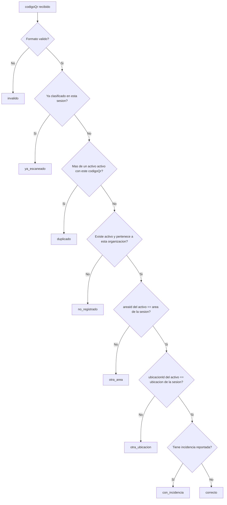

# DOC-009: Motor de Reglas — clasificación de escaneos (Fase 2)

## Función pura, no repository

```ts
function clasificarEscaneo(
  activo: Activo | null,
  duplicado: boolean,        // codigoQr con mas de un activo activo (ver 3)
  sesion: { organizacionId: string; areaId: string; ubicacionId: string },
  yaClasificados: ReadonlySet<string>,   // codigoQr ya resueltos en esta misma sesion
  codigoQr: string,
  tieneIncidencia: boolean,
): ScanResultado
```

Recibe todo ya resuelto (el activo, si hay duplicado, qué ya se clasificó en la sesión actual) —
no consulta la base. Igual que `app-qr-sicsaft/src/lib/scan-resolve.ts` hoy, pero corriendo en
CORE contra datos reales, no contra un snapshot potencialmente viejo del cliente (ver DOC-006
3, "el resultado que manda el cliente es una sugerencia offline, no la verdad").

## Árbol de decisión (idéntico al de `scan-resolve.ts`, más `duplicado` que solo CORE puede ver)



## Diferencias deliberadas con el cliente

1. **`duplicado`**: el cliente nunca puede detectarlo — solo ve su propio catálogo descargado,
   no toda la Base Patrimonial. Es la categoría que motivó mover este motor a CORE en primer
   lugar (ver `base-patrimonial/DOC-005-modelo-patrimonial.md` 5, nota heredada del handoff de
   APP QR).
2. **`con_incidencia`** se evalúa **después** de resolver la ubicación correcta, no como rama
   independiente — un activo con incidencia pero en la ubicación equivocada se clasifica
   `otra_ubicacion` (la ubicación es el problema más urgente de reportar), no `con_incidencia`.
   `scan-resolve.ts` no modela esta rama porque el cliente no recibe `incidencias[]` hasta cerrar
   la sesión completa — es una diferencia de **cuándo** se evalúa, no de regla de negocio.
3. **Orden `ya_escaneado` antes que `duplicado`**: si el mismo código ya se escaneó en esta
   sesión, no vale la pena re-verificar si está duplicado en la base — es información redundante
   para el operador en este momento.

## Qué NO resuelve este documento

- **Umbral de "2+ ciclos sin localizar → extraviado"** (mencionado en
  `base-patrimonial/DOC-005-modelo-patrimonial.md` 4 como "regla de negocio de Fase 2") — sigue
  sin definir cuántos ciclos ni de qué duración. No se implementa en esta fase por falta de
  criterio de negocio confirmado; el estado `extraviado` queda modelado en el enum pero sin
  transición automática todavía, solo manual (fuera de alcance también, ver DOC-008).

## Documentos relacionados

[DOC-006](DOC-006-api-cis-core.md) 3 — de dónde vienen `activo`, `duplicado`, `tieneIncidencia`.
`app-qr-sicsaft/src/lib/scan-resolve.ts` — versión cliente que esta función reemplaza como fuente
de verdad (el cliente sigue teniendo su propia copia para poder operar offline, pero deja de ser
la clasificación final).
