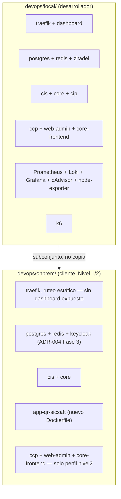
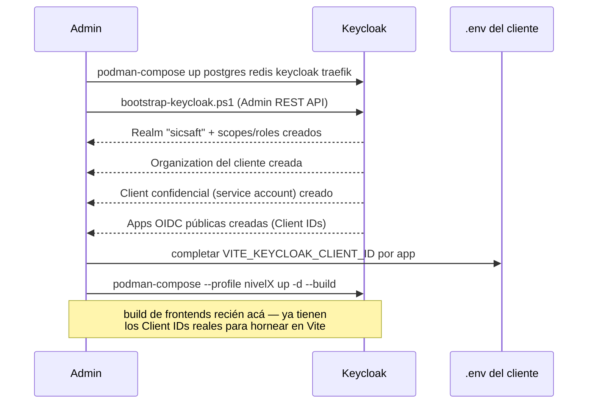

# Arquitectura — Instalador on-premise por cliente

Ver `../requirements/INTENT.md` y `../requirements/REQUIREMENTS.md` para el contexto y los
requisitos completos. Este documento cubre cómo `devops/onprem/` deriva de `devops/local/`, qué
entra en cada nivel, y el flujo del bootstrap de Keycloak (ADR-004 Fase 3, reemplaza al de Zitadel
descrito originalmente acá — `devops/local/` sigue en Zitadel, no migró en esta fase).

## De dónde parte

`devops/onprem/` es una tercera carpeta hermana de `devops/local/` (dev) y `devops/prod/`
(VPS/Coolify) — mismo patrón documentado en `devops/README.md` "Árbol real". Parte de
`devops/local/docker-compose.yml` porque ya es, en los hechos, un tenant aislado (un Postgres, un
Zitadel, sin infraestructura multi-cliente real) — más cercano a lo que necesita una instalación
de cliente que `devops/prod/` (pensado para Linux/Coolify, no para un PC Windows).

## Diferencias contra `devops/local/`

- **Sin observabilidad** (Prometheus/Loki/Grafana/cAdvisor/node-exporter) ni `k6`: herramienta del
  admin/desarrollador, no del cliente final. No se instala en el PC del cliente (INST-RNF-02).
- **Sin dashboard de Traefik expuesto** (`--api.insecure=true` de `devops/local/` queda fuera):
  riesgo innecesario en el PC del cliente.
- **`cip` fuera de los 3 niveles**: no mencionado por el usuario en el modelo de precios — pregunta
  abierta (INST-Q-01), no se instala hasta que se decida.
- **`app-qr-sicsaft` necesita `Dockerfile` propio**: hoy se despliega en Vercel (`README.md`
  "Dónde está el trabajo activo hoy"), no tiene contenedor — se agrega uno nuevo, mismo patrón que
  `ccp/Dockerfile` (build Vite multi-stage + `nginx-unprivileged` sirviendo el bundle, puerto
  8080).
- **Runtime de contenedores: Podman, no Docker Desktop** — ver "Runtime: Podman" abajo.

## Niveles de producto → servicios (resumen, detalle formal en DOC-025)

| Nivel | Servicios que se levantan |
|---|---|
| Nivel 1 | `postgres`, `redis`, `keycloak`, `core-migrate`→`core`, `cis`, `cip-migrate`→`cip`, `app-qr-sicsaft`, `web-admin`, `core-frontend` |
| Nivel 2 | Nivel 1 + `ccp` |
| Nivel 3 | Nivel 2 + RFID — **no implementado, `rfid/` no tiene código todavía** |

Implementado con **Compose profiles** (`nivel2`) en un solo `docker-compose.yml` — mismo mecanismo
que ya usa `devops/local/docker-compose.yml` para aislar el servicio `k6` (`profiles: ["k6"]`).
Los servicios base (postgres/redis/keycloak/cis/core/cip/app-qr-sicsaft/web-admin/core-frontend) no
llevan profile (siempre se levantan, desde Nivel 1 — DOC-025 §1 revisado 2026-08-25); `ccp` es el
único con `profiles: ["nivel2"]`.

## Runtime: Podman, no Docker Desktop

Decisión confirmada con el usuario: Docker Desktop tiene overhead real en el PC del cliente (VM
Hyper-V/WSL2 + GUI + licenciamiento comercial por tamaño de empresa). En su lugar:

- **Podman** (rootless, sin daemon persistente con GUI) + **podman-compose** — compatible con los
  mismos `Dockerfile`s y prácticamente el mismo `docker-compose.yml` que ya existen en el repo.
- Sigue apoyándose en una máquina WSL2 propia (`podman machine init && podman machine start`) —
  WSL2 no desaparece, pero sí el daemon Docker Desktop con GUI.
- **Riesgo a verificar, no asumido**: los `healthcheck` + `depends_on: condition:
  service_healthy` que el compose actual usa fuerte (`core-migrate` → `core`, `postgres`/`redis`
  healthy antes de levantar `cis`/`core`) deben comportarse igual bajo `podman-compose` — se
  verifica al implementar `devops/onprem/docker-compose.yml`, no se da por hecho que la paridad
  con Docker Compose es 100%.
- Como Podman no tiene Enhanced Container Isolation (limitación específica de Docker Desktop en
  Windows), el problema documentado en `devops/local/README.md` ("Nota sobre el ruteo de Traefik
  en Windows") sobre el provider `docker` de Traefik podría no aplicar — igual se mantiene el
  provider `file` (ruteo estático) por simplicidad y paridad con `devops/local/`, no por esa
  restricción puntual.

## Flujo del bootstrap de Keycloak (ADR-004 Fase 3)

`bootstrap-keycloak.ps1` reusa el mismo patrón de cliente HTTP contra la Admin REST API de Keycloak
que ya existe en `cis/src/keycloak-admin/keycloak-admin.service.ts` — no se reinventa la
integración, se adapta a un script standalone porque corre antes de que `cis` exista (el bootstrap
es anterior al `up` completo del stack).

## Automatización end-to-end (INST-RF-07/08)

**Nota histórica**: la versión original de esta sección documentaba el bootstrap de Zitadel — el
flujo dependía de un PAT que Zitadel auto-provisionaba en el primer arranque
(`ZITADEL_FIRSTINSTANCE_ORG_MACHINE_*`/`PATPATH`, investigado contra `cmd/setup/steps.yaml` del
repo oficial de Zitadel). ADR-004 Fase 3 (2026-08-26) reemplazó ese mecanismo por completo — el
resto de esta sección describe el flujo actual con Keycloak.

Keycloak no auto-provisiona nada: `bootstrap-keycloak.ps1` se autentica directo contra el realm
`master` con las credenciales `KEYCLOAK_ADMIN_USERNAME`/`PASSWORD` que ya arrancaron el propio
contenedor (`docker-compose.yml`) — sin PAT, sin archivo de secretos runtime que montar aparte.
Esto simplifica el flujo respecto al de Zitadel: un paso menos ("esperar el PAT") y un directorio
menos que proteger (`.bootstrap/` ya no existe).

`devops/onprem/instalar-cliente.ps1` orquesta el flujo completo: verifica/instala WSL2 y Podman
(`winget install RedHat.Podman`) y `podman-compose` (`pip install podman-compose` — `podman
compose` nativo desde Podman 4.7 es solo un wrapper que delega a un compose provider externo, no
trae uno instalado por default, y no hay paquete de `podman-compose` en winget todavía), genera un
`.env` con contraseñas únicas por cliente, levanta `postgres`/`redis`/`keycloak`/`traefik`, espera
a que Keycloak responda en su endpoint de discovery OIDC, corre el bootstrap (extraído a
`devops/onprem/lib/Bootstrap-Keycloak.psm1`, reusado también por `bootstrap-keycloak.ps1` como
wrapper delgado), completa el `.env` sin copy-paste manual, construye y levanta el stack completo,
y termina con un smoke check por servicio.

`devops/onprem/installer/sicsaft-onprem.iss` empaqueta todo lo anterior en un instalador `.exe`
(Inno Setup) con una UI de 2 pantallas (datos del cliente, nivel) que corre
`instalar-cliente.ps1` al final.

**Estado de verificación real (2026-08-26)**: la parte de WSL2/Podman/winget/build de este flujo
ya está verificada corriendo de punta a punta contra Windows real varias veces — ver
`devops/onprem/README.md` "Instalación automatizada" y `devops/onprem/installer/README.md` para el
historial de bugs reales encontrados y corregidos (con el bootstrap de Zitadel original). La parte
de Keycloak (`Bootstrap-Keycloak.psm1`) se verificó real llamada por llamada contra un Keycloak
26.0 de prueba — realm, Organizations, client scopes con Audience mapper, roles, clients OIDC
públicos con PKCE, client confidencial con service account, y el login completo de un usuario de
prueba con inspección del JWT resultante. Lo que falta es correr el flujo COMPLETO (WSL2 + Podman +
Keycloak + build) de punta a punta en una sola corrida contra este `docker-compose.yml` — ver
`devops/onprem/installer/README.md` para el checklist pendiente antes de usarlo con un cliente
pagante.

## Qué NO cambia

- El esquema de base de datos (`core/migrations/`, `cip/migrations/`), los `Dockerfile`s de cada
  sistema, y la lógica de `core-migrate`/`cip-migrate` se reusan tal cual — este incremento es
  puramente de topología de despliegue, no de dominio.
- `devops/local/` y `devops/prod/` no se tocan — `devops/onprem/` es un tercer objetivo de
  despliegue, no un reemplazo.
