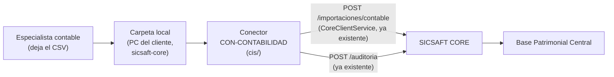

# DOC-016: Conector CON-CONTABILIDAD

Diseño de la pieza que `ROADMAP.md` Fase 7 y `integraciones/README.md` reservaban con este
número. Ver [INTENT.md](../requirements/INTENT.md) y [REQUIREMENTS.md](../requirements/REQUIREMENTS.md)
para alcance. **Estado: diseñado, sin código todavía.**

## 1. Qué resuelve

Hoy la única forma de meter una actualización masiva de la base contable a SICSAFT es que un
humano (Profesional de AFT / Administrador Patrimonial) suba un CSV a mano desde
`ccp/src/pages/ImportacionesPage.tsx` (DOC-012 §6, ✅ implementado). Este documento automatiza
esa entrega: una carpeta local en la PC del cliente, vigilada a diario, sin intervención humana.



**Nada de esto es un camino de escritura nuevo**: el conector es, literalmente, "un cliente más"
de `POST /importaciones/contable` — el mismo endpoint que ya usa el puente manual de `ccp/`.

## 2. Dónde vive el código

Todo en `cis/`, módulo nuevo `cis/src/importacion-contable-conector/` — no un deployable nuevo
(`integraciones/` sigue sin código propio, solo corrige su README, ver §9). Reusa:

- `CoreClientService.postImportacionContable` (`cis/src/core-client/core-client.service.ts:381`)
  — circuit breaker + reintentos con backoff ya provistos (WAF 4), sin reimplementar.
- `CoreClientService.postAuditoria` (`cis/src/core-client/core-client.service.ts:527`) — mismo
  canal que ya usa `auditoria-identidad` para reportar operaciones que no pasan por el
  Orquestador. Este conector es el segundo consumidor de ese mismo canal, no uno nuevo.

Dependencias nuevas: `@nestjs/schedule` (paquete oficial de Nest para cron, no third-party
suelto). Sin parser CSV de librería — mismo criterio simple que ya usa
`ImportacionesPage.tsx:40` (`split(',')`), portado a Node.

## 3. Programación y disparo

`@nestjs/schedule`'s `@Cron(expresion)`, expresión configurable vía env var
(`CON_CONTABILIDAD_CRON`, default `0 3 * * *` — 03:00 todos los días, fuera de horario laboral).
Un método interno separado de la lógica de negocio (`ejecutarCorrida()`) permite además un
disparo manual (útil para pruebas locales, ver §8) sin depender del cron.

## 4. Idempotencia: reenviar siempre, sin estado local en CIS

**Decisión explícita**: el conector NO lleva una marca de "archivo ya procesado" (ni hash ni
timestamp) — en cada corrida relee el archivo completo y lo reenvía entero a
`POST /importaciones/contable`.

Por qué es seguro: ese endpoint ya es idempotente por fila (DOC-012 §6) — contenido igual
devuelve `ya_importado` sin reescribir; contenido distinto para el mismo `codigoPatrimonial`
devuelve `conflicto`, nunca sobrescribe en silencio. Reenviar un archivo sin cambios todos los
días es un no-op costoso en red pero gratis en efectos (mismo criterio que ya aplica CIS a
`POST /inventarios`, DOC-002 §4 "reintentar es seguro").

Por qué se prefiere a llevar estado local: CIS hoy no tiene base de datos propia (proxy sin
estado, ver `CLAUDE.md` "cis/ — backend NestJS... nunca escribe directo a la Base Patrimonial").
Agregar un archivo de estado local (`ultimo-hash.json` o similar) introduciría una fuente de
verdad paralela que puede quedar desincronizada de lo que CORE realmente tiene (reinstalación de
`sicsaft-core`, carpeta de datos borrada, `postgres-data` reseteado como ya pasó en esta misma
sesión) — sin ese estado, el conector siempre converge al estado real de CORE, nunca puede
quedar "creyendo" que ya sincronizó algo que en realidad no llegó.

## 5. Identidad y autorización — sin camino nuevo en CORE

`POST /importaciones/contable` exige `operadorId` + `organizacionId` +
`rolesPorOrganizacion` (`escrituraOficialSchema`, `core/src/patrimonial/activo.schemas.ts:13`) y
CORE verifica `administrador-patrimonial` en esa organización
(`verificarRolAdministradorPatrimonial`, DOC-012 §3). El resto de los callers de CIS obtienen
esos campos de un JWT humano validado por `ZitadelAuthGuard`. El conector no tiene un humano
detrás — construye una identidad sintética en memoria:

```ts
{
  operadorId: 'con-contabilidad',           // constante, distinguible en auditoría de un alta humana
  organizacionId: config.organizacionId,     // una organización por instalación de sicsaft-core
  rolesPorOrganizacion: { [config.organizacionId]: ['administrador-patrimonial'] },
}
```

**Por qué esto no rompe el modelo de cero confianza (WAF 3)**: CORE sigue re-verificando el rol
igual que a cualquier otro caller — no hay bypass ni endpoint nuevo. Lo que cambia es *quién*
puede afirmar ese rol: no un JWT firmado por Zitadel, sino la propia configuración del proceso de
CIS. Es el mismo nivel de confianza que ya existe para `CORE_SERVICE_TOKEN` (quien controla el
entorno donde corre `cis/` ya tiene control total sobre qué puede pedirle a CORE) — no un nivel
de confianza nuevo, solo aplicado a una decisión de negocio en vez de a autenticación de
transporte. Habilitado por organización vía config de servidor (§6), nunca por un toggle en
ninguna UI todavía — sin superficie de ataque nueva expuesta a un usuario final.

## 6. Configuración

Variables de entorno de `cis/` (mismo patrón que el resto de `backend-configs.ts` en
`sicsaft-core/`):

| Variable | Ejemplo | Notas |
|---|---|---|
| `CON_CONTABILIDAD_HABILITADO` | `true`/`false` | default `false` — opt-in explícito por instalación |
| `CON_CONTABILIDAD_ORGANIZACION_ID` | `cliente-prueba` | una sola organización por instalación on-prem (mismo modelo que el resto de `sicsaft-core`) |
| `CON_CONTABILIDAD_CARPETA` | `C:\ProgramData\SICSAFT\contable-entrada` | carpeta local, nunca un share de red (RNF-04) |
| `CON_CONTABILIDAD_ARCHIVO` | `base-contable.csv` | nombre fijo esperado — evita ambigüedad de "cuál archivo" si hay varios en la carpeta |
| `CON_CONTABILIDAD_CRON` | `0 3 * * *` | default diario 03:00 |

`sicsaft-core/src/main/services/backend-configs.ts` (`crearConfigCis`) pasa estas variables
cuando arranca `cis` — mismo lugar donde hoy se arma `KEYCLOAK_URL`/`CORE_URL`/etc. La carpeta
en sí (`CON_CONTABILIDAD_CARPETA`) se crea si no existe al arrancar, igual criterio que
`postgres-service.ts` con su `dataDir`.

## 7. Manejo de errores

| Caso | Comportamiento |
|---|---|
| Carpeta no existe o archivo esperado ausente | Corrida "sin cambios" — se reporta a `/auditoria` (`resultado: 'sin_archivo'`), no es un error, es el estado normal la mayoría de los días |
| CSV con columnas faltantes/mal formado | Corrida completa aborta, se reporta a `/auditoria` con `resultado: 'error'` y el detalle — no se reintenta fila por fila porque no hay filas parseables |
| Fila individual con `catalogoId` inexistente u otro 400 de negocio | Ya lo resuelve CORE hoy — vuelve como `conflicto`/fila con error dentro de `ImportacionContableResultado`, no aborta el resto del archivo (DOC-012 §6) |
| CORE no disponible (circuito abierto, 5xx, timeout) | `CoreClientService` ya reintenta con backoff (RNF-01); si sigue fallando, la corrida de hoy se reporta como error y la de mañana lo vuelve a intentar con el archivo completo (§4) — nunca se pierde el dato, nunca bloquea el resto de CIS (RF-08) |
| `POST /auditoria` en sí falla | Mismo criterio ya documentado para `postAuditoria` (DOC-024 §3): no hay rechazo de negocio que distinguir, se loguea localmente en CIS (nivel warn) y no se reintenta — el próximo día vuelve a intentar auditar la corrida nueva |

## 8. Riesgo aceptado (ver INTENT.md)

`ROADMAP.md` marcaba explícitamente como riesgo "construir CON-CONTABILIDAD contra un sistema
contable hipotético". Esta fase avanza igual, por decisión del usuario (2026-08-28), contra un
formato CSV genérico (idéntico al que ya acepta la carga manual) en vez de contra un ERP real.
Consecuencia concreta si más adelante aparece un sistema real con un formato distinto: el punto
de cambio es exclusivamente el parseo (§2, "parser CSV... portado a Node") — el transporte
(carpeta vigilada, cron, identidad sintética, canal de auditoría) no cambia. No se considera
trabajo tirado, es la misma superficie que ya reusa el conector automático según el propio
`ROADMAP.md` Fase 7 ("mismo shape de payload por fila").

## 9. Fuera de alcance de este documento

- Prueba/verificación con un archivo real de un cliente concreto — sin sistema identificado
  (INTENT.md).
- Tabla `integraciones_registro` o dominio `Integraciones` completo de DOC-005 — se reusa
  `auditoria` (§2, §7); revisar esta decisión si CIP (Fase 9, DOC-026) necesita algún día un
  panel de salud de conectores con más detalle del que `auditoria` puede dar.
- Corrección de clasificación de `integraciones/README.md` ("fase tardía" → Etapa 1 para
  CON-CONTABILIDAD específicamente, el resto de conectores previstos sigue en fase tardía) — se
  aplica en el mismo incremento, no es parte del diseño técnico de este documento.
- UI de configuración del conector — hoy es enteramente por variables de entorno (§6).

## 10. Documentos relacionados

[ROADMAP.md](../../../ROADMAP.md) Fase 7 (origen), [DOC-012](../../../seguridad/DOC-012-administrador-patrimonial.md)
§6 (endpoint reusado), [DOC-005](../../../base-patrimonial/DOC-005-modelo-patrimonial.md) §1/§8
(por qué `Integraciones` quedó sin modelar hasta ahora), [DOC-006](../../core/design-artifacts/DOC-006-api-cis-core.md)
(convenciones CIS↔CORE que este conector hereda), `ARQUITECTURA-WAF.md` §3 (cero confianza) y §4
(circuit breaker/reintentos).
