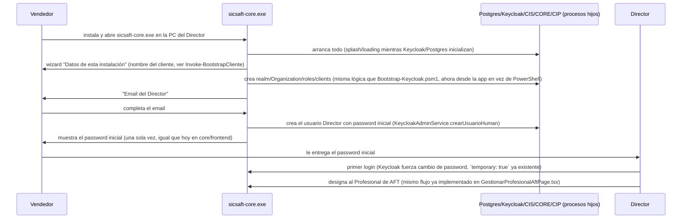

# Arquitectura — SICSAFT CORE (app de escritorio nativa)

Ver `../requirements/INTENT.md` para el contexto completo. Este documento cubre cómo se empaqueta
cada componente dentro de `sicsaft-core.exe`, qué tan factible es cada uno (investigado, no
supuesto), y el flujo de primer arranque.

> Los bugs reales encontrados construyendo todo esto (identidad Keycloak, wizard, login embebido,
> APP QR por LAN) están consolidados en [DOC-027](DOC-027-bitacora-bugs-reales.md) — causa raíz,
> commit y patrones que se repiten. Este documento los cita como `DOC-027 BUG-NN` en vez de
> repetirlos.

## Decisión: Electron, no Tauri

Ambos resuelven "app de escritorio nativa con procesos embebidos", pero:

- **Electron** trae Node.js embebido en el proceso principal — spawnear/gestionar los procesos
  hijos (Postgres, Keycloak, `cis`/`core`/`cip`) es directo (`child_process.spawn`), sin runtime
  adicional que bundlear para eso. `electron-builder` genera el instalador `.exe` (NSIS) sin
  fricción.
- **Tauri** tiene un shell mucho más liviano (WebView2 del sistema en vez de Chromium empaquetado),
  pero el proceso principal es Rust — el equipo no tiene ese stack (todo el monorepo es
  TypeScript/NestJS/React) y de todos modos habría que bundlear un runtime Node aparte para correr
  `cis`/`core`/`cip` (son NestJS, no se reescriben a Rust en este incremento).
- El ahorro de tamaño de Tauri (~100-150MB menos de shell) es marginal comparado con lo que ya pesan
  Postgres + JRE/Keycloak embebidos (fácil 300-400MB juntos) — no cambia la categoría de tamaño del
  instalador final.

**Se elige Electron** por esto — más simple para el equipo real, el ahorro de Tauri no justifica
introducir Rust.

## Componente por componente — factibilidad real

### Postgres — hecho y verificado real (2026-08-27)

EDB (EnterpriseDB) publica binarios oficiales de Postgres para Windows como ZIP portable (sin
instalador) — vendorizados en `resources/postgres/` (PostgreSQL 16.15-1, solo `bin/`/`lib/`/
`share/`, ver `resources/README.md`). Al primer arranque: `initdb.exe` crea un data directory
nuevo en `%APPDATA%/sicsaft-core/postgres-data` (nunca dentro de `Program Files`, por permisos),
después `pg_ctl.exe`/`postgres.exe` corre como proceso hijo del proceso principal de Electron,
escuchando en `127.0.0.1:55432` (no el 5432 estándar, para no chocar con un Postgres que el
cliente ya tenga instalado). Verificado real: `initdb`, arranque, y un `SELECT version()` real vía
`psql.exe` contra el proceso arrancado.

### Keycloak — hecho y verificado real (2026-08-27), con 3 hallazgos reales en el camino

Confirmado en ADR-004 (Context): Keycloak sí tiene distribución Windows oficial (ZIP + `kc.bat`,
JVM, Java 17 mínimo). Vendorizados Eclipse Temurin JRE 17.0.20.1+1 + Keycloak **26.0.8** (no
26.0.0 — ver hallazgo 3) en `resources/keycloak/` (ver `resources/README.md`), con `kc.bat build
--db=postgres --health-enabled=true` corrido en tiempo de EMPAQUETADO (hoy a mano, pendiente
automatizar) para poder arrancar con `--optimized` sin el error real que ya encontramos ("was used
for first ever server start" si no se pre-compila).

**3 hallazgos reales adicionales, no anticipados, encontrados arrancando de verdad** (detalle en
DOC-027 BUG-23/24/25): (1) `--db`/`--health-enabled` son opciones de BUILD TIME en Keycloak 26, no
de runtime — pasarlas solo a `start --optimized` sin `kc.bat build` tira "ERROR: build time
options have values that differ from what is persisted" y el proceso muere. (2) El health-check
(`/health/ready`) vive en una interfaz de **management separada** del puerto HTTP principal
(default 9000, acá fijo en `KC_HTTP_MANAGEMENT_PORT`) — `keycloak-service.ts` apuntaba
originalmente al puerto HTTP y nunca hubiera quedado "listo". (3) Keycloak **26.0.0** tiene un bug
real en `POST /organizations/{id}/members` (usado por `crearGrant`/`crearUsuarioDirector`) —
responde `HTTP 400 "User does not exist"` con el body/headers correctos, arreglado en 26.0.6
(confirmado real: falla en 26.0.0, pasa en 26.0.8 con el mismo código). Además, ese mismo endpoint
exige un string JSON con comillas y `Content-Type: application/json` explícito, o responde 415
(DOC-027 BUG-26), y el `/health/ready` queda verde antes de que el realm sirva tráfico interactivo
o el token del realm master responda sin 500 (DOC-027 BUG-27/28) — todo eso salió cableando el
login embebido, después de este primer arranque.

**Costo real, no minimizado**: JRE + Keycloak suman ~282MB al instalador (verificado, no
estimado), y el arranque en frío de la JVM (aunque optimizado) tomó ~21s en la verificación real —
hace falta un splash/loading screen mientras arrancan los servicios de fondo, no un arranque
instantáneo. Se mantiene Keycloak (no se vuelve a cambiar de identity provider por tercera vez)
porque todo el trabajo de ADR-004 Fases 1-3 (guards, admin service, roles por Organization,
bootstrap) ya está hecho y verificado real end-to-end — reabrir esa decisión de nuevo tendría un
costo mayor al de aceptar el peso de la JVM.

### Redis — resuelto: sacado del ecosistema completo (ADR-005, 2026-08-27)

Investigado el mismo día en dos rondas: primero qué tan viable era empaquetar Redis para Windows
(Memurai gratis prohíbe producción, Memurai Enterprise es pago sin precio público,
`redis-windows/redis-windows` es la opción sin costo más al día pero sin respaldo del fabricante),
después si hacía falta empaquetar *algo* — la respuesta fue no. El usuario confirmó sacar Redis del
**ecosistema completo** (los 3 perfiles de `devops/`, no solo el embebido), documentado en
[ADR-005](../../../adr/ADR-005-postgres-pgboss-reemplaza-redis.md) e implementado ese mismo día:

- `core/`+`cip/`: la cola `cip-eventos` (antes BullMQ/Redis) pasa a
  [`pg-boss`](https://github.com/timgit/pg-boss) sobre una base Postgres dedicada
  (`eventos_outbox`, `EVENTOS_OUTBOX_DATABASE_URL`) — separada de las bases `core`/`cip` a
  propósito (RNF-01/RNF-05), pero infraestructura de mensajería explícitamente compartida entre
  ambos, mismo tipo de recurso que Redis ya era.
- `cis/`: el rate limiter (`InMemoryRateLimiter`) y el device-registry pasan a memoria del propio
  proceso — `cis/` no tiene Postgres propio y corre como instancia única en los 3 perfiles hoy, así
  que no hace falta ningún backend externo (excepción documentada a "multi-instancia sin estado en
  memoria compartido" de WAF 4, ver `ARQUITECTURA-WAF.md`).

**Para este incremento (el perfil embebido) esto es una simplificación directa, no un costo
nuevo**: Postgres ya era una dependencia dura embebida en `sicsaft-core.exe` — la cola de eventos
la usa sin agregar ningún proceso nuevo, y `cis/` sin Redis significa un componente menos por
vendorizar (`resources/redis/` ya no existe, ver `resources/README.md`). El spike de "Redis
embebido en Windows" que bloqueaba la integración de `cis`/`core`/`cip` al orquestador
(`service-orchestrator.ts`) queda cerrado — el bloqueante real ahora es solo el wiring en sí
(env vars, migraciones, la base `eventos_outbox` nueva), no una dependencia externa sin resolver.

### `cis`/`core`/`cip` — hecho y verificado real (2026-08-27)

Ya son apps Node/NestJS compiladas (`node dist/main.js`) — corren como procesos hijos usando el
propio Node embebido de Electron (`spawn` apuntando a `process.execPath` con
`ELECTRON_RUN_AS_NODE=1`), cada uno en un puerto fijo distinto de `127.0.0.1` (56000/56001/56002),
con las mismas env vars que ya usa `devops/onprem/docker-compose.yml` hoy (`KEYCLOAK_URL`,
`CORE_DB_*`, etc. — ver `backend-configs.ts`) apuntando a los procesos locales en vez de a nombres
de servicio de un compose. Ningún cambio de código en estos tres sistemas — solo cambia qué los
arranca y con qué env vars. `core`/`cip` migran su esquema (`node scripts/migrate.js up`) antes de
arrancar, vía `migration-runner.ts`. `cis` arranca en un segundo momento (`iniciarCis()`, llamado
desde el paso 1 del wizard), porque necesita el client OIDC (`KEYCLOAK_ADMIN_CLIENT_ID/SECRET`)
que `keycloak-bootstrap.ts` recién crea ahí — `postgres`/`keycloak`/`core`/`cip` arrancan solos en
`iniciarTodo()`. Simplificación deliberada sobre `devops/`: un solo usuario Postgres
(`sicsaft_admin`) para las 4 bases (`postgres-bootstrap.ts`), en vez de un usuario por sistema —
acá el único cliente de Postgres es esta misma app, no hay superficie multi-tenant que aislar.

### Los portales embebidos (`core/frontend`, `ccp`) — CORE-RF-04 (alcance corregido 2026-08-28)

`sicsaft-core.exe` embebe `core/frontend` (Directivo) y `ccp` (Profesional de AFT) — `web_admin`
(Administrador del Sistema) queda fuera de este incremento, no es un rol que esta app necesite
embebido. `ccp` va **completo en todos los niveles** (DOC-025 §1.1, corrección 2026-09-02 — el "web-aft"
liviano quedó descartado). El nivel contratado solo decide, vía `VITE_SICSAFT_NIVEL` inyectado al
servir el portal, si el módulo **Dashboard/indicadores** (CIP) aparece: Nivel 1 lo oculta, Nivel 2
lo muestra. `web_admin` no se embebe en ningún nivel.

Ambos son builds Vite estáticos (`npm run build`). Se sirven por `http://127.0.0.1:<puerto>`
(`ccp` → 8766, `core/frontend` → 8768 — los mismos puertos que cada portal ya reserva para su
propio `vite preview` en `vite.config.ts`, para que el `redirectUri` que registra Keycloak sea el
mismo sin importar cómo se sirva el portal) desde `static-portal-server.ts` — un servidor
estático de ~40 líneas con `node:http` **dentro del propio proceso de Electron**, sin dependencia
nueva (nada de `express`/`serve-static`/`vite`): sirve el `dist/` ya compilado con MIME types
básicos + SPA fallback a `index.html` (para que un refresh en `/auth/callback` no tire 404).
Mismo criterio que `node-backend-service.ts` (`cis`/`core`/`cip` corren `node dist/main.js`
directo, sin su toolchain de desarrollo en runtime). Se muestran dentro de la propia ventana de
Electron como una `WebContentsView` embebida (no `BrowserView` — Electron 44 lo tiene
soft-deprecated a favor de `contentView.addChildView`) — nunca una ventana de navegador aparte
con URL visible.

**Login único, no un login por portal**: en vez de mostrar cada portal con su propia pantalla de
login (obligaría a elegir "¿sos Director o Profesional de AFT?" antes de loguearse), la pantalla
"listo" del wizard (`PasoListoConLogin.tsx`) muestra una `WebContentsView` chica apuntando directo
a la página de login real de Keycloak (`/realms/sicsaft/protocol/openid-connect/auth`, client OIDC
`sicsaft-core` — el mismo del wizard, solo para este login que detecta el rol) — visualmente es
exactamente "un cuadrado con login más chico, correo y contraseña" (pedido explícito del usuario),
porque es el formulario real de Keycloak, no uno propio reimplementado. El proceso principal
(`portal-login-service.ts` `PortalEmbebidoManager`) intercepta el redirect a la `redirect_uri`
local con `will-redirect`/`will-navigate` (nada escucha en ese puerto — la navegación se corta
antes de intentarse), canjea el código por un token con PKCE, decodifica `realm_access.roles` del
JWT (sin verificar firma acá — el token igual se valida server-side en cada request real, esto es
solo para decidir qué portal mostrar) y navega la **misma** `WebContentsView` a
`http://127.0.0.1:8768` si el rol es `directivo`, o a `http://127.0.0.1:8766` si es
`administrador-patrimonial` (el rol real que `cis` asigna y `ccp` exige — no `profesional-aft`,
ver DOC-027 BUG-29). Ese portal hace su propio login PKCE normal, pero como corre en la misma
`session` de Electron, la cookie de sesión de Keycloak ya existe — el redirect es silencioso
(SSO), el operador no vuelve a tipear nada. El botón "Cambiar de usuario" fuerza `prompt=login`
para poder entrar con otra cuenta sin cerrar la app.

El renderer nunca ve la `WebContentsView` (vive fuera del DOM, la superpone el proceso principal):
lo único que cruza IPC es el rectángulo en coordenadas de pantalla del placeholder donde debe
dibujarse — ni tokens ni roles ni URLs de portal.

**Relanzamiento (wizard ya corrido)**: cada instalación de `sicsaft-core.exe` es de un solo
cliente. `instalacion-marker.ts` persiste `instalacion.json` en `userData` al terminar el paso 1
del wizard — en el próximo arranque, `WizardApp.tsx` lo consulta y salta directo al login
embebido, sin reintentar `bootstrapCliente` (que rompería con 409, el realm ya existe). En esa
rama `cis` no lo arranca el wizard, así que `getInstalacionExistente` lo arranca recuperando el
`client_secret` de `cis-admin` de la Admin API (no se persiste en disco). Ver DOC-027 BUG-30/31.

**Cuidado real, mismo tipo de bug que ya encontramos**: cargar contenido desde `file://` directo
en Electron NO es "secure context" por default (mismas reglas de la Web Platform que ya rompieron
`crypto.subtle` en el navegador con dominios `.test`, DOC-027 BUG-08) — de ahí servir todo por
`http://127.0.0.1:<puerto>` (loopback SÍ es secure context) en vez de `file://`. La APP QR sí
necesitó HTTPS autofirmado porque tiene que alcanzar el teléfono por LAN (DOC-027 BUG-10); acá
todo es loopback, `http://` alcanza.

> Todos los bugs reales encontrados cableando esto — SSO silencioso rechazando `loadURL`,
> React StrictMode disparando dos flujos OIDC, la `WebContentsView` tapando el botón por
> compositing, el `/health/ready` de Keycloak mintiendo — están en
> [DOC-027](DOC-027-bitacora-bugs-reales.md) F, con causa raíz y fix.

### La APK de Android — CORE-Q-01 reabierta (2026-08-27): no existe todavía

> **► Actualización 2026-09 ([DOC-029](../../ccp/design-artifacts/DOC-029-endurecimiento-ccp-cliente-real.md) RF-H)**:
> la APK **se construyó**, pero **no como un wrap Capacitor** — es una **WebView Kotlin propia** en
> `apk-aft/` (un TWA con el cert autofirmado en IP de LAN no carga: la WebView propia sí puede
> aceptar ese cert). `prepack.cjs` empaqueta el `.apk` firmado en `resources/apk/`. Lo de abajo
> sobre Capacitor / `capacitor.config.ts` quedó sin efecto. Sigue abierto verificar la APK en un
> teléfono real y servirla desde el `.exe` con un 2º QR.

Se había dado por resuelta el mismo día asumiendo que era un wrap Capacitor de
`app-qr-sicsaft/` "ya compilado, mantenido fuera de este repo" (confirmado por `grep` que no hay
tooling de Capacitor/Cordova/Tauri-mobile en ningún `package.json` del monorepo) — el usuario
corrigió que esa APK **no existe todavía**, esa afirmación era incorrecta. Este incremento no la
construye ni diseña su mecanismo de red (ver siguiente sección, que queda sin resolver hasta que
la APK exista) — es un incremento aparte, no bloqueante para Nivel 1 embebido
(Postgres/Keycloak/`cis`/`core`/`cip`, que no depende de la APK para nada).

## Consola técnica en pantalla — diagnóstico de arranque (0.1.1)

**Problema real**: el `.exe` se abre con doble clic y no tiene stdout visible. Cuando la
instalación en la PC de un cliente falla (Postgres no levanta, una migración de CORE/CIP se rompe,
Keycloak devuelve 409 en el bootstrap), el motivo se perdía — no hay terminal en terreno. Surgió
de un fallo real de instalación que no se pudo diagnosticar.

**Solución** (PR #97, `src/main/services/logger.ts` + `src/renderer/src/components/ConsolaTecnica.tsx`):

- **Log unificado del proceso principal** — `console.*` (parcheado en `index.ts`), transiciones del
  `ServiceOrchestrator` (`postgres → iniciando` / `error: …`) y `stdout`/`stderr` crudo de los 5
  servicios embebidos van todos a un **buffer en memoria** (3000 líneas) + un **archivo por día**
  en `%APPDATA%\sicsaft-core\logs\` (rota por día, purga a los 7). `redactar()` tapa
  `password`/`secret`/`token`/`Bearer`/URLs de Postgres antes de tocar disco o pantalla.
- **Consola técnica en el renderer** — se despliega sola si un servicio quedó en `error`
  (`PasoIniciandoServicios`), plegada al pie del wizard si no (`WizardApp`). Botones **"Copiar
  todo"** (`clipboard.writeText` de Electron — no `navigator.clipboard`, que depende de secure
  context y el renderer se sirve por `file://`) y **"Abrir carpeta de logs"**.
- **IPC**: `obtenerLog()` (snapshot) · `onLogLinea(cb)` (push en vivo) · `abrirCarpetaLog()` ·
  `copiarAlPortapapeles(texto)`.
- Un fallo al iniciar el log **no impide que la app abra** (`try/catch` en `index.ts`) — es ayuda
  de diagnóstico, no ruta crítica.

Verificado real en el `.exe` empaquetado 0.1.1: arranque completo Postgres→Keycloak→core→cip→cis
capturado en el `.log`, sin fuga de secretos.

## Red: localhost para el escritorio, LAN para el teléfono (riesgo nuevo, mismo tipo que el ya encontrado)

Todo lo de arriba asume `127.0.0.1` —válido para la ventana de Electron misma, pero **la APK corre
en el teléfono, no en la PC del Director** — para que la APP QR sincronice contra `cis`, este tiene
que escuchar en la IP de LAN de la PC del Director (no solo loopback), y Keycloak necesita un
`KC_HOSTNAME` alcanzable desde el teléfono también (no `127.0.0.1`, que desde el teléfono apunta a
sí mismo).

Si la APK termina siendo un WebView de Capacitor (no una app 100% nativa OkHttp/Retrofit) — todavía
sin confirmar, ver CORE-Q-01 reabierta —, la regla de secure context/`crypto.subtle` que ya rompió
`.test` **podría volver a aplicar**, con un matiz investigado (no asumido): una build de
**producción** de Capacitor sirve los assets embebidos por su propio scheme
(`https://localhost`/`capacitor://localhost`), que el WebView trata como secure context — ahí el
riesgo no se repite, solo las llamadas `fetch`/XHR salientes hacia `cis` necesitan alcanzar la LAN.
El riesgo real reaparece si esa APK está compilada con `server.url` apuntando a una URL de LAN
(típico de `--livereload` en desarrollo, no en producción) — hay reportes de exactamente este
problema en el foro de Ionic/Capacitor. **No se resuelve en este documento**: la APK no existe
todavía (CORE-Q-01), así que ni el `capacitor.config.ts` ni la sincronización real
APK↔`sicsaft-core.exe` tienen nada concreto que confirmar por ahora.

## Primer arranque — wizard nativo (reemplaza a `bootstrap-keycloak.ps1` + logins manuales)

Este flujo **reusa lógica ya construida hoy** (`KeycloakAdminService`, `New-KeycloakRealmScaffold`/
`Invoke-BootstrapCliente` de `Bootstrap-Keycloak.psm1`, `GestionarProfesionalAftPage.tsx`) — lo que
cambia es la superficie: un wizard nativo dentro de `sicsaft-core.exe` en vez de un script de
PowerShell + logins de navegador separados.

El diagrama es el **primer** arranque. En los relanzamientos siguientes `instalacion.json` ya
existe (`instalacion-marker.ts`) — el wizard se saltea entero y la app abre directo en el login
embebido de `PasoListoConLogin.tsx`. Reintentar `bootstrapCliente` en ese caso rompería con 409
contra el realm ya creado (DOC-027 BUG-30); persistir el marcador es lo que lo evita, y también
lo que obliga a persistir el password de admin de Keycloak (DOC-027 BUG-33) y a re-arrancar `cis`
por fuera del wizard (DOC-027 BUG-31).

## Qué se reusa tal cual de `devops/onprem/` (ADR-004 Fase 3, hecho hoy)

- Todo el código de `cis/src/keycloak-admin/`, `cis/src/common/auth/` — sin cambios.
- La lógica de `lib/Bootstrap-Keycloak.psm1` (realm, scopes, roles, Organization, clients) — se
  porta a TypeScript/Node dentro del proceso principal de Electron (mismas llamadas HTTP a la
  Admin REST API de Keycloak, ya verificadas reales hoy), no se reescribe desde cero.
- El modelo de roles por Organization (`{organizacionId}::{rol}`, grupos de Keycloak) — sin
  cambios, es independiente de cómo se despliega Keycloak.

## Qué queda obsoleto o en pausa

- `devops/onprem/docker-compose.yml`, `instalar-cliente.ps1`, Podman — dejan de ser el camino de
  instalación **principal**. Resuelto (CORE-Q-02, 2026-08-27): no se borran ni se archivan, siguen
  vigentes como alternativa para un perfil de cliente con servidor dedicado (en vez de una sola PC
  Windows del Director) — coexisten con `sicsaft-core.exe`, que es el camino prioritario de acá en
  adelante.
- El bug de dominios `.test`/`.localhost` (`fix-devops-onprem-dominios-localhost`, encontrado hoy)
  sigue siendo correcto y necesario para quien use `devops/onprem/` como alternativa — no se
  descarta.
