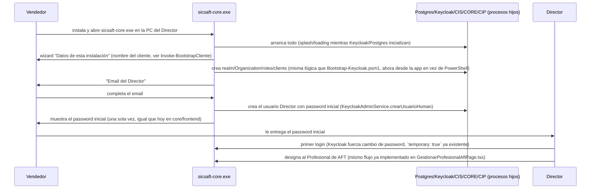

# Arquitectura — SICSAFT CORE (app de escritorio nativa)

Ver `../requirements/INTENT.md` para el contexto completo. Este documento cubre cómo se empaqueta
cada componente dentro de `sicsaft-core.exe`, qué tan factible es cada uno (investigado, no
supuesto), y el flujo de primer arranque.

## Decisión: Electron, no Tauri

Ambos resuelven "app de escritorio nativa con procesos embebidos", pero:

- **Electron** trae Node.js embebido en el proceso principal — spawnear/gestionar los procesos
  hijos (Postgres, Keycloak, `cis`/`core`/`cip`) es directo (`child_process.spawn`), sin runtime
  adicional que bundlear para eso. `electron-builder` genera el instalador `.exe` (NSIS) sin
  fricción.
- **Tauri** tiene un shell mucho más liviano (WebView2 del sistema en vez de Chromium empaquetado),
  pero el proceso principal es Rust — el equipo no tiene ese stack (todo el monorepo es
  TypeScript/NestJS/React) y de todos modos habría que bundlear un runtime Node aparte para correr
  `cis`/`core`/`cip` (son NestJS, no se reescriben a Rust en este incremento).
- El ahorro de tamaño de Tauri (~100-150MB menos de shell) es marginal comparado con lo que ya pesan
  Postgres + JRE/Keycloak embebidos (fácil 300-400MB juntos) — no cambia la categoría de tamaño del
  instalador final.

**Se elige Electron** por esto — más simple para el equipo real, el ahorro de Tauri no justifica
introducir Rust.

## Componente por componente — factibilidad real

### Postgres — bajo riesgo, camino conocido

EDB (EnterpriseDB) publica binarios oficiales de Postgres para Windows como ZIP portable (sin
instalador) — se empaquetan dentro de `resources/` del `.exe`. Al primer arranque:
`initdb.exe` crea un data directory nuevo en `%APPDATA%/sicsaft-core/postgres-data` (nunca dentro
de `Program Files`, por permisos), después `pg_ctl.exe`/`postgres.exe` corre como proceso hijo del
proceso principal de Electron, escuchando en `127.0.0.1` en un puerto fijo (ej. 55432, no el 5432
estándar, para no chocar con un Postgres que el cliente ya tenga instalado).

### Keycloak — factible, pero con costo real de tamaño/arranque

Confirmado en ADR-004 (Context): Keycloak sí tiene distribución Windows oficial (ZIP + `kc.bat`,
JVM, Java 17 mínimo). Se bundlea un JRE redistribuible (Eclipse Temurin publica builds oficiales
para Windows) + la distribución de Keycloak, y se corre `kc.bat build` en tiempo de EMPAQUETADO
(no en el cliente) para poder arrancar con `--optimized` sin el error real que ya encontramos hoy
("was used for first ever server start" si no se pre-compila).

**Costo real, no minimizado**: JRE + Keycloak suman fácilmente 250-350MB al instalador, y el
arranque en frío de la JVM (aunque optimizado) típicamente toma varios segundos — hace falta un
splash/loading screen mientras arrancan los servicios de fondo, no un arranque instantáneo. Se
mantiene Keycloak (no se vuelve a cambiar de identity provider por tercera vez) porque todo el
trabajo de ADR-004 Fases 1-3 (guards, admin service, roles por Organization, bootstrap) ya está
hecho y verificado real end-to-end — reabrir esa decisión de nuevo tendría un costo mayor al de
aceptar el peso de la JVM.

### Redis — resuelto: sacado del ecosistema completo (ADR-005, 2026-08-27)

Investigado el mismo día en dos rondas: primero qué tan viable era empaquetar Redis para Windows
(Memurai gratis prohíbe producción, Memurai Enterprise es pago sin precio público,
`redis-windows/redis-windows` es la opción sin costo más al día pero sin respaldo del fabricante),
después si hacía falta empaquetar *algo* — la respuesta fue no. El usuario confirmó sacar Redis del
**ecosistema completo** (los 3 perfiles de `devops/`, no solo el embebido), documentado en
[ADR-005](../../../adr/ADR-005-postgres-pgboss-reemplaza-redis.md) e implementado ese mismo día:

- `core/`+`cip/`: la cola `cip-eventos` (antes BullMQ/Redis) pasa a
  [`pg-boss`](https://github.com/timgit/pg-boss) sobre una base Postgres dedicada
  (`eventos_outbox`, `EVENTOS_OUTBOX_DATABASE_URL`) — separada de las bases `core`/`cip` a
  propósito (RNF-01/RNF-05), pero infraestructura de mensajería explícitamente compartida entre
  ambos, mismo tipo de recurso que Redis ya era.
- `cis/`: el rate limiter (`InMemoryRateLimiter`) y el device-registry pasan a memoria del propio
  proceso — `cis/` no tiene Postgres propio y corre como instancia única en los 3 perfiles hoy, así
  que no hace falta ningún backend externo (excepción documentada a "multi-instancia sin estado en
  memoria compartido" de WAF 4, ver `ARQUITECTURA-WAF.md`).

**Para este incremento (el perfil embebido) esto es una simplificación directa, no un costo
nuevo**: Postgres ya era una dependencia dura embebida en `sicsaft-core.exe` — la cola de eventos
la usa sin agregar ningún proceso nuevo, y `cis/` sin Redis significa un componente menos por
vendorizar (`resources/redis/` ya no existe, ver `resources/README.md`). El spike de "Redis
embebido en Windows" que bloqueaba la integración de `cis`/`core`/`cip` al orquestador
(`service-orchestrator.ts`) queda cerrado — el bloqueante real ahora es solo el wiring en sí
(env vars, migraciones, la base `eventos_outbox` nueva), no una dependencia externa sin resolver.

### `cis`/`core`/`cip` — bajo riesgo

Ya son apps Node/NestJS compiladas (`node dist/main.js`) — corren como procesos hijos usando el
propio Node embebido de Electron (`child_process.fork` o `spawn` apuntando al Node bundleado), cada
uno en un puerto distinto de `127.0.0.1`, con las mismas env vars que ya usa
`devops/onprem/docker-compose.yml` hoy (`KEYCLOAK_URL`, `CORE_DB_*`, etc.) apuntando a los procesos
locales en vez de a nombres de servicio de un compose. Ningún cambio de código en estos tres
sistemas — solo cambia qué los arranca y con qué env vars.

### Los 4 portales web (`app-qr-sicsaft`, `ccp`, `web_admin`, `core/frontend`)

Nivel 1 necesita `app-qr-sicsaft` (vía APK, ver más abajo) + `web_admin` (Administrador del
Sistema) + `core/frontend` (Directivo) — `ccp` es Nivel 2, fuera de este incremento (DOC-025 §1).
`web_admin`/`core/frontend` son builds Vite estáticos — se sirven desde un servidor HTTP local
embebido (ej. `express` sirviendo el `dist/` de cada uno en su propio puerto de `127.0.0.1`) y se
muestran dentro de la propia app de Electron como vistas embebidas (`BrowserWindow`/`<webview>`
apuntando a `http://127.0.0.1:<puerto>`), reusando el código React existente tal cual — no se
reescriben esos portales.

**Cuidado real, mismo tipo de bug que ya encontramos hoy**: cargar contenido desde `file://`
directo en Electron NO es "secure context" por default (mismas reglas de la Web Platform que ya
rompieron `crypto.subtle` en el navegador con dominios `.test`) — de ahí la elección de servir todo
por `http://127.0.0.1:<puerto>` (loopback SÍ es secure context, verificado ya hoy en el hallazgo de
`.localhost` vs `.test`) en vez de `file://`, para no repetir el mismo bug en un contexto nuevo.

### La APK de Android — resuelta (CORE-Q-01, 2026-08-27): wrap Capacitor de `app-qr-sicsaft/`

Confirmado con el usuario: es un wrap de `app-qr-sicsaft/` hecho con Capacitor, ya compilado y
mantenido fuera de este repo (sin tooling de Capacitor/Cordova/Tauri-mobile en ningún
`package.json` del monorepo, confirmado por `grep` el mismo día). Este incremento no necesita
tocar nada de mobile — solo asegurarse de que la APK pueda alcanzar `cis`/Keycloak corriendo en la
PC del Director **por la red local**, no solo `127.0.0.1` (ver siguiente sección).

## Red: localhost para el escritorio, LAN para el teléfono (riesgo nuevo, mismo tipo que el ya encontrado)

Todo lo de arriba asume `127.0.0.1` —válido para la ventana de Electron misma, pero **la APK corre
en el teléfono, no en la PC del Director** — para que la APP QR sincronice contra `cis`, este tiene
que escuchar en la IP de LAN de la PC del Director (no solo loopback), y Keycloak necesita un
`KC_HOSTNAME` alcanzable desde el teléfono también (no `127.0.0.1`, que desde el teléfono apunta a
sí mismo).

Con CORE-Q-01 resuelta (la APK es un WebView de Capacitor, no una app 100% nativa OkHttp/Retrofit),
la regla de secure context/`crypto.subtle` que ya rompió `.test` hoy **sí puede volver a aplicar**,
con un matiz investigado hoy (no asumido): una build de **producción** de Capacitor sirve los
assets embebidos por su propio scheme (`https://localhost`/`capacitor://localhost`), que el
WebView trata como secure context — ahí el riesgo no se repite, solo las llamadas `fetch`/XHR
salientes hacia `cis` necesitan alcanzar la LAN. El riesgo real reaparece si esa APK está compilada
con `server.url` apuntando a una URL de LAN (típico de `--livereload` en desarrollo, no en
producción) — hay reportes de exactamente este problema en el foro de Ionic/Capacitor. **No se
resuelve en este documento**: falta confirmar el `capacitor.config.ts` real de la APK ya construida
(sub-pregunta de CORE-Q-01 en `INTENT.md`) antes de implementar la sincronización real
APK↔`sicsaft-core.exe`.

## Primer arranque — wizard nativo (reemplaza a `bootstrap-keycloak.ps1` + logins manuales)

Este flujo **reusa lógica ya construida hoy** (`KeycloakAdminService`, `New-KeycloakRealmScaffold`/
`Invoke-BootstrapCliente` de `Bootstrap-Keycloak.psm1`, `GestionarProfesionalAftPage.tsx`) — lo que
cambia es la superficie: un wizard nativo dentro de `sicsaft-core.exe` en vez de un script de
PowerShell + logins de navegador separados.

## Qué se reusa tal cual de `devops/onprem/` (ADR-004 Fase 3, hecho hoy)

- Todo el código de `cis/src/keycloak-admin/`, `cis/src/common/auth/` — sin cambios.
- La lógica de `lib/Bootstrap-Keycloak.psm1` (realm, scopes, roles, Organization, clients) — se
  porta a TypeScript/Node dentro del proceso principal de Electron (mismas llamadas HTTP a la
  Admin REST API de Keycloak, ya verificadas reales hoy), no se reescribe desde cero.
- El modelo de roles por Organization (`{organizacionId}::{rol}`, grupos de Keycloak) — sin
  cambios, es independiente de cómo se despliega Keycloak.

## Qué queda obsoleto o en pausa

- `devops/onprem/docker-compose.yml`, `instalar-cliente.ps1`, Podman — dejan de ser el camino de
  instalación **principal**. Resuelto (CORE-Q-02, 2026-08-27): no se borran ni se archivan, siguen
  vigentes como alternativa para un perfil de cliente con servidor dedicado (en vez de una sola PC
  Windows del Director) — coexisten con `sicsaft-core.exe`, que es el camino prioritario de acá en
  adelante.
- El bug de dominios `.test`/`.localhost` (`fix-devops-onprem-dominios-localhost`, encontrado hoy)
  sigue siendo correcto y necesario para quien use `devops/onprem/` como alternativa — no se
  descarta.
