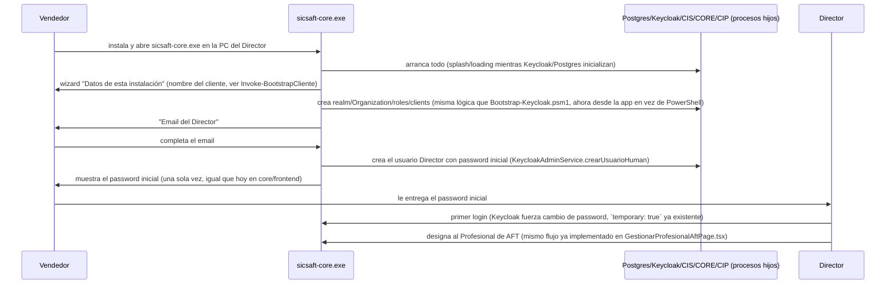

# Arquitectura — SICSAFT CORE (app de escritorio nativa)

Ver `../requirements/INTENT.md` para el contexto completo. Este documento cubre cómo se empaqueta
cada componente dentro de `sicsaft-core.exe`, qué tan factible es cada uno (investigado, no
supuesto), y el flujo de primer arranque.

## Decisión: Electron, no Tauri

Ambos resuelven "app de escritorio nativa con procesos embebidos", pero:

- **Electron** trae Node.js embebido en el proceso principal — spawnear/gestionar los procesos
  hijos (Postgres, Keycloak, `cis`/`core`/`cip`) es directo (`child_process.spawn`), sin runtime
  adicional que bundlear para eso. `electron-builder` genera el instalador `.exe` (NSIS) sin
  fricción.
- **Tauri** tiene un shell mucho más liviano (WebView2 del sistema en vez de Chromium empaquetado),
  pero el proceso principal es Rust — el equipo no tiene ese stack (todo el monorepo es
  TypeScript/NestJS/React) y de todos modos habría que bundlear un runtime Node aparte para correr
  `cis`/`core`/`cip` (son NestJS, no se reescriben a Rust en este incremento).
- El ahorro de tamaño de Tauri (~100-150MB menos de shell) es marginal comparado con lo que ya pesan
  Postgres + JRE/Keycloak embebidos (fácil 300-400MB juntos) — no cambia la categoría de tamaño del
  instalador final.

**Se elige Electron** por esto — más simple para el equipo real, el ahorro de Tauri no justifica
introducir Rust.

## Componente por componente — factibilidad real

### Postgres — bajo riesgo, camino conocido

EDB (EnterpriseDB) publica binarios oficiales de Postgres para Windows como ZIP portable (sin
instalador) — se empaquetan dentro de `resources/` del `.exe`. Al primer arranque:
`initdb.exe` crea un data directory nuevo en `%APPDATA%/sicsaft-core/postgres-data` (nunca dentro
de `Program Files`, por permisos), después `pg_ctl.exe`/`postgres.exe` corre como proceso hijo del
proceso principal de Electron, escuchando en `127.0.0.1` en un puerto fijo (ej. 55432, no el 5432
estándar, para no chocar con un Postgres que el cliente ya tenga instalado).

### Keycloak — factible, pero con costo real de tamaño/arranque

Confirmado en ADR-004 (Context): Keycloak sí tiene distribución Windows oficial (ZIP + `kc.bat`,
JVM, Java 17 mínimo). Se bundlea un JRE redistribuible (Eclipse Temurin publica builds oficiales
para Windows) + la distribución de Keycloak, y se corre `kc.bat build` en tiempo de EMPAQUETADO
(no en el cliente) para poder arrancar con `--optimized` sin el error real que ya encontramos hoy
("was used for first ever server start" si no se pre-compila).

**Costo real, no minimizado**: JRE + Keycloak suman fácilmente 250-350MB al instalador, y el
arranque en frío de la JVM (aunque optimizado) típicamente toma varios segundos — hace falta un
splash/loading screen mientras arrancan los servicios de fondo, no un arranque instantáneo. Se
mantiene Keycloak (no se vuelve a cambiar de identity provider por tercera vez) porque todo el
trabajo de ADR-004 Fases 1-3 (guards, admin service, roles por Organization, bootstrap) ya está
hecho y verificado real end-to-end — reabrir esa decisión de nuevo tendría un costo mayor al de
aceptar el peso de la JVM.

### Redis — riesgo real, sin solución perfecta (NOTA DE HONESTIDAD)

`cis/` usa Redis para rate-limiting (`rate-limit/redis-rate-limiter.ts`), device-registry, y
config general (`redis/`); `cip/` lo usa para la cola BullMQ del worker de agregación
(`agregacion/eventos-outbox.worker.ts`) — no es un uso decorativo, sacarlo requeriría reescribir
esas piezas para otro backend de estado.

**Redis Inc. no publica binario oficial de Windows** desde hace años (el port de Microsoft
quedó archivado, basado en Redis 3.x viejo). Las opciones reales:

1. **Bundlear un build comunitario mantenido de Redis para Windows** (ej. el fork
   `tporadowski/redis`, basado en releases más nuevos de Redis, usado ampliamente para desarrollo
   local en Windows) — no es oficial ni tiene el respaldo de Redis Inc., pero es la opción más
   rápida de implementar sin tocar el código de `cis/`/`cip/`. **Recomendado como default de este
   incremento**, documentado explícitamente como riesgo a revisar (si ese fork deja de mantenerse,
   hay que migrar).
2. **Reescribir el rate-limiter/device-registry/cola de `cip/` para no depender de Redis** en modo
   desktop embebido (ej. SQLite o un backend en memoria del propio proceso) — más correcto a largo
   plazo, pero es trabajo de backend real, no de empaquetado, y toca código que hoy es compartido
   con `devops/local/`/`devops/prod/` (que si tienen Redis real disponible). Se deja como
   alternativa futura, no se implementa en este incremento.

No se asume que la opción 1 "simplemente funciona" — se marca como el primer punto a verificar real
(igual que se hizo hoy con Keycloak) antes de dar por cerrado este componente.

### `cis`/`core`/`cip` — bajo riesgo

Ya son apps Node/NestJS compiladas (`node dist/main.js`) — corren como procesos hijos usando el
propio Node embebido de Electron (`child_process.fork` o `spawn` apuntando al Node bundleado), cada
uno en un puerto distinto de `127.0.0.1`, con las mismas env vars que ya usa
`devops/onprem/docker-compose.yml` hoy (`KEYCLOAK_URL`, `CORE_DB_*`, etc.) apuntando a los procesos
locales en vez de a nombres de servicio de un compose. Ningún cambio de código en estos tres
sistemas — solo cambia qué los arranca y con qué env vars.

### Los 4 portales web (`app-qr-sicsaft`, `ccp`, `web_admin`, `core/frontend`)

Nivel 1 necesita `app-qr-sicsaft` (vía APK, ver más abajo) + `web_admin` (Administrador del
Sistema) + `core/frontend` (Directivo) — `ccp` es Nivel 2, fuera de este incremento (DOC-025 §1).
`web_admin`/`core/frontend` son builds Vite estáticos — se sirven desde un servidor HTTP local
embebido (ej. `express` sirviendo el `dist/` de cada uno en su propio puerto de `127.0.0.1`) y se
muestran dentro de la propia app de Electron como vistas embebidas (`BrowserWindow`/`<webview>`
apuntando a `http://127.0.0.1:<puerto>`), reusando el código React existente tal cual — no se
reescriben esos portales.

**Cuidado real, mismo tipo de bug que ya encontramos hoy**: cargar contenido desde `file://`
directo en Electron NO es "secure context" por default (mismas reglas de la Web Platform que ya
rompieron `crypto.subtle` en el navegador con dominios `.test`) — de ahí la elección de servir todo
por `http://127.0.0.1:<puerto>` (loopback SÍ es secure context, verificado ya hoy en el hallazgo de
`.localhost` vs `.test`) en vez de `file://`, para no repetir el mismo bug en un contexto nuevo.

### La APK de Android — bloqueada en información, no en factibilidad

Sin tooling de empaquetado mobile (Capacitor/Cordova/Tauri-mobile) en este repo hoy — búsqueda
confirmada (`grep` sobre todos los `package.json` del monorepo, 2026-08-27). Ver CORE-Q-01 en
`INTENT.md`: si la APK es un wrap de `app-qr-sicsaft/` con una herramienta externa al repo, este
incremento no necesita tocar nada de mobile — solo asegurarse de que la APK pueda alcanzar `cis`
corriendo en la PC del Director **por la red local**, no solo `127.0.0.1` (ver siguiente sección).

## Red: localhost para el escritorio, LAN para el teléfono (riesgo nuevo, mismo tipo que el ya encontrado)

Todo lo de arriba asume `127.0.0.1` —válido para la ventana de Electron misma, pero **la APK corre
en el teléfono, no en la PC del Director** — para que la APP QR sincronice contra `cis`, este tiene
que escuchar en la IP de LAN de la PC del Director (no solo loopback), y Keycloak necesita un
`KC_HOSTNAME` alcanzable desde el teléfono también (no `127.0.0.1`, que desde el teléfono apunta a
sí mismo). Esto reabre una versión del mismo problema que ya resolvimos hoy para el navegador
(dominio/origin correcto, secure context) pero ahora del lado de una app Android nativa — cuya
reglas de red son distintas (OkHttp/Retrofit no tienen el concepto de "secure context" de un
navegador, así que `crypto.subtle` no aplica ahí; pero si la APK es un WebView de la PWA, sí podría
volver a aplicar). **No se resuelve en este documento** — depende de la respuesta a CORE-Q-01, se
deja marcado como punto a cerrar antes de implementar la sincronización real APK↔`sicsaft-core.exe`.

## Primer arranque — wizard nativo (reemplaza a `bootstrap-keycloak.ps1` + logins manuales)

Este flujo **reusa lógica ya construida hoy** (`KeycloakAdminService`, `New-KeycloakRealmScaffold`/
`Invoke-BootstrapCliente` de `Bootstrap-Keycloak.psm1`, `GestionarProfesionalAftPage.tsx`) — lo que
cambia es la superficie: un wizard nativo dentro de `sicsaft-core.exe` en vez de un script de
PowerShell + logins de navegador separados.

## Qué se reusa tal cual de `devops/onprem/` (ADR-004 Fase 3, hecho hoy)

- Todo el código de `cis/src/keycloak-admin/`, `cis/src/common/auth/` — sin cambios.
- La lógica de `lib/Bootstrap-Keycloak.psm1` (realm, scopes, roles, Organization, clients) — se
  porta a TypeScript/Node dentro del proceso principal de Electron (mismas llamadas HTTP a la
  Admin REST API de Keycloak, ya verificadas reales hoy), no se reescribe desde cero.
- El modelo de roles por Organization (`{organizacionId}::{rol}`, grupos de Keycloak) — sin
  cambios, es independiente de cómo se despliega Keycloak.

## Qué queda obsoleto o en pausa

- `devops/onprem/docker-compose.yml`, `instalar-cliente.ps1`, Podman — dejan de ser el camino de
  instalación principal. Ver CORE-Q-02 en `INTENT.md`: no se borran todavía, quedan como posible
  alternativa para un perfil de cliente distinto (servidor dedicado) hasta que el usuario confirme
  si conviene mantenerlos.
- El bug de dominios `.test`/`.localhost` (`fix-devops-onprem-dominios-localhost`, encontrado hoy)
  deja de ser urgente si `devops/onprem/` deja de ser el camino principal — pero el fix ya escrito
  no se descarta, sigue siendo correcto para quien use ese camino alternativo.
