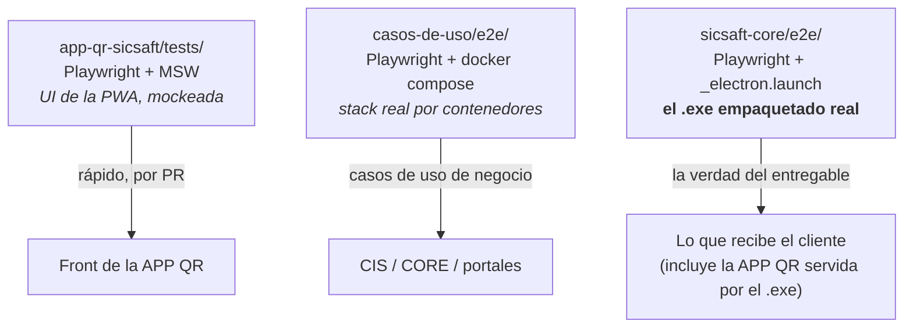

# DOC-031 — Ambiente real y endurecimiento para el primer cliente

> **Estado**: propuesta de fase, pendiente de aprobación. No se toca `src/` hasta confirmar.
> **Nace de**: la corrida completa del harness del `.exe` (PR #112/#113/#114) y la revisión de
> huecos que dejó. Continúa [DOC-028](DOC-028-camino-a-cliente-final.md); los bugs que ya se
> corrigieron van en [DOC-027](DOC-027-bitacora-bugs-reales.md).

## 1. Por qué esta fase

El `.exe` tiene hoy **56 pruebas Playwright verdes contra el ejecutable empaquetado real**
(`sicsaft-core/e2e/`): arranque de los 5 servicios embebidos, wizard, identidad, RBAC server-side,
los dos portales, baja lógica sin `DELETE`, auditoría, ingesta de Excel del cliente (252 activos
reales entrando a la BPI), relanzamiento y cierre limpio.

Lo que **no** está probado es, justamente, el corazón del producto:

| Hueco | Evidencia |
|---|---|
| **El ciclo de captura nunca se ejecutó de verdad** | `app-qr-sicsaft/tests/` corre con `VITE_MOCK_API=true` + MSW contra `mock-cis.invalid` ("Keycloak nunca se llama de verdad", `.env.e2e`). `casos-de-uso/e2e/` tiene 3 casos y ninguno es de inventario. `sicsaft-core/e2e/` sólo verifica que `GET /inventarios` responde `[]`. |
| **Todo el CIP (Nivel 2) se verificó vacío** | Cobertura, áreas controladas, activos fuera de área, no localizados, incidencias y `PantallaControlArea` se alimentan **exclusivamente** de sesiones de inventario. Como nunca hubo ninguna, las 56 pruebas vieron esos paneles en cero. |
| **La BPI no tiene respaldo** | No existe `pg_dump`, export ni restore en el `.exe`. Todo el patrimonio vive en `%APPDATA%\sicsaft-core\postgres-data\`. Si ese directorio se pierde, se perdió el inventario. |
| **No hay camino de actualización** | Sin `electron-updater`. Un fix llega al cliente como un `.exe` de 490 MB reinstalado a mano. |
| **`sicsaft-core/` no tiene CI** | Las 56 pruebas corren sólo si alguien se acuerda. Así llegó a la entrega el bug del `java` huérfano. |

La APP QR **es la fuente de captura principal** del ecosistema
(`APP QR → CIS → CORE → BPI`, [README.md](../../../README.md)). Que no esté probada de punta a
punta no es "falta cobertura": es que no sabemos si funciona.

## 2. Qué NO es esta fase

- No es rediseño de ningún módulo. Todo lo de abajo es endurecimiento + pruebas.
- No es una feature nueva de negocio. No se agregan pantallas al CCP ni al portal del Directivo.
- No se toca la regla no negociable (`CIS → CORE` para toda escritura patrimonial).

## 3. El punto clave: el `.exe` YA es el ambiente real

No hace falta montar nada para probar la APP QR de verdad. El propio `.exe` la sirve:

```
asegurarServidorAppQr()  →  https://<ip-lan>:8765   (cert autofirmado, appqr-tls.ts)
                             VITE_KEYCLOAK_ISSUER = http://<ip-lan>:58080/realms/sicsaft
                             VITE_CIS_URL         = http://<ip-lan>:56000
```

Es literalmente la instalación del cliente: Keycloak, CIS, CORE y Postgres reales, corriendo como
procesos hijos del `.exe`. Playwright puede abrir esa URL con `ignoreHTTPSErrors: true` y emulación
de dispositivo móvil. **No se necesita un teléfono ni docker compose para automatizarlo.**

### 3.1 Cómo se prueba el escaneo sin cámara

`ScanPage.tsx` ya expone las dos puertas y **ambas caen en el mismo `handleDecode()`**:

```
cámara (html5-qrcode) ─┐
                       ├─→ handleDecode(codigo) ─→ resolver ─→ cola de sync ─→ POST a CIS
entrada manual ────────┘     (data-testid="manual-code-input" → handleManualEntry)
```

- **Capa A — entrada manual (base).** Ejercita el mismo camino de código que la cámara: resolución
  del QR, clasificación del escaneo, cola offline, POST a CIS, persistencia en la BPI. Cubre la
  lógica completa y es determinista. Es la que lleva el peso de la matriz de pruebas.
- **Capa B — cámara falsa (una sola prueba).** Chromium con
  `--use-fake-device-for-media-stream --use-file-for-fake-video-capture=<qr.y4m>` para que
  `html5-qrcode` decodifique de verdad un QR generado desde un `codigoQr` real de la BPI. Sirve
  para probar el decodificador óptico, no para repetir la matriz.

Que la app ya traiga `data-testid` en los controles indica que fue pensada para esto.

## 4. Fases

### Fase 1 — El ciclo de captura real y el CIP con datos  ⟵ prioridad 1

Lo más valioso: convierte "el Nivel 2 nunca se vio con datos" en "el Nivel 2 está probado".

**Se construye**: nada de producto. Sólo harness — un project nuevo `captura` en
`sicsaft-core/e2e/playwright.config.ts`, con `dependencies: ['principal']` (necesita los activos,
áreas y ubicaciones que crean las specs 06/07/18).

**Specs nuevas** (`sicsaft-core/e2e/specs/`):

| Spec | Qué prueba |
|---|---|
| `20-appqr-login-y-catalogo` | La PWA carga por HTTPS desde la IP de LAN, hace login OIDC/PKCE contra el Keycloak embebido (client `app-qr-sicsaft`, redirect a la IP de LAN) y baja el catálogo real de la organización. |
| `21-appqr-sesion-de-inventario` | Abrir sesión en un área → escanear N activos (entrada manual) → cerrar → `POST /inventarios` → CIS → CORE → filas reales en `inventarios` y sus escaneos en la BPI. **El caso de uso que falta.** |
| `22-appqr-escaneo-optico` | Cámara falsa con un `.y4m` de un QR real: `html5-qrcode` lo decodifica y el flujo sigue igual. |
| `23-appqr-offline-y-sync` | Sin red: los escaneos quedan en la cola; vuelve la red y sincronizan sin duplicar. Hoy sólo existe mockeado (`sync-queue.spec.js`). |
| `24-cip-con-datos-reales` | **Cierra el círculo.** Tras la 21, el Dashboard del Directivo y el del AFT muestran cobertura > 0, áreas controladas, activos fuera de área, no localizados, incidencias, y `PantallaControlArea` con su veredicto. |
| `25-escaneo-variantes` | QR inexistente, QR de otra organización, activo dado de baja, escaneo duplicado en la misma sesión, estado declarable (`mantenimiento`/`inactivo`) vs. no declarable. |

**Además**: dejar explícito en `app-qr-sicsaft/README.md` que su suite es de UI con mocks (rápida,
para desarrollo del front) y que la verdad de integración vive en `sicsaft-core/e2e/`.

#### 1.bis — Layout de la APP QR (hallazgo al revisarla en pantalla de teléfono)

Antes de escribir las specs se recorrió la PWA a 375×812 con la red mockeada. **No es una opinión
de estilo: la app obliga a hacer scroll desde el primer escaneo.** Medido con
`document.documentElement.scrollHeight` vs `window.innerHeight`:

| Pantalla | Alto de página | Viewport | Exceso |
|---|---|---|---|
| Login / seleccionar organización | 812 | 812 | 0 — pero **~60 % vacío**, con los controles arriba |
| Nuevo control | 812 | 812 | 0 — ~35 % vacío |
| Escaneo, 0 ítems | 812 | 812 | 0 |
| Escaneo, **1 ítem** | 930 | 812 | **+118** |
| Escaneo, 2+ ítems | 1090 | 812 | **+278** |
| **Resultado del control** | **1800** | 812 | **+988 → 2,22 pantallas** |

Problemas confirmados por aserción (las 13 que fallaron en el primer `layout.spec.js`), en orden de
impacto para alguien parado en una oficina con el teléfono en una mano:

1. **Scroll anidado.** `zonas que scrollean a la vez: documento, scanned-list`. La página scrollea
   *y* la lista scrollea por dentro (`max-h-[40vh]` propio). El dedo nunca sabe qué va a mover.
2. **Cerrar la sesión exigía scrollear.** `finish-btn → {"fuera": true, "y": 982, "viewportH": 812}`:
   el botón de terminar el control quedaba **170 px bajo el pliegue** (273 px en 360×640).
3. **El veredicto aparecía FUERA de pantalla.** `report-verdict → {"fuera": true, "y": -71}`. Al
   pulsar *Finalizar* la página conservaba la posición de scroll, así que el AFT aterrizaba en el
   resultado del control **ya pasado de largo**. Esto no se veía en una captura tomada en scroll 0.
4. **Jerarquía invertida.** Lo que el operador mira cien veces (contador + lista) quedaba abajo;
   lo que mira una vez (la tarjeta "¿EL QR NO ESCANEA?", con título, subtítulo, input y botón)
   ocupaba el centro.
5. **`100vh`**: en móvil la barra del navegador cambia el alto visible y siempre deja algo bajo el
   pliegue.

**Lo que la medición DESMINTIÓ**: la sospecha inicial de que la bottom nav tapaba las acciones del
reporte era falsa — `AppShell` ya compensa con
`paddingBottom: calc(var(--bottomnav-h) + env(safe-area-inset-bottom) + 1.5rem)`, y las tres
aserciones de oclusión sobre `export-csv-btn`/`reset-btn` pasaron desde el principio. Lo que se
había visto en la captura era contenido bajo el pliegue, no contenido tapado. Es exactamente por
esto que las aserciones se escribieron antes de tocar el código.

**Qué se cambió** (hecho — `app-qr-sicsaft/src/`):

- **Layout de app, no de documento**: la vista de escaneo pasó de un `grid` en flujo normal a una
  columna de alto fijo (`ALTO_DISPONIBLE`, en `svh` y descontando app bar + bottom nav +
  `env(safe-area-inset-*)`). Cámara arriba → fallback manual como **una fila** (antes una tarjeta
  con título y subtítulo que costaba ~250 px) → lista en el `flex-1` → acciones fijas abajo.
- **`ScannedList` deja de tener scroll propio** (`max-h-[40vh]` → `h-full`): el alto lo define el
  contenedor, y así queda **una sola** zona scrolleable.
- **El scroll vuelve a cero al cambiar de vista** — un `useEffect` sobre `view`. Arregla el
  veredicto en `y = -71`.
- `min-w-0` en el botón de finalizar: sin eso el `flex-1` no podía encogerse por debajo del texto
  y metía **scroll horizontal** (regresión introducida en este mismo refactor y atrapada por una
  aserción nueva, ver abajo).

**Resultado medido** (375×812, 6 ítems escaneados): `exceso: 0` — antes `+278`.

**Diferido, con motivo**: la **fila compacta** (hoy 166 px porque las tres acciones envuelven en
tres líneas). No se hizo acá porque las etiquetas de esos botones son contrato de otras suites
(`scan-classification` aserta `'Marcado fuera de lugar'`, `fase-3.1` aserta
`'Editar sugerencia de baja'`) y esconderlas detrás de un disclosure rompería los tests que las
clican. Es un cambio de interacción que merece su propia decisión, no un ajuste al pasar.

**Cómo se prueba** — deja de ser criterio y pasa a ser aserción. `app-qr-sicsaft/tests/layout.js` +
`layout.spec.js`, en tres viewports (**360×640** gama baja, **375×812**, **414×896**):

```
medirScroll(page)                →  exceso (vertical) y excesoH (horizontal)
inspeccionarOclusion(page, sel)  →  elementFromPoint(centro) === el propio elemento
                                    (distingue "tapado por X" de "fuera del viewport")
contarZonasScrolleables(page)    →  debe ser exactamente 1, y no el documento
```

Cubre: escaneo con 1 y 20 ítems, scroll anidado, alcance del botón de finalizar, veredicto e
indicadores del reporte sin scrollear, oclusión de las acciones del reporte y desborde lateral.

**Estado**: `layout.spec.js` pasó de **13 fallos → 0**. La suite completa de `app-qr-sicsaft`
(6 archivos previos + el nuevo) queda en **67/67**.

### Fase 2 — Respaldo y recuperación de la BPI  ⟵ prioridad 2

**Se construye**:
- `backup-service.ts`: `pg_dump` con el binario ya vendorizado (`resources/postgres/bin/`) hacia
  `%APPDATA%\sicsaft-core\backups\bpi-<ISO>.dump`, con rotación (últimos N).
- Disparadores: automático al cerrar la app (antes de `detenerTodo()`) y cada N horas; manual con
  un botón **Respaldar ahora** + **Abrir carpeta de respaldos** junto a la Consola técnica.
- Restauración: si al arrancar `postgres-data` está vacío o corrupto pero hay `instalacion.json`,
  el wizard ofrece restaurar el último respaldo.
- IPC nuevo: `crearRespaldo()`, `listarRespaldos()`, `restaurarRespaldo(ruta)`.

**Prueba (spec `26-respaldo-y-restauracion`)**: crear activos → respaldar → **borrar
`postgres-data`** → relanzar → restaurar → los activos volvieron y el portal los lista.
Es exactamente el escenario que ocurrió por accidente durante el desarrollo; queda como regresión.

### Fase 3 — Actualización del `.exe`  ⟵ prioridad 4

**Se construye**: `electron-updater` con `publish` a GitHub Releases (repo privado) o a un
`generic` sobre el VPS que ya orquesta Coolify. Chequeo al arrancar, aviso no intrusivo, descarga
en segundo plano, aplicación al cerrar. El `blockmap` ya se genera en el build, así que la descarga
es diferencial.

**Prueba (spec `27-actualizacion`)**: feed servido localmente con una versión mayor → la app la
detecta y muestra el aviso. La instalación efectiva de la actualización se verifica a mano una vez
(no se automatiza reinstalar el `.exe` dentro del harness).

### Fase 4 — CI del entregable  ⟵ prioridad 3

`.github/workflows/sicsaft-core-ci.yml` sobre `windows-latest`, con `paths` a `sicsaft-core/**` y
`herramientas/etl-contable/**`:

- **Por PR** (rápido, ~5 min): `npm run lint:ci` + `npm test` + `npx tsc --noEmit -p e2e/tsconfig.json`.
- **Por PR, subconjunto** (~20 min): `npm run pack` + `npm run e2e -- --grep "01 - |02 - |19 - "`
  (arranque, wizard, cierre sin huérfanos). Es la red que habría atajado el bug del `java`.
- **Nightly / `workflow_dispatch`**: la suite completa (`principal` + `ciclo-vida` + `captura`).
- Publicar el `Setup.exe` como artifact del workflow — de paso resuelve cómo le llega al cliente.

### Fase 5 — Entrega y escala  ⟵ prioridad 5

- **Firma de código**: certificado OV/EV. Sin esto el cliente ve *"Windows protegió su PC"* y un
  área de TI institucional puede bloquear la instalación. Es una compra, no código.
- **`EtiquetasPage` a escala**: hoy genera un `QRCode.toDataURL()` **por activo** en el navegador.
  Con 252 anduvo; con miles planta el renderer. Paginar por dirección/área y generar bajo demanda.
- **Prueba de volumen (spec `28-volumen`)**: sembrar ~5.000 activos por la ingesta y verificar que
  el CCP, las etiquetas y el Dashboard siguen usables, con umbrales de tiempo explícitos.
- **Prueba de corte de luz (spec `29-apagado-abrupto`)**: `taskkill /F` del `.exe` sin cierre
  ordenado → relanzar → Postgres hace crash recovery y la app levanta con los datos intactos.

## 5. Los tres harness, con roles explícitos



Regla: **en `sicsaft-core/e2e/` no entra ningún mock.** Si algo necesita mockearse, no pertenece a
ese harness.

## 6. Orden sugerido y esfuerzo

| # | Fase | Esfuerzo | Por qué ese lugar |
|---|---|---|---|
| 1 | Captura real + CIP con datos | ~2-3 días | Es el único hueco donde hay **incertidumbre**, no sólo falta de cobertura |
| 2 | Respaldo de la BPI | ~1 día | Riesgo de pérdida total de datos del cliente |
| 3 | CI del entregable | ~1 día | Evita que se repita lo del `java` huérfano |
| 4 | Actualización | ~1 día | Necesario a partir del segundo cliente |
| 5 | Firma + escala | compra + ~1-2 días | Bloquea despliegue institucional, no el piloto |

Total ≈ 1,5–2 semanas de desarrollo, más el trámite del certificado en paralelo.

## 7. Criterio de "listo para el primer cliente"

- [ ] Una sesión de inventario real, hecha desde la PWA contra el `.exe`, aparece en la BPI y
      mueve los indicadores del CIP.
- [ ] Borrar `postgres-data` y recuperar el inventario desde un respaldo, verificado por prueba.
- [ ] La suite completa (`principal` + `ciclo-vida` + `captura`) verde en CI, no sólo en una
      máquina.
- [ ] El instalador no dispara SmartScreen.
- [ ] Existe un camino para entregarle al cliente la versión siguiente sin ir a su oficina.

## Documentos relacionados

- [DOC-027](DOC-027-bitacora-bugs-reales.md) — bitácora de bugs reales (el `java` huérfano al
  cerrar y su fix van ahí).
- [DOC-028](DOC-028-camino-a-cliente-final.md) — fases previas del camino al cliente final.
- [DOC-029](../../ccp/design-artifacts/DOC-029-modo-basico-y-profesional.md) — RF-B (ingesta
  contable) y RF-I (informe de control de área), que la Fase 1 pasa a ejercitar con datos reales.
- [DOC-030](DOC-030-nivel-2-en-sicsaft-core-exe.md) — Nivel 2 en el `.exe`.
- [TEST_STRATEGY.md](../testing/TEST_STRATEGY.md) — cómo se prueba cada capa.
