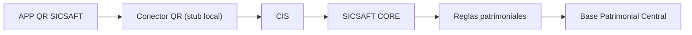

# Handoff: APP QR SICSAFT — para iniciar una nueva sesión de planificación

> Adjuntá este archivo completo a una nueva sesión de Claude (con o sin acceso al repo) para que tenga todo el contexto necesario y pueda seguir planificando junto con el equipo de SICSAFT CORE. Si la nueva sesión sí tiene acceso al repo, todos los `path` citados abajo son reales y navegables.

## Instrucciones para la nueva sesión

1. Este documento es autocontenido: no hace falta re-auditar el código para tener el contexto de negocio y las decisiones ya tomadas.
2. **TASK-004 a TASK-006 y TASK-008 a TASK-010 ya están hechas** — ver sección 7. Solo queda **TASK-007** (sincronización real con CORE), bloqueada. Con eso, las 12 pantallas de DOC-001 están cubiertas salvo el envío HTTP real. No hay backlog nuevo definido todavía para APP QR SICSAFT más allá de TASK-007 — antes de inventar trabajo nuevo, confirmar con el usuario si corresponde esperar a CORE, sincronizar Trello, o mirar otro sistema del ecosistema (`cis/`, `core/`, etc., ver `README.md` raíz).
3. **TASK-007 (sincronización real con CORE) sigue bloqueada** — las 4 preguntas de la sección 6 siguen sin respuesta (confirmado con el usuario el 2026-08-12, sin novedades de CORE). Todo el Conector QR (`src/lib/qr-connector.ts`) es un **stub explícito**: implementa el contrato de DOC-002 como interfaz, con una implementación local respaldada por IndexedDB. No asumas respuestas a las preguntas abiertas; si en algún momento las responden, TASK-007 reemplaza esa implementación por HTTP real sin tocar la UI (`ScanPage.tsx` solo conoce la interfaz `QrConnectorClient`, nunca `db.ts` directo).
4. El backlog vive en Trello: https://trello.com/b/nCi6W4oB/sicsaft (tablero **SICSAFT**, board id `6a79df5317e070b5a23014d0`). Se gestiona con `C:\Proyectos\trello-ai-project-manager\trello_project.py` (`validate-plan` / `sync-plan`, dry-run por defecto, `--apply` para escribir). Requiere `TRELLO_API_KEY`, `TRELLO_TOKEN`, `TRELLO_BOARD_ID` en variables de entorno — **no están guardadas en ningún archivo**; pedíselas al usuario si hace falta escribir en Trello, y si te las pasa por chat, avisale que las rote después (ya se expusieron una vez en una sesión anterior). **El tablero no se sincronizó todavía con el trabajo de TASK-004 a TASK-009** — falta mover esas tarjetas a "Hecho" cuando haya credenciales.
5. No se hizo `git push` de ningún commit todavía — todo vive local en `main`.

---

## 1. Qué es este proyecto

**APP QR SICSAFT** (antes "QR Vault") es la app de **captura** del ecosistema patrimonial SICSAFT: identifica al operador, la organización/área/ubicación, escanea activos con QR, valida contra la Base Patrimonial Central, registra incidencias y envía los resultados a SICSAFT CORE. No modifica directamente la Base Patrimonial Central — todo pasa por un **Conector QR** intermediario (hoy un stub local, ver sección 5).



Repo: `C:\Trabajos\SICSAFT\app-qr-sicsaft`.

## 2. Decisión de identidad — ADR-003

`aidlc-docs/design-artifacts/ADR/ADR-003-rename-app-qr-sicsaft.md`

Rename QR Vault → APP QR SICSAFT en dos fases:
- **Fase 1 (cosmética, YA APLICADA — commit `063e1a7`)**: nombre visible, título del navegador, manifest PWA, textos de instalación/offline, README, `package.json`/`-lock.json`.
- **Fase 2 (identificadores internos, NO TOCAR sin migración explícita)**: `DB_NAME = 'qrvault-inventory'` en `src/lib/db.ts` (IndexedDB), claves de `localStorage` (`qrvault-theme`, `qrvault-print-columns`, `qrvault-catalog-view`, `qrvault-operator`, `qrvault-device-id`), nombre del CSV exportado, y `package_name: app.vercel.qr_vault_nu.twa` en `public/.well-known/assetlinks.json` (atado al fingerprint de firma del TWA de Android — romperlo invalida la verificación de Play Store).
- Fuera del repo: nombre del proyecto en el dashboard de Vercel (no gestionable desde código).

## 3. Estado real del código

`aidlc-docs/design-artifacts/AUDIT-SICSAFT-FLOW.md` documenta el estado **al momento de TASK-001/002** (antes de TASK-004+) — queda como registro histórico, no como estado actual. Estado actual del flujo oficial (8 pasos):

| Paso | Estado | Detalle |
|---|---|---|
| Identificar operador | ✅ Existe | `OperatorGate.tsx` + `operator.ts` (localStorage, sin auth real — ver sección 6) |
| Seleccionar organización | ✅ Existe | `OrganizationPicker.tsx`, alimentado por `qrConnector.authSession()` |
| Seleccionar área | ✅ Existe | `AreaLocationPicker.tsx` |
| Seleccionar ubicación | ✅ Existe | `AreaLocationPicker.tsx`, cascada área→ubicación |
| Iniciar inventario | ✅ Existe | `startScanning()` en `ScanPage.tsx` — trae catálogo vía `qrConnector.getCatalogo()`, genera `correlationId` |
| Escanear QR | ✅ Existe | `QrScanner.tsx` (`html5-qrcode`) |
| Validar activos | ✅ Existe | `scan-resolve.ts` — 6 de las 8 categorías de DOC-001 sección 3 (`duplicate` reservada, no alcanzable sin backend real) |
| Registrar incidencias | ✅ Existe | `IncidentDialog.tsx` |
| Finalizar inventario | ✅ Existe | `finishScanning()` para la cámara y muestra el resumen — **ya no envía** (ver TASK-010) |
| Enviar a SICSAFT CORE | ⚠️ Stub | Paso explícito del operador: botón "Confirmar y enviar" (`confirmAndSend()`, TASK-010) → `syncQueue.submitInventario()` → `qr-connector.ts` simula el envío (`postInventario`); si no hay conexión queda en cola local con reintentos (`sync-queue.ts`, TASK-008) — el envío real a CORE sigue bloqueado (TASK-007, sección 6) |

**Función que queda fuera de alcance (decisión del usuario, 2026-08-10)**: catálogo de productos + impresión de etiquetas QR (`CatalogPage.tsx`) se conserva tal cual, no forma parte del flujo oficial ni del Conector QR — sigue con acceso directo a `db.ts`.

## 4. Flujo oficial y pantallas — DOC-001

`aidlc-docs/design-artifacts/DOC-001-flujo-oficial.md`

**12 pantallas mínimas — las 12 están cubiertas.** Pantalla 10 (resumen del inventario) muestra esperados/faltantes/correctos/fuera de lugar/no registrados/externos/incidencias (TASK-010). Pantalla 11 (confirmación y envío) es el botón "Confirmar y enviar" (`confirmAndSend()` en `ScanPage.tsx`, TASK-010) — separado de "Finalizar", matchea el diagrama de DOC-001 (`Finalizar → Resumen → Confirmar y enviar`). Pantalla 12 (estado de sincronización) se resolvió como parte de `HistoryPage.tsx` en vez de una ruta propia (badge de `syncStatus` + botón "Ver auditoría", TASK-008/009) — DOC-001 la describe como estado por inventario, no como pantalla de contenido propio.

**Clasificación de resultados de escaneo** (8 categorías, `scan-resolve.ts`): correcto, otra área, otra ubicación, no registrado, código inválido, ya escaneado — implementadas y testeadas (TASK-005). "Duplicado" está reservada en el type pero no es alcanzable client-side (IndexedDB usa `code` como clave única) — la detectaría el futuro Base Patrimonial Central. "Con incidencia" se resolvió como una acción disponible sobre cualquier ítem escaneado, no como categoría excluyente.

## 5. Contrato del Conector QR — DOC-002

`aidlc-docs/design-artifacts/DOC-002-conector-qr.md`

**Implementado como stub local** (`src/lib/qr-connector.ts`, TASK-006) — interfaz `QrConnectorClient` calcada del contrato, con una implementación local (`LocalQrConnectorClient`) respaldada por el mismo IndexedDB de siempre:

| Operación | Método | Estado |
|---|---|---|
| `authSession` | — | Stub: token falso, devuelve las organizaciones semilla (`organizations-data.ts`) |
| `getCatalogo(organizacionId, areaId, ubicacionId)` | — | Stub: ignora área/ubicación, devuelve todo el catálogo de la organización (necesario para clasificar TASK-005) |
| `postInventario(session)` | — | Stub: chequea `navigator.onLine` y lanza si no hay conexión (única falla simulable sin backend real) |
| `getInventarioEstado` | — | Stub trivial, sin caller (pantalla 12 resuelta de otra forma, ver sección 4) |

**Ya implementado sin depender de CORE:**
- Reintentos con backoff exponencial (5s/15s/45s, luego cada 5min) + reintento inmediato al recuperar conexión — `src/lib/sync-queue.ts` (TASK-008).
- `correlationId` generado al iniciar el inventario, registro de auditoría local con operador/dispositivo/inventario/código/resultado/ubicación/incidencia/estado de sync — `src/lib/audit-log.ts` + `src/lib/device-id.ts` (TASK-009), visible en Historial → "Ver auditoría".

**Sigue bloqueado por CORE (sección 6):** el envío HTTP real, autenticación real, y el manejo de errores `400`/`401`/`409`/`5xx` contra un backend de verdad — todo eso es TASK-007.

## 6. Preguntas abiertas — SOLO el equipo de SICSAFT CORE puede responderlas

1. ¿CIS ya expone rutas equivalentes a las 4 propuestas en la sección 5, o hay que adaptarse a un contrato ya existente?
2. Mecanismo real de autenticación (¿OAuth2 client credentials? ¿JWT propio de SICSAFT? ¿certificado de dispositivo?).
3. ¿CORE ya tiene su propio esquema de correlación/tracing al que el `correlationId` deba adaptarse, en vez de proponer uno nuevo?
4. ¿La semántica de idempotencia propuesta (misma key = mismo resultado, nunca duplicar) es compatible con cómo CORE aplica las Reglas patrimoniales?

**Sin novedades de CORE al 2026-08-12.** Mientras sigan sin responder, TASK-007 queda saltada — TASK-008 y TASK-009 ya se hicieron contra el stub sin necesitar estas respuestas (son mecánica local, no protocolo de red).

## 7. Backlog completo y cadena de dependencias

Tablero Trello SICSAFT — última sincronización verificada contra el código real: **2026-08-10**, antes de TASK-004 a TASK-010. El tablero en sí **todavía no refleja** este trabajo (pendiente de credenciales para escribir, ver punto 4 de instrucciones). Estado real según el código:

```
TASK-004 (sesiones de inventario) ................................ ✅ Hecho
  → TASK-005 (normalizar 8 resultados de escaneo) ................. ✅ Hecho
    → TASK-006 (cliente del Conector QR, stub) ..................... ✅ Hecho
      → TASK-007 (sincronización real con CORE) .................... ⛔ Bloqueada — saltada, ver sección 6
        → TASK-008 (cola sin conexión) .............................. ✅ Hecho (contra el stub)
          → TASK-009 (registro de eventos y auditoría) .............. ✅ Hecho
            → TASK-010 (resumen final del inventario) .............. ✅ Hecho
```

Único pendiente de la cadena: **TASK-007**, bloqueada por CORE (sección 6). No hay más tarjetas
definidas para APP QR SICSAFT en el handoff — confirmar con el usuario antes de proponer alcance
nuevo.

Cada tarjeta tiene en su descripción de Trello: objetivo, alcance, criterios de aceptación verificables, evidencia esperada y dependencias — usar `board-summary`/`export-board` del script para traer el contenido exacto, y `sync-plan --apply` para marcar TASK-004 a TASK-006 y TASK-008 a TASK-010 como Hecho cuando haya credenciales.

## 8. Historial de commits relevantes (repo local, sin push)

```
fb6f4ad feat(app-qr-sicsaft): TASK-010 - resumen final del inventario y confirmacion de envio
5e409fd feat(app-qr-sicsaft): TASK-009 - registro de eventos y auditoria con correlationId
fc547ad feat(app-qr-sicsaft): TASK-008 - cola sin conexion con reintentos automaticos
ba0486c feat(app-qr-sicsaft): TASK-006 - cliente del Conector QR, saca acceso directo a IndexedDB de la UI
33fe1bf feat(app-qr-sicsaft): TASK-005 - normalizar resultados de escaneo en 8 categorias
ccd529d feat(app-qr-sicsaft): TASK-004 - sesiones de inventario con operador/organizacion/area/ubicacion
b513776 docs: DOC-002 - contrato del Conector QR
8d9a348 docs: DOC-001 - flujo oficial de captura APP QR SICSAFT
dcfc1f6 docs: auditoria TASK-001/TASK-002 - matriz funcion->accion y gap vs flujo oficial
063e1a7 feat: renombrar QR Vault a APP QR SICSAFT (rebrand cosmetico)
```

TASK-007 no tiene commit — quedó explícitamente saltada, no implementada a medias.

## 9. Reglas de trabajo ya acordadas (no re-preguntar)

- No modificar identificadores internos (IndexedDB, localStorage, TWA) sin migración explícita — ver sección 2.
- El acceso a datos pasa por el Conector QR (`qr-connector.ts`) — `ScanPage.tsx`/`scan-resolve.ts` nunca importan `db.ts` directo. `HistoryPage.tsx` sí lee `db.ts` directo (dato genuinamente local al dispositivo, DOC-002 no define un endpoint de "listar mis inventarios"). `CatalogPage.tsx` también, está fuera de alcance del Conector.
- El catálogo de productos/etiquetas QR se conserva fuera de alcance por ahora (no eliminar ni mover sin nueva decisión del usuario).
- Categorías/estados no alcanzables sin backend real (`duplicate` en `ScanCategory`, `rejected` en `SyncStatus`, `getInventarioEstado`) se dejan **reservados y documentados en el código**, no se implementan a medias ni se inventan datos para simularlos artificialmente.
- No hacer `git push` ni aplicar cambios en Trello (`--apply`) sin confirmación explícita del usuario en cada caso.
- Cada TASK-0XX se planifica con `EnterPlanMode` antes de tocar código (arquitectura/alcance revisados con el usuario primero) y se verifica con `npm run build` + `npm run test:e2e` + recorrido manual en navegador antes de darla por terminada.
