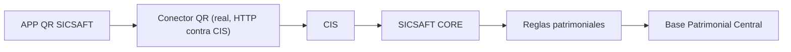

# Handoff: APP QR SICSAFT — para iniciar una nueva sesión de planificación

> Adjuntá este archivo completo a una nueva sesión de Claude (con o sin acceso al repo) para que tenga todo el contexto necesario y pueda seguir planificando junto con el equipo de SICSAFT CORE. Si la nueva sesión sí tiene acceso al repo, todos los `path` citados abajo son reales y navegables.

## Instrucciones para la nueva sesión

1. Este documento es autocontenido: no hace falta re-auditar el código para tener el contexto de negocio y las decisiones ya tomadas.
2. **TASK-004 a TASK-010 ya están hechas** — ver sección 7. Las 12 pantallas de DOC-001 están cubiertas, incluido el envío HTTP real. No hay backlog nuevo definido todavía para APP QR SICSAFT — antes de inventar trabajo nuevo, confirmar con el usuario si corresponde sincronizar Trello o mirar otro sistema del ecosistema (`cis/`, `core/`, etc., ver `README.md` raíz). La suite de e2e de Playwright (`tests/`) ya corre en verde contra la sesión OIDC real, mockeando la red con MSW (`src/mocks/`, ver sección 7). El recorrido manual contra Zitadel/CIS/CORE reales **ya se hizo y se verificó de punta a punta el 2026-08-13** (sección 7, incluye un bug real encontrado y corregido) — **pendiente real que sí queda abierto**: la prueba en un dispositivo Android físico (offline real, cámara, PWA instalada), ver sección 7.
3. **TASK-007 (sincronización real con CORE) ya no está bloqueada — se hizo.** Las 4 preguntas de la sección 6 tienen respuesta concreta desde el trabajo de `cis/`/`core/` (Fases 2-3 de `ROADMAP.md`): CIS expone exactamente las 4 rutas propuestas (DOC-006), la identidad viene de Zitadel real vía PKCE, `correlationId` de negocio convive con el header transversal, y la idempotencia es la propuesta. El Conector QR (`src/lib/qr-connector.ts`) ya no es un stub: `HttpQrConnectorClient` habla HTTP real contra CIS. Sección 6 actualizada con las respuestas.
4. El backlog vive en Trello: https://trello.com/b/nCi6W4oB/sicsaft (tablero **SICSAFT**, board id `6a79df5317e070b5a23014d0`). Se gestiona con `C:\Proyectos\trello-ai-project-manager\trello_project.py` (`validate-plan` / `sync-plan`, dry-run por defecto, `--apply` para escribir). Requiere `TRELLO_API_KEY`, `TRELLO_TOKEN`, `TRELLO_BOARD_ID` en variables de entorno — **no están guardadas en ningún archivo**; pedíselas al usuario si hace falta escribir en Trello, y si te las pasa por chat, avisale que las rote después (ya se expusieron una vez en una sesión anterior). **El tablero no se sincronizó todavía con el trabajo de TASK-004 a TASK-009** — falta mover esas tarjetas a "Hecho" cuando haya credenciales.
5. No se hizo `git push` de ningún commit todavía — todo vive local en `main`.

---

## 1. Qué es este proyecto

**APP QR SICSAFT** (antes "QR Vault") es la app de **captura** del ecosistema patrimonial SICSAFT: identifica al operador, la organización/área/ubicación, escanea activos con QR, valida contra la Base Patrimonial Central, registra incidencias y envía los resultados a SICSAFT CORE. No modifica directamente la Base Patrimonial Central — todo pasa por un **Conector QR** intermediario, que ya habla HTTP real contra CIS→CORE (ver sección 5/7).



Repo: `C:\Trabajos\SICSAFT\app-qr-sicsaft`.

## 2. Decisión de identidad — ADR-003

`aidlc-docs/design-artifacts/ADR/ADR-003-rename-app-qr-sicsaft.md`

Rename QR Vault → APP QR SICSAFT en dos fases:
- **Fase 1 (cosmética, YA APLICADA — commit `063e1a7`)**: nombre visible, título del navegador, manifest PWA, textos de instalación/offline, README, `package.json`/`-lock.json`.
- **Fase 2 (identificadores internos, NO TOCAR sin migración explícita)**: `DB_NAME = 'qrvault-inventory'` en `src/lib/db.ts` (IndexedDB), claves de `localStorage` (`qrvault-theme`, `qrvault-print-columns`, `qrvault-catalog-view`, `qrvault-operator`, `qrvault-device-id`), nombre del CSV exportado, y `package_name: app.vercel.qr_vault_nu.twa` en `public/.well-known/assetlinks.json` (atado al fingerprint de firma del TWA de Android — romperlo invalida la verificación de Play Store).
- Fuera del repo: nombre del proyecto en el dashboard de Vercel (no gestionable desde código).

## 3. Estado real del código

`aidlc-docs/design-artifacts/AUDIT-SICSAFT-FLOW.md` documenta el estado **al momento de TASK-001/002** (antes de TASK-004+) — queda como registro histórico, no como estado actual. Estado actual del flujo oficial (8 pasos):

| Paso | Estado | Detalle |
|---|---|---|
| Identificar operador | ✅ Existe | `OperatorGate.tsx` redirige a Zitadel (OIDC authorization code + PKCE, `src/lib/oidc/`) — ya no hay nombre tipeado, la identidad es real (TASK-007) |
| Seleccionar organización | ✅ Existe | `OrganizationPicker.tsx`, alimentado por `qrConnector.authSession()` real contra CIS |
| Seleccionar área | ✅ Existe | `AreaLocationPicker.tsx`, árbol derivado del catálogo real (`buildOrganizationTree`, ver sección 5) |
| Seleccionar ubicación | ✅ Existe | `AreaLocationPicker.tsx`, cascada área→ubicación |
| Iniciar inventario | ✅ Existe | `startScanning()` en `ScanPage.tsx` reutiliza el catálogo ya traído al elegir organización, genera `correlationId` |
| Escanear QR | ✅ Existe | `QrScanner.tsx` (`html5-qrcode`) |
| Validar activos | ✅ Existe | `scan-resolve.ts` — 6 de las 8 categorías de DOC-001 sección 3. `duplicate` sigue sin ser alcanzable: `POST /inventarios` no devuelve reclasificación por escaneo, solo el estado de la sesión completa (DOC-006 3) — requeriría un cambio de contrato, no algo que TASK-007 pudiera resolver sola |
| Registrar incidencias | ✅ Existe | `IncidentDialog.tsx` |
| Finalizar inventario | ✅ Existe | `finishScanning()` para la cámara y muestra el resumen — **ya no envía** (ver TASK-010) |
| Enviar a SICSAFT CORE | ✅ Existe | Botón "Confirmar y enviar" (`confirmAndSend()`, TASK-010) → `syncQueue.submitInventario()` → `qr-connector.ts` envía HTTP real (`HttpQrConnectorClient.postInventario`); sin conexión o 5xx queda en cola con reintentos (`sync-queue.ts`, TASK-008); un 400/409 real de CORE ahora sí puede ocurrir y corta la cola con `syncStatus: 'rejected'` en vez de reintentar para siempre (TASK-007) |

**Función que queda fuera de alcance (decisión del usuario, 2026-08-10)**: catálogo de productos + impresión de etiquetas QR (`CatalogPage.tsx`) se conserva tal cual, no forma parte del flujo oficial ni del Conector QR — sigue con acceso directo a `db.ts`.

## 4. Flujo oficial y pantallas — DOC-001

`aidlc-docs/design-artifacts/DOC-001-flujo-oficial.md`

**12 pantallas mínimas — las 12 están cubiertas.** Pantalla 10 (resumen del inventario) muestra esperados/faltantes/correctos/fuera de lugar/no registrados/externos/incidencias (TASK-010). Pantalla 11 (confirmación y envío) es el botón "Confirmar y enviar" (`confirmAndSend()` en `ScanPage.tsx`, TASK-010) — separado de "Finalizar", matchea el diagrama de DOC-001 (`Finalizar → Resumen → Confirmar y enviar`). Pantalla 12 (estado de sincronización) se resolvió como parte de `HistoryPage.tsx` en vez de una ruta propia (badge de `syncStatus` + botón "Ver auditoría", TASK-008/009) — DOC-001 la describe como estado por inventario, no como pantalla de contenido propio.

**Clasificación de resultados de escaneo** (8 categorías, `scan-resolve.ts`): correcto, otra área, otra ubicación, no registrado, código inválido, ya escaneado — implementadas y testeadas (TASK-005). "Duplicado" sigue reservada en el type sin ser alcanzable: aunque ahora hay backend real, `POST /inventarios` (DOC-006 3) solo devuelve el estado de la sesión completa, no una reclasificación por escaneo — CORE sí reclasifica internamente (Motor de Reglas) pero ese detalle no vuelve al cliente con el contrato actual. Activarla requeriría negociar un campo nuevo en la respuesta, fuera de alcance de TASK-007. "Con incidencia" se resolvió como una acción disponible sobre cualquier ítem escaneado, no como categoría excluyente.

## 5. Contrato del Conector QR — DOC-002

`aidlc-docs/design-artifacts/DOC-002-conector-qr.md`

**Implementado real contra CIS** (`src/lib/qr-connector.ts`, TASK-007) — `HttpQrConnectorClient` reemplazó al stub local (`LocalQrConnectorClient`, TASK-006):

| Operación | Método | Estado |
|---|---|---|
| `authSession` | — | Real: `POST {CIS_URL}/auth/session` con el access token de Zitadel (`Authorization: Bearer`) y `deviceId`; devuelve `organizaciones` reales (`{id, nombre, sedes}[]`, forma de CIS — no el árbol de 3 niveles que usaba el stub) |
| `getCatalogo(organizacionId, areaId?, ubicacionId?)` | — | Real: `GET {CIS_URL}/catalogo`. área/ubicación ahora son opcionales — se llama sin ellas al elegir organización para traer el catálogo completo y derivar el árbol área/ubicación que la UI necesita (`buildOrganizationTree`, ver nota abajo) |
| `postInventario(session)` | — | Real: `POST {CIS_URL}/inventarios`. Un 400/409 real (DOC-002 5) lanza `RejectedInventarioError`, que `sync-queue.ts` distingue de una falla transitoria para no reintentar un payload que CORE nunca va a aceptar (`syncStatus: 'rejected'`, activado por primera vez) |
| `getInventarioEstado` | — | Real: `GET {CIS_URL}/inventarios/{id}/estado`. Sigue sin caller (pantalla 12 resuelta de otra forma, ver sección 4) |

**Hallazgo no anticipado por las 4 preguntas de la sección 6 (ahora resuelto):** CIS/CORE no modelan "área" como entidad con nombre propio — `GET /entitlements` solo da `organización→sedes` (2 niveles), y `activos[].areaId` en el catálogo es un id suelto sin nombre. El árbol de 3 niveles que la UI necesita (`OrganizationPicker`/`AreaLocationPicker`) ya no viene de datos semilla (`organizations-data.ts` perdió su array `ORGANIZATIONS`, solo quedan los tipos) — se deriva en runtime del catálogo completo de la organización (`buildOrganizationTree` en `qr-connector.ts`): el nombre de área se muestra como su id (no hay otro dato), el de ubicación se resuelve contra `sedes[]` cuando el id calza. Decisión confirmada explícitamente con el usuario — no había otra forma de poblar el picker sin inventar un endpoint nuevo en CIS/CORE.

**Ya implementado sin depender de CORE (sin cambios, TASK-008/009):**
- Reintentos con backoff exponencial (5s/15s/45s, luego cada 5min) + reintento inmediato al recuperar conexión — `src/lib/sync-queue.ts`.
- `correlationId` generado al iniciar el inventario, registro de auditoría local con operador/dispositivo/inventario/código/resultado/ubicación/incidencia/estado de sync — `src/lib/audit-log.ts` + `src/lib/device-id.ts`, visible en Historial → "Ver auditoría".

**Auth real (TASK-007):** `src/lib/oidc/` implementa authorization code + PKCE contra Zitadel (ya probado con curl, ver `devops/local/README.md` "Cliente OIDC real") — `oidc-config.ts`/`oidc-client.ts`/`token-store.ts`/`pkce.ts`. Decisiones confirmadas explícitamente con el usuario: refresh token explícito (requiere `offline_access` habilitado en la app OIDC de Zitadel, no re-login silencioso) y `sessionStorage` para el token (no `localStorage` — es un secreto, a diferencia de `device-id.ts`).

## 6. Preguntas que bloqueaban TASK-007 — ya respondidas

Las 4 preguntas originales, con la respuesta concreta que dio el trabajo de `cis/`/`core/` (Fases 2-3 de `ROADMAP.md`):

1. **¿CIS expone las 4 rutas propuestas?** Sí, exactamente esas — `POST /auth/session`, `GET /catalogo`, `POST /inventarios`, `GET /inventarios/:id/estado` (DOC-006, `cis/src/qr-connector/`).
2. **¿Mecanismo real de autenticación?** OIDC (Zitadel) con authorization code + PKCE — app tipo User Agent/SPA sin secreto de cliente, ya provisionada (ver `devops/local/README.md` "Cliente OIDC real"). CIS valida el JWT vía `ZitadelAuthGuard`.
3. **¿Esquema de correlación propio de CORE?** No reemplaza al `correlationId` de negocio de DOC-002 6 — conviven: CIS agrega un header transversal `X-Correlation-Id` (WAF 2) que es independiente del `correlationId` que ya viaja en el payload de `POST /inventarios`.
4. **¿Semántica de idempotencia compatible?** Sí, idéntica a la propuesta — CORE persiste `idempotencyKey` en `sesiones_inventario` (DOC-006 3): mismo key + mismo payload devuelve el resultado ya procesado, distinto payload da 409.

Con esto TASK-007 se implementó completa (ver sección 5) y **se verificó real de punta a punta el 2026-08-13** (ver sección 7) — login OIDC real, catálogo real, escaneo y envío persistido en Postgres vía CIS→CORE.

## 7. Backlog completo y cadena de dependencias

Tablero Trello SICSAFT — última sincronización verificada contra el código real: **2026-08-10**, antes de TASK-004 a TASK-010. El tablero en sí **todavía no refleja** este trabajo (pendiente de credenciales para escribir, ver punto 4 de instrucciones). Estado real según el código:

```
TASK-004 (sesiones de inventario) ................................ ✅ Hecho
  → TASK-005 (normalizar 8 resultados de escaneo) ................. ✅ Hecho
    → TASK-006 (cliente del Conector QR, stub) ..................... ✅ Hecho
      → TASK-007 (sincronización real con CORE) .................... ✅ Hecho — verificado real de punta a punta 2026-08-13, ver nota abajo
        → TASK-008 (cola sin conexión) .............................. ✅ Hecho, ahora contra backend real
          → TASK-009 (registro de eventos y auditoría) .............. ✅ Hecho
            → TASK-010 (resumen final del inventario) .............. ✅ Hecho
```

**TASK-007 — nota de verificación (2026-08-13, cerrada)**: el código está implementado completo
(sección 5) y el recorrido manual real ya se hizo con el stack local completo (Traefik + Postgres
+ Redis + Zitadel + CIS + CORE, todos reconstruidos con el código vigente): login OIDC/PKCE real
contra Zitadel (app `app-qr-sicsaft` ya provisionada en el proyecto "CIS", client ID copiado a
`app-qr-sicsaft/.env`) → `POST /auth/session` → organización real (DUOC UC) → catálogo real
(`GET /catalogo`) → dos escaneos (`QR-000001`/`QR-000002`, los activos reales del seed) →
`POST /inventarios` → fila nueva en `sesiones_inventario` (`estado: recibido`), dos filas en
`inventarios` y un registro en `auditoria`, todo verificado por consulta directa a Postgres, no
solo por la respuesta HTTP.

**Dos bugs reales encontrados y corregidos durante la verificación** (ninguno de los dos lo
detectaba `npm run test:e2e` porque los mocks MSW no validan la forma del request saliente ni
dependen de la imagen Docker):
1. La imagen Docker de `cis` en el compose local estaba compilada de antes de que se agregara
   `CIS_CORS_ORIGIN`/`app.enableCors()` — el preflight `OPTIONS` devolvía 404 y todo fetch desde
   el navegador fallaba con "Failed to fetch". Se resolvió con `docker compose up -d --build cis`;
   no era un bug de código, es un recordatorio operativo (reconstruir imágenes al levantar el
   stack después de cambios de código, no asumir que `docker compose up -d` sin `--build` alcanza).
2. **Bug de código real**: `postInventario()` (`src/lib/qr-connector.ts`) mandaba el payload de
   `POST /inventarios` con los nombres de campo internos de `ScanSession` (`operatorName`,
   `organizationId`, `areaId`, `locationId`, `startedAt`, `date`, `items`) en vez de traducirlo al
   contrato DOC-006 (`operadorId`, `organizacionId`, `areaId`, `ubicacionId`, `fechaInicio`,
   `fechaCierre`, `escaneos[]`, `incidencias[]`) — CORE rechazaba cada envío con 400, pero
   `sync-queue.ts` atrapa el error y marca la sesión como `rejected` sin relanzarlo, así que la UI
   mostraba "Enviado ✔" con la base de datos vacía. Corregido con `toInventarioRequest()` (mismo
   archivo): mapea `ScanCategory → ScanResultado` y usa `correlationId` también como
   `idempotencyKey` (ya es estable por sesión, cumple el invariante de DOC-002 4 sin agregar un
   campo nuevo a `ScanSession`). Confirma que `test:e2e` en verde con mocks **no es evidencia** de
   que el contrato real esté bien implementado — falta cubrir la forma del payload saliente en el
   mock o en un test de contrato aparte (no hecho todavía, ver "Hallazgo documentado de paso" más
   abajo).

**Estrategia de e2e — resuelta con MSW.** La suite entera bootstrapeaba cada test vía
`identifyOperator()` (`tests/helpers.js`), que llenaba un input de texto que ya no existe.
`oidcClient.isAuthenticated()` sólo mira si hay tokens en `sessionStorage` (no valida firma —
CIS es quien valida server-side), así que alcanza con sembrar un JWT falso vía
`page.addInitScript()` (`tests/helpers.js`, `seedAuth`) para saltar `OperatorGate` sin simular el
redirect real a Zitadel. La red hacia CIS (los 4 endpoints de DOC-006) se mockea con
[MSW](https://mswjs.io/) (`src/mocks/`), activado sólo en un modo Vite dedicado
(`VITE_MOCK_API=true`, `.env.e2e`, `playwright.config.js` construye con `--mode e2e`) — nunca se
filtra al build de producción normal (`npm run build`). Las fixtures del catálogo mockeado
reusan `FULL_CATALOG` de `catalog-data.ts` en vez de duplicar datos.

Hallazgo documentado de paso, no corregido (cambiaría comportamiento de producto, fuera de
alcance de esto): `scan-resolve.ts` usa el `ubicacionId` crudo del activo para
`expectedLocationName` (mensaje "otra ubicación") en vez de resolverlo contra `sedes[]` como sí
hace `buildOrganizationTree` para el picker — pese a que el comentario del código dice "mismo
criterio que el picker". Muestra un id crudo en vez de un nombre legible en ese mensaje puntual.

Brecha de cobertura documentada de paso, no cerrada todavía: los handlers MSW de `POST
/inventarios` (`src/mocks/handlers.ts`) devuelven éxito sin inspeccionar el `body` del request —
por eso el bug de payload de TASK-007 (ver arriba) pasó 37/37 en verde antes de la verificación
manual. Agregar una aserción de forma (`operadorId`/`organizacionId`/`escaneos[]`, no
`operatorName`/`organizationId`/`items`) al handler o a un test de contrato dedicado evitaría que
un regreso futuro vuelva a pasar la suite en silencio.

No hay más tarjetas definidas para APP QR SICSAFT en el handoff más allá de esto — confirmar con
el usuario antes de proponer alcance nuevo.

Cada tarjeta tiene en su descripción de Trello: objetivo, alcance, criterios de aceptación verificables, evidencia esperada y dependencias — usar `board-summary`/`export-board` del script para traer el contenido exacto, y `sync-plan --apply` para marcar TASK-004 a TASK-010 como Hecho cuando haya credenciales (TASK-007 con la salvedad de verificación de arriba).

## 8. Historial de commits relevantes (repo local, sin push)

```
e0e9be7 feat: unificar colores de marca SICSAFT (BRAND.md + app-qr-sicsaft)
c9145e0 docs: sincronizar HANDOFF y READMEs tras TASK-010 - 12 pantallas de DOC-001 cubiertas
fb6f4ad feat(app-qr-sicsaft): TASK-010 - resumen final del inventario y confirmacion de envio
5e409fd feat(app-qr-sicsaft): TASK-009 - registro de eventos y auditoria con correlationId
fc547ad feat(app-qr-sicsaft): TASK-008 - cola sin conexion con reintentos automaticos
ba0486c feat(app-qr-sicsaft): TASK-006 - cliente del Conector QR, saca acceso directo a IndexedDB de la UI
33fe1bf feat(app-qr-sicsaft): TASK-005 - normalizar resultados de escaneo en 8 categorias
ccd529d feat(app-qr-sicsaft): TASK-004 - sesiones de inventario con operador/organizacion/area/ubicacion
b513776 docs: DOC-002 - contrato del Conector QR
8d9a348 docs: DOC-001 - flujo oficial de captura APP QR SICSAFT
dcfc1f6 docs: auditoria TASK-001/TASK-002 - matriz funcion->accion y gap vs flujo oficial
063e1a7 feat: renombrar QR Vault a APP QR SICSAFT (rebrand cosmetico)
```

TASK-007: implementación real (`src/lib/oidc/`, `qr-connector.ts` real, CORS en CIS) — ver nota de
verificación pendiente arriba antes de considerarla cerrada con el mismo rigor que las anteriores.

## 9. Reglas de trabajo ya acordadas (no re-preguntar)

- No modificar identificadores internos (IndexedDB, localStorage, TWA) sin migración explícita — ver sección 2.
- El acceso a datos pasa por el Conector QR (`qr-connector.ts`) — `ScanPage.tsx`/`scan-resolve.ts` nunca importan `db.ts` directo. `HistoryPage.tsx` sí lee `db.ts` directo (dato genuinamente local al dispositivo, DOC-002 no define un endpoint de "listar mis inventarios"). `CatalogPage.tsx` también, está fuera de alcance del Conector.
- El catálogo de productos/etiquetas QR se conserva fuera de alcance por ahora (no eliminar ni mover sin nueva decisión del usuario).
- `rejected` en `SyncStatus` ya es alcanzable (TASK-007, `RejectedInventarioError`) — dejó de estar reservado. `duplicate` en `ScanCategory` sigue sin serlo: el contrato actual de `POST /inventarios` no devuelve reclasificación por escaneo (ver sección 5) — se deja **reservado y documentado en el código**, no se implementa a medias ni se inventan datos para simularlo.
- No hacer `git push` ni aplicar cambios en Trello (`--apply`) sin confirmación explícita del usuario en cada caso.
- Cada TASK-0XX se planifica con `EnterPlanMode` antes de tocar código (arquitectura/alcance revisados con el usuario primero) y se verifica con `npm run build` + `npm run test:e2e` + recorrido manual en navegador antes de darla por terminada.
- Colores de marca: `src/index.css` ya no usa el preset "Sera" de fábrica — mapea 1:1 contra la paleta oficial azul-marino de SICSAFT. Fuente de verdad única para cualquier trabajo visual (nuevos componentes, otros sistemas del ecosistema): `../BRAND.md` (commit `e0e9be7`). No reinventar colores a mano sin pasar por ese archivo.
