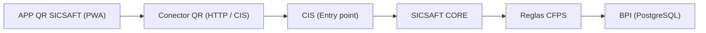

# Handoff: APP QR SICSAFT — Contexto y Estado Operativo

> Documento de referencia para el subsistema de captura móvil **APP QR SICSAFT**. Todos los `path` citados son reales y navegables en el repositorio.

## 1. Qué es este proyecto

**APP QR SICSAFT** es la aplicación PWA de **captura** del ecosistema patrimonial SICSAFT: identifica al operador, la organización/área/ubicación, escanea activos con código QR, valida contra la BPI (Base Patrimonial Inteligente), registra incidencias y envía los resultados a SICSAFT CORE.

**Invariante de captura**: Ninguna fuente de captura modifica directamente la BPI — todo pasa por el **Conector QR** intermediario hacia CIS → CORE.

Repo: `c:\Trabajos\SICSAFT\app-qr-sicsaft`.

## 2. Decisión de identidad — ADR-003 y ADR-004

- **Nombre**: APP QR SICSAFT (ex QR Vault).
- **Identidad oficial**: Keycloak 26 (ADR-004) mediante OIDC Authorization Code Flow + PKCE (`src/lib/oidc/`).
- **Identificadores internos preservados**: `DB_NAME = 'qrvault-inventory'` en `src/lib/db.ts` (IndexedDB local) y claves de `localStorage` para persistencia offline.

## 3. Estado del flujo oficial (8 pasos de captura)

| Paso | Estado | Detalle |
|---|---|---|
| Identificar operador | ✅ Activo | `OperatorGate.tsx` con OIDC + PKCE contra Keycloak (`src/lib/oidc/`) |
| Seleccionar organización | ✅ Activo | `OrganizationPicker.tsx` vía `qrConnector.authSession()` contra CIS |
| Seleccionar área | ✅ Activo | `AreaLocationPicker.tsx` con árbol derivado del catálogo (`buildOrganizationTree`) |
| Seleccionar ubicación | ✅ Activo | `AreaLocationPicker.tsx` (cascada área → ubicación) |
| Iniciar inventario | ✅ Activo | `startScanning()` en `ScanPage.tsx`, genera `correlationId` |
| Escanear QR | ✅ Activo | `QrScanner.tsx` (`html5-qrcode`) |
| Validar activos | ✅ Activo | `scan-resolve.ts` (clasificación contra catálogo) |
| Registrar incidencias | ✅ Activo | `IncidentDialog.tsx` |
| Finalizar inventario | ✅ Activo | Resumen de escaneo y auditoría previa |
| Enviar a SICSAFT CORE | ✅ Activo | `confirmAndSend()` → `syncQueue.submitInventario()` → `HttpQrConnectorClient.postInventario` (con cola offline y reintentos) |

## 4. Contrato del Conector QR con CIS

`HttpQrConnectorClient` (`src/lib/qr-connector.ts`) implementa la comunicación con CIS:

| Operación | Endpoint CIS | Propósito |
|---|---|---|
| `authSession` | `POST /auth/session` | Valida JWT de Keycloak y devuelve organizaciones asignadas |
| `getCatalogo` | `GET /catalogo` | Recupera catálogo de activos de la organización |
| `postInventario` | `POST /inventarios` | Envía sesión de escaneo finalizada con idempotencia |
| `getInventarioEstado` | `GET /inventarios/{id}/estado` | Consulta estado de procesamiento en CORE |

## 5. Resiliencia y Almacenamiento Offline

- **Cola offline**: `src/lib/sync-queue.ts` maneja reintentos con backoff exponencial.
- **Auditoría local**: `src/lib/audit-log.ts` y `src/lib/device-id.ts` conservan registro local inmutable con `correlationId`.
- **Sesión de tokens**: `sessionStorage` para access tokens OIDC.

## 6. Documentos Relacionados

- [`README.md`](README.md) — Instrucciones de desarrollo y ejecución de APP QR.
- [`../aidlc-docs/app-qr-sicsaft/design-artifacts/DOC-001-flujo-oficial.md`](../aidlc-docs/app-qr-sicsaft/design-artifacts/DOC-001-flujo-oficial.md) — Especificación de pantallas y estados.
- [`../aidlc-docs/app-qr-sicsaft/design-artifacts/DOC-002-conector-qr.md`](../aidlc-docs/app-qr-sicsaft/design-artifacts/DOC-002-conector-qr.md) — Contrato de interfaz Conector QR.
- [`../adr/ADR-004-identidad-keycloak-reemplaza-zitadel.md`](../adr/ADR-004-identidad-keycloak-reemplaza-zitadel.md) — Norma de autenticación OIDC.
- [`../NOMENCLATURA.md`](../NOMENCLATURA.md) — Nomenclatura oficial BPI y roles.

