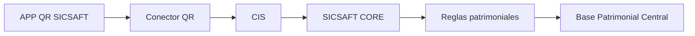

# Handoff: APP QR SICSAFT — para iniciar una nueva sesión de planificación

> Adjuntá este archivo completo a una nueva sesión de Claude (con o sin acceso al repo) para que tenga todo el contexto necesario y pueda seguir planificando junto con el equipo de SICSAFT CORE. Si la nueva sesión sí tiene acceso al repo `C:\Trabajos\SICSAFT\QRVault`, todos los `path` citados abajo son reales y navegables.

## Instrucciones para la nueva sesión

1. Este documento es autocontenido: no hace falta re-auditar el código para tener el contexto de negocio y las decisiones ya tomadas.
2. El trabajo pendiente inmediato es **TASK-004** (sesiones de inventario) en adelante — ver sección 7.
3. Antes de avanzar con TASK-006/007 (Conector QR real), hay 4 preguntas abiertas que solo puede responder el equipo de SICSAFT CORE — ver sección 6. No asumas respuestas; si hace falta avanzar sin ellas, proponé un stub/mock explícito del Conector QR.
4. El backlog vive en Trello: https://trello.com/b/nCi6W4oB/sicsaft (tablero **SICSAFT**, board id `6a79df5317e070b5a23014d0`). Se gestiona con `C:\Proyectos\trello-ai-project-manager\trello_project.py` (`validate-plan` / `sync-plan`, dry-run por defecto, `--apply` para escribir). Requiere `TRELLO_API_KEY`, `TRELLO_TOKEN`, `TRELLO_BOARD_ID` en variables de entorno — **no están guardadas en ningún archivo**; pedíselas al usuario si hace falta escribir en Trello, y si te las pasa por chat, avisale que las rote después (ya se expusieron una vez en una sesión anterior).
5. No se hizo `git push` de ningún commit todavía — todo vive local en `main`.

---

## 1. Qué es este proyecto

**APP QR SICSAFT** (antes "QR Vault") es la app de **captura** del ecosistema patrimonial SICSAFT: identifica al operador, la organización/área/ubicación, escanea activos con QR, valida contra la Base Patrimonial Central, registra incidencias y envía los resultados a SICSAFT CORE. No debe modificar directamente la Base Patrimonial Central — todo pasa por un **Conector QR** intermediario.



Repo: `C:\Trabajos\SICSAFT\QRVault` (carpeta local sigue llamándose `QRVault`, no se renombró — ver sección 2).

## 2. Decisión de identidad — ADR-003

`aidlc-docs/design-artifacts/ADR/ADR-003-rename-app-qr-sicsaft.md`

Rename QR Vault → APP QR SICSAFT en dos fases:
- **Fase 1 (cosmética, YA APLICADA — commit `063e1a7`)**: nombre visible, título del navegador, manifest PWA, textos de instalación/offline, README, `package.json`/`-lock.json`.
- **Fase 2 (identificadores internos, NO TOCAR sin migración explícita)**: `DB_NAME = 'qrvault-inventory'` en `src/lib/db.ts` (IndexedDB), claves de `localStorage` (`qrvault-theme`, `qrvault-print-columns`, `qrvault-catalog-view`), nombre del CSV exportado, y `package_name: app.vercel.qr_vault_nu.twa` en `public/.well-known/assetlinks.json` (atado al fingerprint de firma del TWA de Android — romperlo invalida la verificación de Play Store).
- Fuera del repo: nombre del proyecto en el dashboard de Vercel (no gestionable desde código).

## 3. Estado real del código (auditoría TASK-001/TASK-002)

`aidlc-docs/design-artifacts/AUDIT-SICSAFT-FLOW.md`

**Stack**: Vite + React 19 + TypeScript, PWA con `vite-plugin-pwa`, **sin backend**. Acceso a datos 100% directo a IndexedDB (`src/lib/db.ts`), sin ninguna capa API ni llamada de red en todo el código. Hay indicios de un wrapper TWA para Android (`assetlinks.json`) pero sin proyecto Android real en el repo.

**Cobertura del flujo oficial (8 pasos):**

| Paso | Estado | Detalle |
|---|---|---|
| Identificar operador | ❌ Falta | No hay login ni modelo de usuario |
| Seleccionar organización | ❌ Falta | No existe la entidad |
| Seleccionar área | ❌ Falta | No existe la entidad |
| Seleccionar ubicación | ❌ Falta | No existe la entidad |
| Iniciar inventario | ⚠️ Parcial | `startScanning()` en `ScanPage.tsx`, sin metadatos de sesión |
| Escanear QR | ✅ Existe | `QrScanner.tsx` (`html5-qrcode`) |
| Validar activos | ⚠️ Parcial | `scan-resolve.ts` solo found/not-found, faltan las 8 categorías |
| Registrar incidencias | ❌ Falta | No existe |
| Finalizar inventario | ✅ Existe | `finishScanning()` guarda sesión en IndexedDB |
| Enviar a SICSAFT CORE | ❌ Falta | Solo export CSV local, cero llamadas de red |

**Función que queda fuera de alcance (decisión del usuario, 2026-08-10)**: catálogo de productos + impresión de etiquetas QR (`CatalogPage.tsx`) se conserva tal cual por ahora, no forma parte del flujo oficial pedido.

## 4. Flujo oficial y pantallas — DOC-001

`aidlc-docs/design-artifacts/DOC-001-flujo-oficial.md`

**12 pantallas mínimas** — estado: 2 ya existen (escáner, historial parcial), 4 son adaptaciones de pantallas actuales (lista de inventarios, iniciar inventario, resultado del escaneo, resumen del inventario), **6 no existen** (login, organización, área/ubicación, ficha del activo, incidencia, confirmación y envío, estado de sincronización — son 7, ver el doc completo para el detalle exacto por pantalla).

**Clasificación de resultados de escaneo** (8 categorías, cada una con su acción para el operador): activo correcto, de otra área, de otra ubicación, no registrado, código inválido, duplicado, ya escaneado, con incidencia.

## 5. Contrato del Conector QR — DOC-002

`aidlc-docs/design-artifacts/DOC-002-conector-qr.md`

**Operaciones propuestas** (REST/JSON, todavía no implementadas ni acordadas con CORE):

| Operación | Método | Uso |
|---|---|---|
| `/auth/session` | POST | Identificar operador |
| `/catalogo?organizacionId&areaId&ubicacionId` | GET | Poblar catálogo local esperado |
| `/inventarios` | POST | Enviar sesión de inventario cerrada |
| `/inventarios/{id}/estado` | GET | Consultar estado de sincronización |

**Reglas de diseño ya definidas:**
- Idempotencia: `idempotencyKey` por sesión; **la unidad atómica es el inventario completo**, nunca escaneos sueltos.
- Reintentos: backoff exponencial, gestionado por la cola offline (TASK-008), nunca reintento manual del operador.
- Errores `400`/`409` no se reintentan automáticamente (se muestran al operador); `401` reintenta re-autenticando; `5xx`/sin red se encola.
- Trazabilidad: `correlationId` generado al **iniciar** el inventario (no al enviarlo), viaja en cada operación y en el registro de auditoría local (TASK-009).

## 6. Preguntas abiertas — SOLO el equipo de SICSAFT CORE puede responderlas

1. ¿CIS ya expone rutas equivalentes a las 4 propuestas en la sección 5, o hay que adaptarse a un contrato ya existente?
2. Mecanismo real de autenticación (¿OAuth2 client credentials? ¿JWT propio de SICSAFT? ¿certificado de dispositivo?).
3. ¿CORE ya tiene su propio esquema de correlación/tracing al que el `correlationId` deba adaptarse, en vez de proponer uno nuevo?
4. ¿La semántica de idempotencia propuesta (misma key = mismo resultado, nunca duplicar) es compatible con cómo CORE aplica las Reglas patrimoniales?

Hasta que estas se respondan, TASK-006/TASK-007 pueden avanzar con un **stub/mock** del Conector QR (contrato de DOC-002 como interfaz, implementación falsa) para no bloquear el resto del desarrollo.

## 7. Backlog completo y cadena de dependencias

Tablero Trello SICSAFT — 13 tarjetas (verificado y sincronizado el 2026-08-10 contra el código real): **6 en Hecho** (TASK-001, TASK-002, DOC-001, DOC-002, ADR-001, TASK-003), **1 en En proceso** (TASK-010 — existe una vista de resumen en `ScanPage.tsx` pero le falta "esperados/faltantes/externos/incidencias" y la pantalla de confirmación de envío), **6 en Lista de tareas** (TASK-004 a TASK-009, sin empezar — cero código de sesiones, categorías de escaneo, cliente API, sincronización, cola offline o auditoría en `src/`).

```
TASK-004 (sesiones de inventario — SIN dependencia de CORE, se puede empezar ya)
  → TASK-005 (normalizar los 8 resultados de escaneo — SIN dependencia de CORE)
    → TASK-006 (sacar acceso directo a datos, implementar cliente del Conector QR)
      → TASK-007 (sincronización real con CORE — BLOQUEADO por sección 6 salvo que se use un stub)
        → TASK-008 (cola sin conexión)
          → TASK-009 (registro de eventos y auditoría, usa correlationId)
            → TASK-010 (resumen final del inventario)
```

Cada tarjeta tiene en su descripción de Trello: objetivo, alcance, criterios de aceptación verificables, evidencia esperada y dependencias — usar `board-summary`/`export-board` del script para traer el contenido exacto y actualizado si pasó tiempo desde este handoff.

## 8. Historial de commits relevantes (repo local, sin push)

```
b513776 docs: DOC-002 - contrato del Conector QR
8d9a348 docs: DOC-001 - flujo oficial de captura APP QR SICSAFT
dcfc1f6 docs: auditoria TASK-001/TASK-002 - matriz funcion->accion y gap vs flujo oficial
063e1a7 feat: renombrar QR Vault a APP QR SICSAFT (rebrand cosmetico)
```

## 9. Reglas de trabajo ya acordadas (no re-preguntar)

- No modificar identificadores internos (IndexedDB, localStorage, TWA) sin migración explícita — ver sección 2.
- El acceso a datos debe migrar de directo-a-IndexedDB a pasar por el Conector QR — nunca escribir directo a la Base Patrimonial Central.
- El catálogo de productos/etiquetas QR se conserva fuera de alcance por ahora (no eliminar ni mover sin nueva decisión del usuario).
- No hacer `git push` ni aplicar cambios en Trello (`--apply`) sin confirmación explícita del usuario en cada caso.
