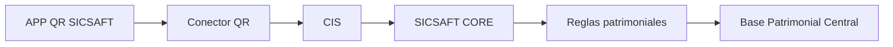

# DOC-002: Contrato del Conector QR

Evidencia de la tarjeta DOC-002 del tablero [SICSAFT](https://trello.com/b/nCi6W4oB/sicsaft). Define cómo APP QR SICSAFT habla con el resto del ecosistema, según el diagrama acordado:

> **Estado del contrato**: propuesta técnica basada en el flujo oficial ([DOC-001](./DOC-001-flujo-oficial.md)) y en las restricciones ya conocidas del lado APP QR SICSAFT (PWA, posible offline, un solo dispositivo por operador). No existe todavía integración real ni especificación publicada de CIS/SICSAFT CORE en este repositorio — los puntos marcados **⚠️ Pendiente de confirmar con el equipo de SICSAFT CORE** son supuestos de diseño, no hechos verificados, y deben validarse antes de implementar TASK-006/007.

## 1. Alcance del Conector QR

El Conector QR es la **única** vía por la que APP QR SICSAFT toca datos que no son locales al dispositivo. La app nunca escribe directo a la Base Patrimonial Central (ver [ADR-003](./ADR/ADR-003-rename-app-qr-sicsaft.md) y TASK-006). Responsabilidades del conector:

- Autenticar al operador/dispositivo ante CIS.
- Enviar sesiones de inventario cerradas (no escaneos sueltos) hacia CORE.
- Traer el catálogo de activos esperados por organización/área/ubicación (para poder validar activos offline durante el escaneo).
- Reintentar envíos fallidos sin duplicar datos en CORE.
- Producir un identificador de correlación por cada operación, para trazabilidad de punta a punta.

Fuera de alcance del conector: aplicar Reglas patrimoniales (eso vive en CORE) y escribir directo en la Base Patrimonial Central (eso vive en CORE + Reglas).

## 2. Operaciones (contrato de mensajes)

Propuesta REST/HTTPS sobre JSON, una operación por caso de uso del flujo oficial:

| Operación | Método | Cuándo se usa | Request (resumen) | Response (resumen) |
|---|---|---|---|---|
| `POST /auth/session` | POST | Al identificar operador (pantalla 1) | `{ operadorId, credencial, deviceId }` | `{ accessToken, expiresAt, organizaciones[] }` |
| `GET /catalogo?organizacionId&areaId&ubicacionId` | GET | Al iniciar inventario (pantalla 5), para poblar el catálogo local de activos esperados | — | `{ activos: [{ codigoQr, nombre, organizacionId, areaId, ubicacionId, estado }] }` |
| `POST /inventarios` | POST | Al finalizar inventario y confirmar envío (pantallas 10–11) | `{ correlationId, idempotencyKey, operadorId, organizacionId, areaId, ubicacionId, fechaInicio, fechaCierre, escaneos: [...], incidencias: [...] }` | `{ inventarioId, estado: "recibido"\|"rechazado", errores?[] }` |
| `GET /inventarios/{inventarioId}/estado` | GET | Para refrescar el estado de sincronización (pantalla 12) si el envío quedó en cola | — | `{ estado: "pendiente"\|"recibido"\|"rechazado", ultimoIntento }` |

`escaneos[]` transporta la clasificación completa definida en DOC-001 (correcto, otra área, otra ubicación, no registrado, inválido, duplicado, ya escaneado, con incidencia), no solo found/missing — así CORE puede aplicar Reglas patrimoniales con el mismo detalle que vio el operador.

⚠️ **Pendiente de confirmar con el equipo de SICSAFT CORE**: si CIS expone estas rutas tal cual, o si el conector debe adaptarse a un contrato ya existente (versión de API, formato de autenticación real, nombres de campo). Esta tabla es el contrato deseado desde el lado de la app, a usar como punto de partida de la negociación, no como API ya acordada.

## 3. Autenticación

- El operador se autentica una vez por sesión de trabajo (pantalla 1) contra `POST /auth/session`; el token resultante se usa en todas las llamadas posteriores (`Authorization: Bearer <accessToken>`).
- El token debe persistirse solo en memoria/IndexedDB local, nunca en `localStorage` sin cifrar (ver regla de seguridad de sesiones — no reutilizar el patrón simple ya usado para `qrvault-theme`).
- Vencimiento corto (`expiresAt`) + refresh transparente si el operador sigue trabajando; si el token vence en medio de una sesión offline, el envío se reintenta re-autenticando primero (ver sección 4).

⚠️ **Pendiente de confirmar con el equipo de SICSAFT CORE**: mecanismo real (OAuth2 client credentials, JWT propio de SICSAFT, certificado de dispositivo). Se asume aquí un esquema token-based estándar como placeholder de diseño.

## 4. Reintentos e idempotencia

- **Idempotency key**: cada envío de `POST /inventarios` lleva un `idempotencyKey` generado localmente al cerrar el inventario (ej. UUID v4 derivado del `inventarioId` local). CORE debe tratar reintentos con la misma key como el mismo envío (devolver el resultado ya procesado, no duplicar el inventario).
- **Reintentos**: backoff exponencial (ej. 5s, 15s, 45s, luego cada 5 min) gestionado por la cola sin conexión (TASK-008), no por el usuario reintentando manualmente.
- **Qué se reintenta**: solo el envío completo de la sesión (`POST /inventarios`). Nunca se reintenta parcialmente (no se reenvían escaneos sueltos) — la unidad atómica es la sesión de inventario completa.
- **Qué NO se reintenta indefinidamente**: errores de validación (`400`, catálogo/organización inexistente) no se reintentan automáticamente — se muestran al operador como "rechazado" con el detalle de `errores[]`, porque un reintento no va a cambiar el resultado.
- **Corte**: si tras N reintentos (a definir, ej. 10) sigue sin poder enviarse por error de red, el inventario queda visible como "pendiente" indefinidamente en la pantalla de estado de sincronización (pantalla 12) hasta que el operador o el sistema recuperen conexión — nunca se descarta silenciosamente.

## 5. Manejo de errores

| Código | Significado | Comportamiento esperado en la app |
|---|---|---|
| `401` | Token vencido/ inválido | Re-autenticar automáticamente y reintentar una vez; si falla de nuevo, pedir login |
| `400` | Payload inválido (ej. escaneo con organización inexistente) | Marcar el inventario como rechazado, mostrar `errores[]` al operador, no reintentar |
| `409` | Conflicto (ej. `idempotencyKey` ya usada con payload distinto) | Tratar como bug de cliente — loguear con el `correlationId`, no reintentar automáticamente |
| `5xx` / timeout / sin red | Error transitorio | Encolar localmente y aplicar la política de reintentos de la sección 4 |

## 6. Trazabilidad

- Todo envío lleva un `correlationId` generado en el dispositivo al **iniciar** el inventario (no al enviarlo), para poder correlacionar desde el primer escaneo hasta la confirmación de CORE aunque el envío tarde horas en salir de la cola offline.
- El `correlationId` se guarda en el registro de auditoría local (TASK-009: operador, fecha/hora, dispositivo, inventario, código leído, resultado, ubicación, incidencia, estado de sincronización) junto a cada operación relacionada.
- CORE debe devolver el mismo `correlationId` (o uno propio vinculado) en toda respuesta, para que soporte pueda seguir un caso de punta a punta entre logs de la app y logs de CORE.

⚠️ **Pendiente de confirmar con el equipo de SICSAFT CORE**: si CORE ya tiene su propio esquema de correlación/tracing (ej. cabecera estándar tipo `X-Correlation-Id`, integración con un sistema de observabilidad existente) al que el conector deba adaptarse en lugar de proponer uno nuevo.

## Dependencias hacia el resto del backlog
- **TASK-006** (separar frontend del acceso directo a datos) implementa el cliente de este contrato en lugar de las llamadas directas a IndexedDB.
- **TASK-007** (sincronización con CORE) implementa `POST /inventarios` y el manejo de errores de la sección 5.
- **TASK-008** (cola sin conexión) implementa la política de reintentos de la sección 4.
- **TASK-009** (registro de eventos y auditoría) usa el `correlationId` de la sección 6.
