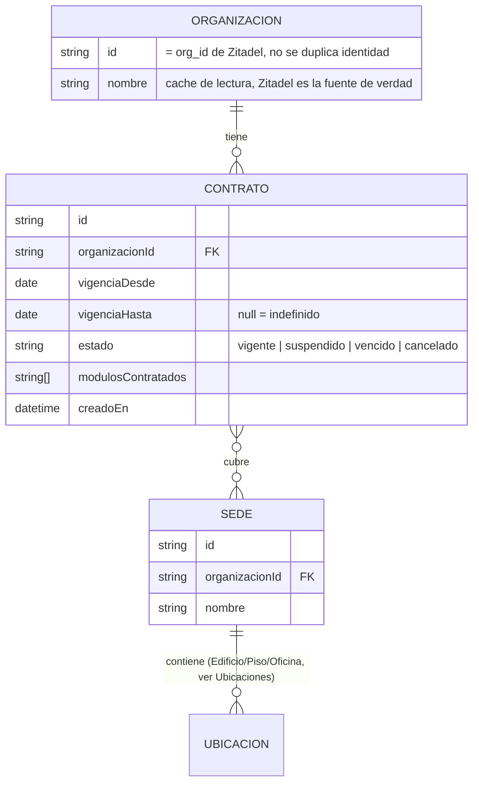
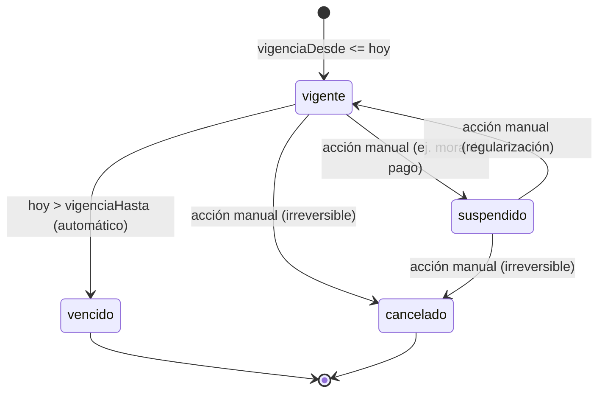

# DOC-004: Modelo de dominio — Contrato

> **Alcance de este documento**: solo la entidad `Contrato` y su relación inmediata con
> `Organización` y `Sede` — el mínimo necesario para desbloquear la resolución real de
> entitlements en CIS (ver el `TODO(ADR-002/Contrato)` en
> `cis/src/qr-connector/qr-connector.service.ts`). **No** modela todavía el resto de los 11
> dominios de Base Patrimonial (Catálogo de Activos, Inventarios, Eventos, Historial, etc., ver
> `base-patrimonial/README.md`) — eso queda para un DOC-005 posterior, en conjunto con CORE.
>
> **Estado**: implementada. Tablas reales en Postgres, versionadas con migraciones
> (`core/migrations/`, motor ya resuelto a nivel de ecosistema por
> [ADR-001](../adr/ADR-001-stack-backend-nestjs.md)) servidas por `core/` vía `GET /entitlements`
> (`core/src/entitlements/contrato.repository.ts`), consumidas por CIS. Sigue sin existir el resto
> de los 11 dominios de Base Patrimonial.

## 1. Por qué existe esta entidad

[ADR-002](../adr/ADR-002-identidad-zitadel-multi-tenant.md) estableció que el acceso no se
otorga por organización completa, sino por **organización + sede específica, según contrato
vigente** (caso real: DUOC UC tiene contrato solo para la sede Melipilla). El modelo de
`seguridad/README.md` es `Usuario → Organización → Contrato → Sede/Área → Rol → Permisos →
Acción` — `Contrato` es la pieza que faltaba modelar.

**Punto de validación: Base Patrimonial guarda el dato, CORE lo sirve, CIS lo cachea y valida en
cada request — nunca el token.** El JWT de Zitadel solo trae `sub`/`org_id`/`roles[]`; no
codifica qué sedes están habilitadas (ver ADR-002 §"Punto de validación"). Esto ya es visible en
el código: `ZitadelAuthContext` (`cis/src/common/auth/zitadel-auth.guard.ts`) solo expone
`operadorId`, y `QrConnectorService.authSession()` sigue devolviendo el seed fijo
(`SEED_ORGANIZACIONES`) porque no existe todavía de dónde resolver el dato real.

## 2. Entidades y relaciones



### Organización
**No es una entidad propia de Base Patrimonial** — es una referencia de solo lectura al `org_id`
que Zitadel ya administra (evita duplicar la fuente de verdad de identidad, ver ADR-002). Base
Patrimonial guarda `organizacionId` como string opaco (el ID que Zitadel asigna) más un `nombre`
cacheado únicamente para lectura/reportes — nunca se escribe de vuelta a Zitadel desde acá, y
nunca se usa este cache para decisiones de autorización (eso lo valida el token en cada request).

### Sede
Unidad **gruesa** de cobertura contractual (ej. "Melipilla", "Providencia") — corresponde al
primer nivel de la jerarquía `Sede → Edificio → Piso → Oficina` que el dominio "Ubicaciones" de
`base-patrimonial/README.md` ya insinúa (su primer campo listado es justamente `Sede`). Este
documento **formaliza `Sede` como entidad direccionable por ID** (no un string libre dentro de
`Ubicaciones`) precisamente porque `Contrato` necesita referenciarla — el resto de la jerarquía de
`Ubicaciones` (Edificio/Piso/Oficina/Zona RFID) sigue siendo responsabilidad de ese dominio y no
se toca acá. ⚠️ Queda como ajuste pendiente de reconciliar formalmente esa relación cuando se
diseñe el dominio "Ubicaciones" completo (DOC-005).

### Contrato
La entidad nueva. Relación con Sede es **muchos-a-muchos** (un contrato puede cubrir varias
sedes; en el caso base cubre una sola). Campos:

| Campo | Tipo | Notas |
|---|---|---|
| `id` | string | — |
| `organizacionId` | string (FK) | referencia al `org_id` de Zitadel |
| `sedes` | Sede[] (N:N) | sedes cubiertas por este contrato |
| `vigenciaDesde` | date | requerido |
| `vigenciaHasta` | date \| null | `null` = indefinido, vigente hasta cancelación explícita |
| `estado` | enum | ver §3 |
| `modulosContratados` | string[] | ver §4 |
| `creadoEn` | datetime | auditoría — no se borra, mismo principio de Historial (§"Ciclo de vida", `base-patrimonial/README.md`) |

## 3. Estados y transiciones



Solo `vigente` habilita acceso — `suspendido`/`vencido`/`cancelado` deben resolver a "sin módulos
habilitados para esa sede", nunca a un 401/403 duro en el login (mismo criterio que ADR-002 ya
fijó: "el login funciona igual — solo no ve ningún módulo habilitado", mejor UX y mejor palanca
de upsell que negar el login directamente).

## 4. Invariante: una sede, un contrato vigente

**Una `Sede` no puede estar cubierta por más de un `Contrato` en estado `vigente` al mismo
tiempo.** Alternativa descartada: permitir contratos vigentes solapados por sede y tomar el más
permisivo — se descarta porque introduce ambigüedad en auditoría ("¿bajo qué contrato se otorgó
este acceso?") sin un caso de negocio real que lo justifique hoy; si aparece (ej. renovación con
período de traslape), se revisita como excepción explícita, no como comportamiento por defecto.

## 5. `modulosContratados`: vocabulario controlado

Lista abierta pero controlada — no texto libre. Hoy solo existe un valor real:

- `inventario-qr` — habilita el Conector QR (`cis/src/qr-connector/`, contrato
  [DOC-002](../app-qr-sicsaft/aidlc-docs/design-artifacts/DOC-002-conector-qr.md)) para las sedes
  cubiertas por el contrato.

Valores futuros (no implementados, solo reservados para no romper el enum al agregarlos):
`inventario-rfid` (SYS-07), `integracion-erp` / `integracion-rrhh` (SYS-08). No se define su
comportamiento acá — cada uno se agrega cuando su sistema correspondiente tenga su propio DOC de
contrato.

## 6. Cómo lo consume CIS (resolución de entitlements)

Flujo previsto (⚠️ el endpoint de CORE marcado abajo **no existe todavía** — CORE sigue sin
código, ver `core/README.md`):

1. Operador se autentica contra Zitadel (OIDC, fuera del CIS) → token con `sub`/`org_id`.
2. CIS valida el token (`ZitadelAuthGuard`, ya implementado) y llama a CORE:
   `GET /entitlements?organizacionId={org_id}&operadorId={sub}` (contrato propuesto, a definir
   formalmente en un DOC-006 API CIS↔CORE — ver `cis/README.md` § Documentos relacionados).
3. CORE resuelve contra Base Patrimonial: contratos `vigente` de esa organización → sedes
   cubiertas → módulos habilitados. Devuelve exactamente la forma que
   `AuthSessionResponse.organizaciones` de CIS ya espera hoy
   (`cis/src/qr-connector/qr-connector.types.ts`):
   ```ts
   interface Organizacion { id: string; nombre: string; sedes: Sede[] }
   ```
   — sin cambios al contrato ya construido en CIS, esto reemplaza `SEED_ORGANIZACIONES` por el
   resultado real.
4. CIS cachea el resultado — **invalidado por evento cuando un contrato cambia, no por TTL fijo**
   (ADR-002, mismo patrón de caché de catálogos de `ARQUITECTURA-WAF.md` §5). El evento
   (`contrato.actualizado`, `contrato.vencido`, etc.) y su mecanismo de entrega (webhook, cola)
   quedan pendientes de diseño junto con CORE — no se resuelven en este documento.

## 7. Lo que este documento NO resuelve (abierto, con dueño)

- **Modelo de datos completo de Base Patrimonial** (los 11 dominios) — DOC-005, junto con CORE.
- **Evento de invalidación de caché de CIS** (`contrato.actualizado`, `contrato.vencido`, etc.) y
  su mecanismo de entrega (webhook, cola) — DOC-006, no hay endpoint de escritura de `Contrato`
  todavía que lo dispare.
- **Contrato de API `GET /entitlements`** formalizado (paths, auth service-to-service CIS↔CORE)
  — DOC-006, aunque la implementación real ya existe.
- **Reconciliación formal de `Sede` con el dominio "Ubicaciones"** existente — ver nota §2.
- **Quién crea/edita un Contrato** (¿un panel admin en WEB? ¿API directa?) — depende de que WEB
  exista. Hoy la tabla `contratos` solo se lee, no hay ruta de escritura.

## Depende de
Nada técnicamente para el diseño (este documento no depende de código existente). Ya implementado
sobre Postgres (`core/migrations/`, `core/src/entitlements/`) — ver §7 para lo que sigue abierto.

## Bloquea
- El `TODO(ADR-002/Contrato)` en `cis/src/qr-connector/qr-connector.service.ts` (resolución real
  de `organizaciones` en `auth/session`, hoy seed fijo).
- `seguridad/README.md` § "Depende de" (modelo de `Contrato`).

## Documentos relacionados
- [ADR-002](../adr/ADR-002-identidad-zitadel-multi-tenant.md) — decisión de mecanismo de
  identidad y por qué se agrega `Contrato` al modelo.
- [`seguridad/README.md`](../seguridad/README.md) — modelo completo
  Usuario→Organización→Contrato→Sede→Rol→Permisos→Acción.
- [DOC-002](../app-qr-sicsaft/aidlc-docs/design-artifacts/DOC-002-conector-qr.md) — contrato del
  Conector QR, primer consumidor real de `modulosContratados: ["inventario-qr"]`.
- `cis/src/qr-connector/qr-connector.types.ts` — forma exacta de `Organizacion`/`Sede` que este
  modelo debe poder producir sin romper el contrato ya construido.

## Próximo paso sugerido
Ya implementado: `GET /entitlements` sirve `Contrato`/`Sede`/`Organizacion` reales desde Postgres
(`core/src/entitlements/contrato.repository.ts`) y CIS ya lo consume. Lo que sigue es DOC-005
(resto del dominio patrimonial) y el primer motor real de CORE (Motor Patrimonial) sobre esas
tablas.
