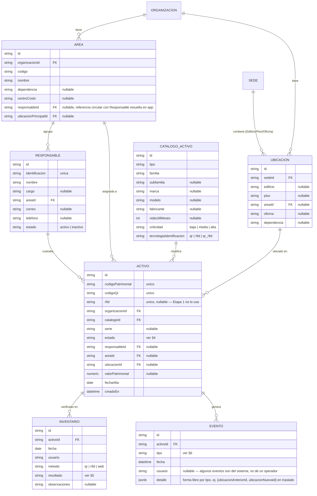
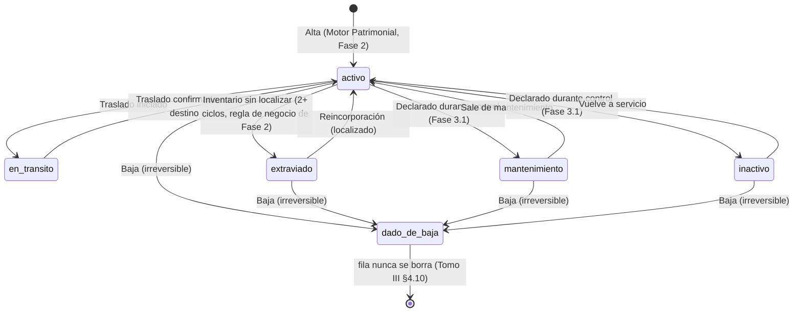

# DOC-005: Modelo de dominio — Base Patrimonial (alcance mínimo viable)

> **Alcance de este documento**: los dominios de `base-patrimonial/README.md` §"Los 11 dominios
> oficiales" que el flujo de captura QR necesita para dejar de ser un mock — `Área`, `Ubicación`,
> `Responsable`, `Catálogo de Activos`, `Base Patrimonial Central` (el activo), `Inventarios`,
> `Eventos` y `Auditoría`. `Historial` no es una tabla propia: es la lectura cronológica de
> `Eventos` por activo (Tomo III §4.10, "todos los eventos desde alta hasta baja"). **No**
> modela `Configuración` ni `Integraciones` — sin consumidor todavía, modelarlas sería
> especulativo (YAGNI, ver `ARQUITECTURA-WAF.md` §9). Sigue la misma disciplina que
> [DOC-004](DOC-004-modelo-contrato.md): entidades, estados, invariantes, qué consume esto y qué
> NO resuelve.
>
> **Estado**: implementado. Tablas reales en Postgres, migraciones versionadas en
> `core/migrations/` (mismo mecanismo que DOC-004, node-pg-migrate). Sin API todavía — ningún
> endpoint de CORE sirve estos datos aún, eso es el Motor Patrimonial (ROADMAP.md Fase 2).

## 1. Por qué este alcance y no los 11 dominios completos

`ROADMAP.md` Fase 1 es explícito: modelar los 11 dominios completos antes de tener un solo
consumidor real es el riesgo principal identificado para esta fase ("se convierte en un ejercicio
de modelar sin fin y bloquea meses"). El criterio de corte es el mismo que ya usó DOC-004 para
`Contrato`: **modelar lo que el flujo QR (DOC-002) necesita para reemplazar sus mocks**
(`SEED_CATALOGO`, `SEED_ORGANIZACIONES` de `cis/src/qr-connector/qr-connector.seed.ts`, y las 8
categorías de resultado de escaneo que hoy resuelve `scan-resolve.ts` del lado del cliente en vez
de CORE). `Configuración` e `Integraciones` no tienen ningún consumidor hasta CON-CONTABILIDAD
(ROADMAP.md Fase 7) — se reservan como dominios futuros, no se modelan acá.

## 2. Entidades y relaciones

`AUDITORIA` no se relaciona con `ACTIVO` directamente — registra **toda** acción del ecosistema
(login, escritura, consulta sensible), no solo las de un activo. Ver §7.

### Nota: por qué `Área`/`Responsable` no tienen ciclo estricto de creación

`Área.responsableId` y `Responsable.areaId` se referencian mutuamente (un área tiene un
responsable principal, un responsable pertenece a un área) — no se resuelve con una constraint de
base de datos circular (Postgres no lo permite limpio sin `DEFERRABLE`, y no vale la complejidad
para un caso que además es opcional). Se valida en la capa de aplicación cuando exista el Motor
Patrimonial (Fase 2); hoy son ambos nullable y el seed de desarrollo no ejercita el caso circular.

## 3. Reconciliación con `Sede` (deuda dejada abierta por DOC-004 §2)

DOC-004 §2 dejó anotado: *"queda como ajuste pendiente reconciliar formalmente esa relación
cuando se diseñe el dominio Ubicaciones completo (DOC-005)"*. Resolución: `Sede` (ya modelada en
`core.sql`/migraciones de DOC-004) es el primer nivel de la jerarquía `Sede → Edificio → Piso →
Oficina` que Tomo III §4.5 describe para `Ubicaciones` — este documento agrega `ubicaciones` como
tabla nueva que referencia `sedes.id` y opcionalmente `areas.id`, sin modificar el esquema de
`Sede` existente. `Área` referencia `organizaciones.id` directamente (no `sedes.id`) porque Tomo
III §4.3 la describe como "estructura organizacional", no atada a una sede física — un área puede
existir en más de una sede (ej. "Finanzas" con gente en Melipilla y en otra sede).

## 4. Estados de `Activo`

> **Actualizado 2026-08-17** (decisión de producto, ver `ROADMAP.md` Fase 3.1 y
> [DOC-017](../app-qr-sicsaft/aidlc-docs/design-artifacts/DOC-017-fase-3.1-brechas-flujo.md)):
> se agregan `mantenimiento` e `inactivo`. Tomo III §4.15 marca "Mantenimiento" como parte del
> ciclo de vida oficial del activo (aparece explícitamente en la secuencia
> Alta→…→Auditorías→**Mantenimiento**→Baja), etiquetado "(módulo futuro)" — no es una prohibición
> del tomo, es un orden de construcción sugerido. Construirlo ahora no contradice el tomo, adelanta
> ese módulo a pedido explícito del usuario. `inactivo` no tiene cita textual propia en el tomo
> (que solo dice "Estado operativo" en §4.4 sin enumerar valores) — se modela como un estado
> adicional de uso operativo (activo temporalmente fuera de servicio, sin estar en mantenimiento ni
> extraviado), distinto del `estado` de `Responsable` (`activo|inactivo`, dominio no relacionado).

**Quién puede declarar cada transición** (ver DOC-012 § "Registro de estado operativo durante el
control" para el detalle de autorización):
- `activo ⇄ mantenimiento` y `activo ⇄ inactivo`: **cualquier operador autenticado de APP QR**,
  durante el registro de un inventario — Tomo III §1.4 ya le concede a APP QR "registro de
  inventarios/**estados**", no requiere el rol Administrador Patrimonial. Es una extensión de
  `POST /inventarios` (DOC-006), no un endpoint nuevo.
- `* → dado_de_baja`: **exclusivo de Administrador Patrimonial** (`POST /activos/:id/baja`, ya
  implementado) — el tomo reserva "eliminar activos" a ese rol y dice explícitamente que APP QR
  "no puede: modificar la Base Patrimonial Oficial". Esto **no cambia** con este incremento: un
  operador de escaneo sin ese rol no puede dar de baja un activo, ni siquiera desde la pantalla de
  control (ver DOC-017 § conflicto abierto).
- `activo ⇄ en_transito` y `extraviado → activo`: sin cambios (Fase 2/4, ya implementado o
  YAGNI-diferido según DOC-008).

## 5. `Inventario.resultado`: las 8 categorías ya citadas en el ecosistema

`core/README.md` § "Arquitectura interna" ya lista las 8 categorías de resultado de escaneo que
el Motor de Reglas debe resolver **en CORE, no en el cliente** — hoy las resuelve
`app-qr-sicsaft/src/lib/scan-resolve.ts` del lado de la app porque CORE no tiene datos contra qué
validar. Este documento fija el vocabulario controlado que usará esa migración (Fase 2/3):

`correcto | otra_area | otra_ubicacion | no_registrado | codigo_invalido | duplicado |
ya_escaneado | con_incidencia`

## 6. `Evento.tipo`: vocabulario controlado

Igual a la lista de Tomo III §4.7 (`base-patrimonial/README.md`, fila "Eventos"):

`alta | traslado | escaneo_qr | lectura_rfid | cambio_responsable | mantenimiento | movimiento |
salida_autorizada | salida_no_autorizada | baja | reincorporacion`

## 7. `Auditoría`: no depende de `Activo`

Campos exactos de Tomo III §4.9 (`base-patrimonial/README.md`, fila "Auditoría"): usuario, fecha,
hora, equipo, IP, operación, resultado, observaciones. Se modela como tabla independiente
(`fecha`+`hora` se combinan en un solo `timestamptz` — separarlos no aporta nada que
`EXTRACT(...)` no resuelva en consulta) sin FK a `activos` porque audita **cualquier** operación
del ecosistema, incluidas las que no tocan un activo (ej. login fallido, consulta de reportes).
Sin escritor todavía — se llena recién cuando exista el Motor de Auditoría (Fase 2).

## 8. Lo que este documento NO resuelve (abierto, con dueño)

- **`Configuración` e `Integraciones`** — sin consumidor, quedan fuera a propósito (ver §1).
- **Gestión Documental** (expediente digital por activo) — Tomo IV §2.4 la lista como motor
  aparte de CORE, sin fecha en el roadmap todavía.
- **Zona RFID / coordenadas en `Ubicación`** — Etapa 2+ del roadmap tecnológico (Tomo III §1.2,
  `ARQUITECTURA-WAF.md` §12), no construir todavía.
- **Reglas de negocio de las 8 categorías de escaneo y de la máquina de estados de `Activo`** —
  este documento fija el vocabulario y las transiciones válidas, pero la lógica que las aplica
  vive en el Motor de Reglas/Motor Patrimonial (Fase 2), no en este esquema.
- **Migración de la constraint `estado IN (...)` de `activos`** (`core/migrations/`, hoy
  `('activo', 'en_transito', 'extraviado', 'dado_de_baja')`) — agregar `mantenimiento`/`inactivo`
  a la constraint es aditivo (no destructivo, no invalida filas existentes), pero la migración en
  sí no está escrita todavía — Fase 3.1 sigue en Inception (DOC-017), sin código.
- **Ningún endpoint de CORE sirve estos datos todavía** — Motor Patrimonial (Fase 2) es quien
  expone `GET /catalogo`, `POST /inventarios`, etc. sobre estas tablas.
- **Auditoría sin escritor** — la tabla existe, nada la llena todavía (Motor de Auditoría, Fase
  2).

## Depende de
[DOC-004](DOC-004-modelo-contrato.md) (`organizaciones`, `sedes` ya existen) — este documento
solo agrega tablas nuevas, no modifica el esquema de Contrato.

## Bloquea
- Motor Patrimonial y Motor de Reglas de CORE (ROADMAP.md Fase 2) — necesitan estas tablas para
  tener algo real que consultar/validar.
- TASK-007 de APP QR (ROADMAP.md Fase 3) — indirectamente, vía Fase 2.

## Documentos relacionados
[`base-patrimonial/README.md`](README.md) — tabla completa de los 11 dominios oficiales (Tomo III
§4.2–4.13) y de dónde sale el alcance recortado de este documento.
[`core/README.md`](../core/README.md) § "Arquitectura interna" — los 9 motores que van a
consumir este modelo, en particular el Motor Patrimonial y el Motor de Reglas.
[`ROADMAP.md`](../ROADMAP.md) Fase 1/Fase 2 — dónde encaja este documento en la secuencia de
trabajo.
`app-qr-sicsaft/src/lib/scan-resolve.ts` — lógica de las 8 categorías de escaneo que Fase 2/3
migra desde el cliente hacia el Motor de Reglas usando el vocabulario de §5.

## Próximo paso sugerido
Motor Patrimonial (ROADMAP.md Fase 2): Orquestador + consulta/catálogo/inventario/traslado sobre
estas tablas, con la idempotencia que hoy vive mal ubicada en
`cis/src/qr-connector/qr-connector.service.ts` movida a CORE.
