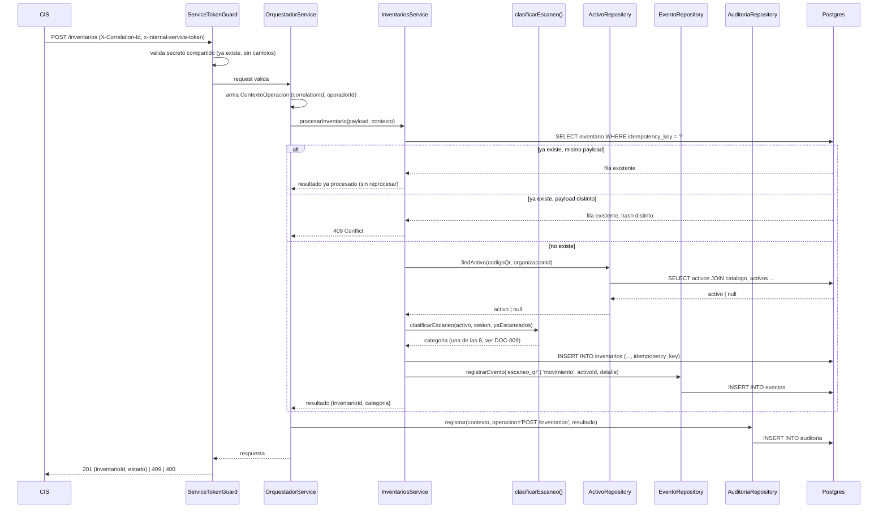

# Architecture — CORE Fase 2

## Mapa de módulos (Nest, dentro del mismo desplegable — `ARQUITECTURA-WAF.md` §1/§9)

```
core/src/
├── entitlements/          # ya existe (Fase 0/DOC-004) — sin cambios en esta fase
├── database/              # ya existe — Pool de pg compartido, reusado por los repos nuevos
├── common/
│   ├── auth/               # ya existe — ServiceTokenGuard
│   └── correlation-id/     # ya existe — CorrelationIdMiddleware
├── orquestador/            # NUEVO — DOC-007
│   ├── orquestador.service.ts     # unico punto de entrada a los motores
│   └── contexto-operacion.ts      # arma ContextoOperacion (ver DOMAIN_MODEL.md)
├── patrimonial/            # NUEVO — DOC-008 (Motor Patrimonial)
│   ├── activo.repository.ts
│   ├── catalogo.controller.ts      # GET /catalogo
│   ├── activo.service.ts           # consulta/traslado/cambio de ubicacion-estado
│   └── activo.schemas.ts
├── reglas/                 # NUEVO — DOC-009 (Motor de Reglas)
│   └── clasificar-escaneo.ts      # funcion pura: (activo|null, sesion) -> categoria
├── eventos/                 # NUEVO — DOC-010 (Motor de Eventos)
│   └── evento.repository.ts
├── auditoria/                # NUEVO — DOC-011 (Motor de Auditoria)
│   └── auditoria.repository.ts
└── inventarios/              # NUEVO — orquesta reglas+patrimonial+eventos+auditoria
    ├── inventarios.controller.ts   # POST /inventarios, GET /inventarios/:id/estado
    ├── inventarios.service.ts      # idempotencia + delega al Orquestador
    └── inventarios.schemas.ts
```

`reglas/`, `eventos/`, `auditoria/` no exponen controllers propios en esta fase — son módulos que
el Orquestador y `inventarios.service.ts` invocan directamente (Tomo IV §2.4: "toda operación pasa
primero por [el Orquestador]"). Mismo patrón que ya usa `core/src/entitlements/` (repository +
service + controller + schemas Zod) — sin introducir un patrón nuevo (RNF-05).

## Secuencia completa: `POST /inventarios`



Puntos clave que este diagrama fija (y que el código de Fase 2 debe respetar):

1. **La auditoría se registra siempre**, incluso en la rama `409`/rechazo — no solo en el camino
   feliz (RF-04, Tomo IV §2.9).
2. **La idempotencia se resuelve antes de invocar el Motor de Reglas** — un reintento legítimo no
   vuelve a clasificar el escaneo, devuelve el resultado ya persistido (evita reclasificar un
   escaneo como `ya_escaneado` en su propio reintento).
3. **El Motor de Reglas es una función pura** (`clasificarEscaneo`), no un repository — no toca
   la base directamente, recibe el activo ya resuelto y el estado de la sesión (ver DOC-009).

## Qué NO cambia en esta fase

- `entitlements/`, `database/`, `common/` — sin modificaciones.
- El contrato de `ServiceTokenGuard`/`CorrelationIdMiddleware` — se reusan tal cual.
- `docker-compose.yml`/`Dockerfile` — sin servicios nuevos, todo corre dentro del mismo
  desplegable `core` (RNF-04).
