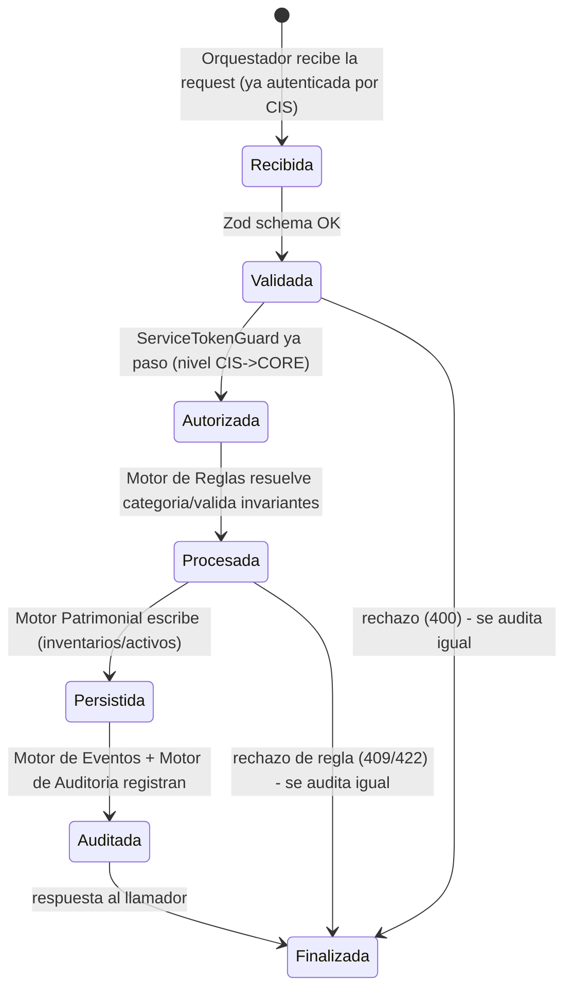
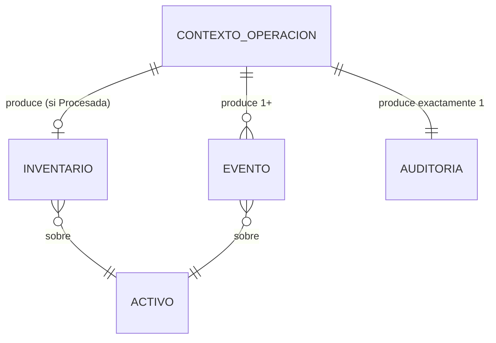

# Domain Model — CORE Fase 2 (orquestación)

Extiende el modelo de datos de `base-patrimonial/DOC-005-modelo-patrimonial.md` (que ya define
`Activo`, `Inventario`, `Evento`, `Auditoría`, etc.) con los conceptos de **orquestación** que
Tomo IV §2.15–2.16 describe y que hoy no tienen representación en código.

## Conceptos nuevos (no son tablas — viven en memoria de request, no se persisten como tales)

### `ContextoOperacion`
Lo que el Orquestador arma a partir de la request ya autenticada por CIS, antes de invocar
cualquier motor:

```ts
interface ContextoOperacion {
  correlationId: string;      // CorrelationIdMiddleware, ya existe desde Fase 0
  operadorId: string;         // sub del JWT, ya lo valida CIS
  organizacionId: string;
  serviceCaller: 'cis';       // hoy el unico llamador valido (ServiceTokenGuard)
}
```

### `Transaccion` (Tomo IV §2.15–2.16)
Máquina de estados que **no se persiste como tabla propia** en esta fase — se modela como el
`try/catch` del Orquestador más los registros que sí dejan rastro (`eventos`, `auditoria`,
`inventarios`). Persistir `Transaccion` como entidad de primera clase queda deliberadamente fuera
de alcance: sin un consumidor real de "ver transacciones en curso" todavía (YAGNI).



Cualquier fallo cancela la transacción de forma controlada y registra el motivo en `auditoria`
(regla ya declarada en `core/README.md` § "Flujo/ciclo de vida de una transacción").

## Relación con las entidades de DOC-005



Cada `POST /inventarios` (o traslado/cambio de ubicación) produce **como máximo un**
`Inventario`, **uno o más** `Evento` (ej. un traslado genera `traslado`; un inventario con
incidencia puede generar `movimiento` además del inventario mismo), y **exactamente un**
`Auditoria` — incluso si la operación fue rechazada, porque `auditoria` registra intentos, no
solo éxitos (Tomo IV §2.9, "registra... resultado").

## Idempotencia: dónde vive el estado

`IdempotencyKey` dejó de ser un `Map` en memoria de `QrConnectorService` (CIS) — pasa a ser una
columna `idempotency_key` en `inventarios` (única, ver DOC-008). El Orquestador consulta esa
columna antes de invocar al Motor de Reglas: si existe con el mismo hash de payload, devuelve el
resultado ya persistido sin reprocesar; si existe con hash distinto, `409` sin tocar ningún motor.
